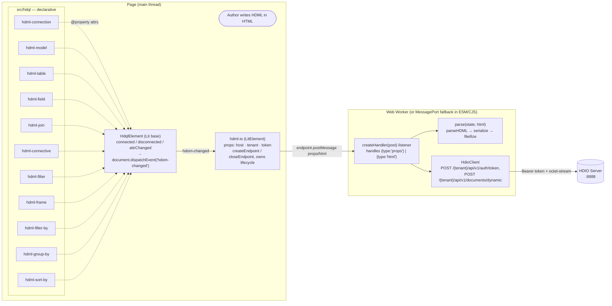
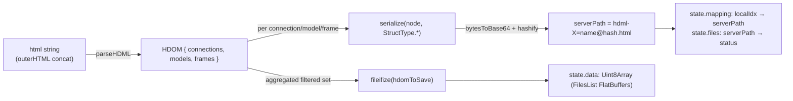
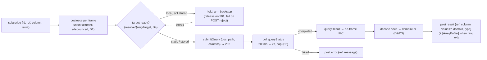
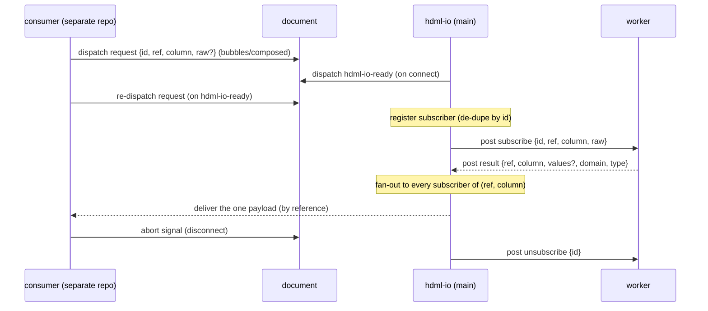
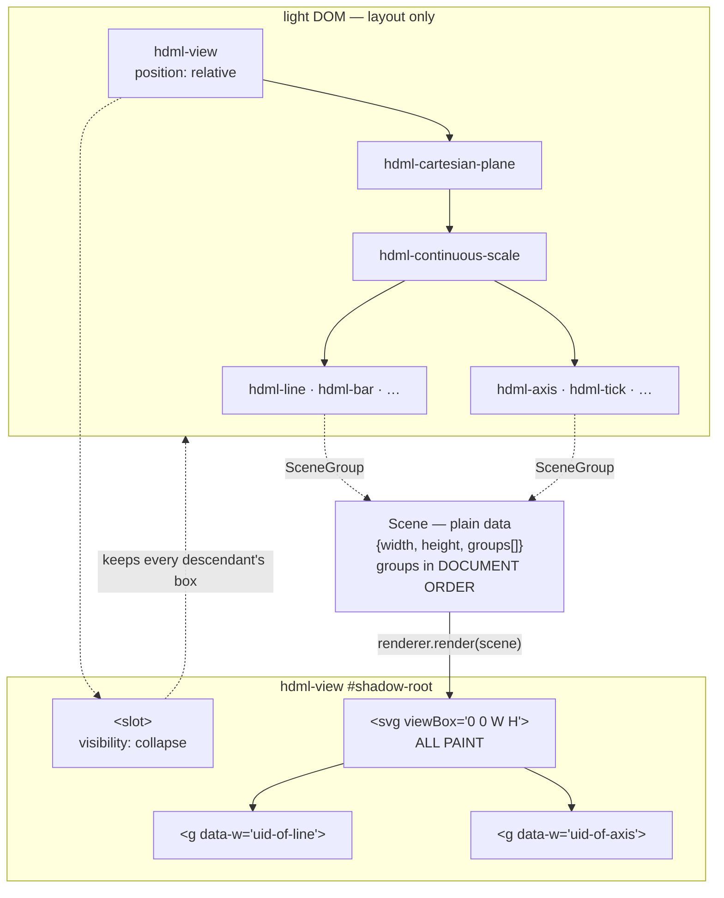
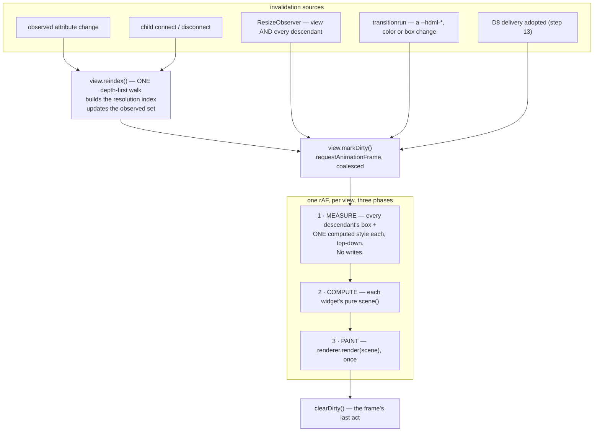
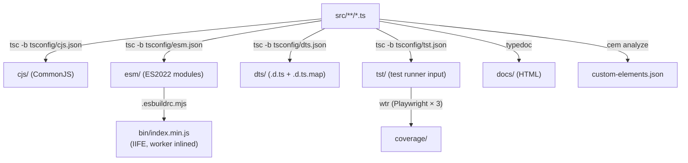

# Architecture

**Scope:** end-to-end data flow from `<hdml-*>` elements in the page to a serialized
FlatBuffers payload posted to the HDIO server, plus the build pipeline that turns
[src/](../src/) into the four shipped artifacts.

Adjacent reading:
[docs/components.md](components.md) for per-element attribute reference ·
[docs/hdio-client.md](hdio-client.md) for the worker / HTTP layer ·
[docs/decisions.md](decisions.md) for *why* it's shaped this way.

## Two element families



> **The boundary (RFC 014/001 Slice A).** The main thread ↔ worker seam
> is `src/hdio/endpoint.ts`: `createEndpoint()` / `closeEndpoint()`. In
> the `esm`/`cjs` builds this checked-in **fallback** returns the `port1`
> of a private `MessageChannel` whose `port2` runs the handler — a
> same-thread, isolated channel that touches **no** global slot
> (superseding the old `globalThis.self`/`window.onmessage` path, A1). In
> the IIFE (`bin`) build the esbuild plugin swaps the whole `endpoint.js`
> module for a `Worker`-spawning form (A2), so `HdmlIo.ts` never branches
> on the build — it holds `#endpoint: null | Endpoint` (`Worker |
> MessagePort`) and calls only `createEndpoint` / `closeEndpoint`. The
> worker handler is `createHandler(post)` (`src/hdio/onmessage.ts`): its
> `client` / `state` are closure state (one endpoint, one client, A3),
> and `post(msg, transfer?)` is the outbound sink, wired to
> `self.postMessage` in the real worker and to `port2.postMessage` in the
> fallback — both in the transfer-list form `postMessage(msg, transfer ??
> [])` (A4).

## The `hdom-changed` event bus

`HdqlElement` (in [src/hdql/HdqlElement.ts](../src/hdql/HdqlElement.ts)) is the single point
where every HDQL custom element notifies the rest of the page that the declarative document
has changed. The base class dispatches a `CustomEvent<HdqlElement>` named **`hdom-changed`**
on the `document` whenever the element is connected, disconnected, or any observed attribute
changes (see [src/hdql/HdqlElement.ts:12-49](../src/hdql/HdqlElement.ts#L12-L49)).

Properties of this event:

- **Target:** `document` (not the element itself — listeners attach to `document`).
- **`bubbles: false`, `composed: false`, `cancelable: false`** — fire-and-forget.
- **`detail`** is the element instance, typed `HdqlElement` but actually one of the concrete
  subclasses.

Every subclass in `src/hdql/Hdml*.ts` is a thin shell that only declares its `@property`
fields keyed by `*_ATTRS_LIST` enums from `@hdml/types`. They do not override lifecycle hooks
— Lit's `attributeChangedCallback` reaches `HdqlElement`, which dispatches.

The canonical listener is `<hdml-io>`: see
[`#listenHdomChanges`](../src/hdio/HdmlIo.ts#L493) at
[src/hdio/HdmlIo.ts:493-505](../src/hdio/HdmlIo.ts#L493-L505) (with its
`#unlistenHdomChanges` peer). When fired, it walks the document for `hdml-connection`,
`hdml-model`, `hdml-frame` elements and re-posts their `outerHTML` to the Worker.

## The hdml-io → Worker → HDIO chain

`<hdml-io>` is **not** an `HdqlElement` — it extends `LitElement` directly, because it does
not represent HDML state, it observes it. It owns four concerns:

1. **Lifecycle.** On `connectedCallback`, it calls `createEndpoint()` (through the module-level
   `endpoints` seam) and assigns `#endpoint.onmessage` (which also *starts* the fallback
   `port1`, so worker→main messages can arrive later). It never branches on the build — the
   `endpoint.ts` seam returns a `Worker` (IIFE build) or a `MessagePort` (esm/cjs fallback). On
   `disconnectedCallback` it calls `closeEndpoint(#endpoint)` (terminate vs close, handled
   inside the seam). See
   [src/hdio/HdmlIo.ts](../src/hdio/HdmlIo.ts).
2. **Property sync.** `host` / `tenant` / `mode` / `token` changes are debounced 5ms via
   `throdeb.debounce` (`@hdml/common`) and posted as `{type:"props", data:{host, tenant, mode,
   token, config}}` — `config.queryReadyTimeout` is read from `window.HDML_CONFIG` (the D4 gate
   backstop; a worker has no `window`).
3. **HTML sync.** On every `hdom-changed`, debounced 5ms, it concatenates the `outerHTML` of
   every `hdml-connection`, `hdml-model`, and `hdml-frame` in the document and posts
   `{type:"html", data:{html}}`.
4. **The discovery bus + subscription registry.** It listens on `document` for the D8 request
   event, holds the `subId → subscriber` registry, drives `subscribe`/`unsubscribe`, and fans
   each worker `result` out to every subscriber of that `(ref, column)` (see
   [The discovery bus](#the-discovery-bus) below).

The Worker entry [src/hdio/HdmlIo.worker.ts](../src/hdio/HdmlIo.worker.ts) — the only file
that touches `self` — wires `self.onmessage = createHandler((msg, t) => self.postMessage(msg,
t ?? []))`. `createHandler(post)` lives in [src/hdio/onmessage.ts](../src/hdio/onmessage.ts);
the fallback wires the same handler onto `port2` instead. Its `client` and `state = { data,
registry }` are **closure** state (one endpoint, one client), not module globals:

- **`type:"props"`** (re)constructs the `HdioClient`, closing any prior one; reads
  `config.queryReadyTimeout` (the D4 gate backstop).
- **`type:"html"`** runs `parse(state, html)` (see below) and calls
  `client.postDocument(state.data)`, folding the 201 via `recordStored` — which also
  **releases** any query frames gated on a now-`stored` ref (a POST rejection instead
  **fails** them).
- **`type:"subscribe"` / `type:"unsubscribe"`** open / close a `(ref, column)`
  subscription, driving the reactive query engine (see [The query leg](#the-query-leg) below).

The message envelope is a discriminated union on `type` (RFC §2.5) — inbound `props` /
`html` / `oidc-tokens` / `subscribe` / `unsubscribe`, outbound `result` / `error`. (The OIDC
exchange runs on the main thread — a `blob:`-Worker `fetch` is CORS-rejected — so it only
hands the minted pair in via `oidc-tokens`; there is no `auth` reply.) All are routed after
Step 07. See [docs/hdio-client.md](hdio-client.md#worker-message-protocol).

### Parse + serialize

[src/hdio/parse.ts](../src/hdio/parse.ts) is the only place this repo touches `@hdml/*`'s
binary-serialization surface:



Notes worth knowing before editing:

- The hash is content-addressed: identical content → identical path → skipped on subsequent
  uploads. `state.files` tracks which paths have already been parsed (`"parsed"`) vs marked
  for upload (`"requested-<uid>"`).
- Frame `source` attribute is rewritten in place: an absolute path (`/foo.hdml?hdml-model=m`)
  is reshaped via `sourceToPath`; a same-document reference (`?hdml-model=m`) is resolved via
  `state.mapping`. Diagnostics print to `console.error` if unresolved.

### The query leg

The reactive data-binding engine (RFC §5, Slice D) lives in the same
[onmessage.ts](../src/hdio/onmessage.ts) closure. A subscriber binds a `(ref, column)`; the
worker coalesces per frame, gates the first query until the target is server-side, submits
**one** query, polls it to completion, decodes the result once, and delivers a
ready-to-render column back to the main thread:



The **worker query-target map** is the `ref → {key, stored}` registry already in `state`
(the C6 map `resolveQueryTarget` reads): a local `?hdml-{kind}={name}` ref resolves to
`dynamic:{key}` gated on `stored`, a static `/…​.html?…` ref to a `/…​.hdml` artifact path
with no gate. **Supersession (D5):** each frame carries a monotonic generation; a widened
union bumps it, and a superseded run **discards** its late completion rather than delivering
it (a still-`pending` superseded job is best-effort cancelled, running jobs never — server
`Cancel` cannot abort a live Trino query). See
[docs/hdio-client.md](hdio-client.md#the-query-leg-slice-d).

### The discovery bus

The consumer-facing half of the query leg lives on the **main thread** in
[src/hdio/HdmlIo.ts](../src/hdio/HdmlIo.ts) (RFC §5.8, D8). Data-binding consumers (charts /
axes / legends — a **separate repo**) never touch the worker: they rendezvous with `<hdml-io>`
over a `document` event bus, symmetric and race-free.



- **Rendezvous.** `<hdml-io>` listens on `document` for a `bubbles:true, composed:true` request
  event (the W3C/Lit context-request pattern) — no `MutationObserver`, no hard-coded consumer
  tag-name list. This is **distinct** from the three authored roots it *queries* with
  `document.querySelectorAll`: declarations are in the document by definition; consumers
  **announce** (and may live in shadow, hence `composed`).
- **Symmetric `hdml-io-ready` handshake.** On connect (endpoint + request listener wired)
  `<hdml-io>` announces `hdml-io-ready` and answers any request it heard; a consumer both
  listens for ready and dispatches its request, re-dispatching on ready. Subscriptions
  **de-dupe by `id`**, so either ordering converges — closing the subscribe-before-hdml-io
  race. "Ready" = ready to **receive**, not parsed/stored; the D4 gate then handles
  satisfiability.
- **Fan-out (D7).** One worker `result` per distinct column is delivered — **by reference** —
  to every subscriber of that `(ref, column)`; the transfer already detached the buffer from
  the worker, so a shared raw column is never re-cloned per subscriber. Teardown rides the
  request's `AbortSignal` → `unsubscribe`.
- **`window.HDML_CONFIG`** ([src/hdio/config.ts](../src/hdio/config.ts)) is the one main-thread
  config **both** repos read (§8): `queryReadyTimeout` (default `10000`, forwarded to the
  worker), `readyEvent` (`"hdml-io-ready"`), `requestEvent` (`"hdml-io-request"`). See
  [docs/hdio-client.md](hdio-client.md#the-discovery-bus--subscription-registry-step-08-d7d8).

### HTTP

[src/hdio/HdioClient.ts](../src/hdio/HdioClient.ts) wraps `fetch` (polyfilled via
`whatwg-fetch`). All requests go to the post-006 tenant routes at `{host}/{tenant}/api/v1/…`
(the `public/api/v1/{tenant}` base is gone) carrying `Authorization: Bearer {access}` — an
access token held **in memory only**, never a `session`. There is no `sessions` bootstrap:
in token mode the `token` attribute is a single-use **handoff code** redeemed at
`POST /{tenant}/api/v1/auth/token`, and the document itself goes to
`POST /{tenant}/api/v1/documents/dynamic` (`content-type: application/octet-stream`,
`state.data.buffer` as the body) for a `201 { stored[], ddl[] }`. The query leg adds
`POST /{tenant}/api/v1/queries` and its `GET …/{jobId}` / `…/{jobId}/result` /
`DELETE …/{jobId}` peers. Errors decode the JSON body and re-throw `new
Error(message.message || statusText)`. The full endpoint table is in
[docs/hdio-client.md](hdio-client.md#endpoint-surface).

## The render pipeline

The display half paints nothing per-element. **One `<svg>` per `<hdml-view>` lives in
the view's shadow root and owns every pixel**; each display element contributes a
*description* of what it wants drawn and touches no drawing API.



**Two mechanisms make this keep the box promise rather than break it.**
`visibility: collapse` on the slot keeps every slotted descendant's **layout box** — a
slotted, absolutely positioned child of a collapsed slot still reports a non-zero rect
on chromium, firefox and webkit, so every element has a true box that DevTools
highlights and that CSS drives; it simply paints nothing itself. And because CSS on a
light-DOM widget cannot reach nodes painted in the view's shadow, each `SceneGroup`
carries its **resolved** `opacity` / `filter` / `visibility` / `clip` / `clipPath`, which
the renderer re-applies to the group's `<g>` by explicit transfer. Both sheets that make
this work live in [src/hdvl/ua.ts](../src/hdvl/ua.ts).

### The scene is data

[src/hdvl/scene.ts](../src/hdvl/scene.ts) is types only. A `Scene` is **immutable,
serializable plain data** — `structuredClone` round-trips one, and the renderer is
asserted never to write to what it is handed. No SVG path string, no DOM node and no CSS
selector crosses the boundary: a `path` node carries `Subpath[]` of `line` / `cubic`
segments, and an `arc` node stays *parameterised* (`cx cy r0 r1 a0 a1`, degrees, `0` at
12 o'clock, clockwise) rather than pre-serialized. All geometry is in **view
coordinates**: CSS px, origin at the view's content-box top-left, y down.

That is what makes a **scene assertion** — not a DOM assertion — the primary test
mechanism for the display half: a widget test builds no page, reads back no attributes,
and compares one plain object.

A new `Subpath` is a **gap**, never a bridge: a missing value breaks a path rather than
interpolating across it.

### The renderer seam

[src/hdvl/renderer.ts](../src/hdvl/renderer.ts) declares six methods —

| Method | Owed |
|---|---|
| `mount(root)` | takes over a shadow root; **reuses** an `<svg>` it already holds |
| `resize(w, h, dpr)` | sets `viewBox`; under SVG the device-pixel mapping is an identity, so `dpr` is recorded and nothing is scaled by it |
| `render(scene)` | one `<g>` per group, in array order — array order **is** paint order |
| `resolve(x, y)` | view-local CSS px → `{widget, index}`; nearest vertex within **12 CSS px**, or containment for a discrete node |
| `measureText(text, font)` | text extents, available **during** scene construction |
| `unmount()` | leaves the root as it found it |

**`render()` diffs; it does not rebuild.** The key is `(group.widget, node index)`: a
group whose widget uid is unchanged patches its existing `<g>`, node *j* patches node
*j*, surplus nodes are removed, and a node whose kind changed is replaced rather than
patched. Node identity is stable across frames — which is what pointer targets and CSS
transitions on the emitted nodes both need.

**`measureText` is the sixth method, and it lives in its own module.** A guide cannot
lay out what it cannot measure, and measurement must happen *before* the scene exists —
so [src/hdvl/measure-text.ts](../src/hdvl/measure-text.ts) holds one memoised
offscreen-2D implementation that both the SVG renderer and the test-double recording
renderer delegate to. A measurement utility, explicitly not a canvas renderer.

`renderers.create` is a **mutable module-level property**, the same test seam shape as
`HdmlIo.ts`'s exported `nav` / `endpoints`: a test swaps in the recording renderer by
assigning to it. A per-instance injection would be clobbered by the legacy
webcomponents polyfill's upgrade-on-connect.

**Author strings never become markup.** Every node is created with
`document.createElementNS` and every author string reaches the DOM through
`textContent` — never `innerHTML`, `insertAdjacentHTML` or `unsafeHTML`.

**`clip-path` is resolved by the runtime, not passed through.** The emitted `<g>` has no
CSS box, so a percentage or a `border-box` keyword would resolve against a different
reference than the author wrote. [src/hdvl/kernel/clip-shape.ts](../src/hdvl/kernel/clip-shape.ts)
converts `inset()` / `circle()` / `ellipse()` / `polygon()` against the widget's measured
box into explicit geometry; the `url()` form is unsupported and reported rather than
half-applied, and the same rule applies to `filter`. Everything under
[src/hdvl/kernel/](../src/hdvl/kernel/) is **pure**: no DOM, no computed style, no import
side effect.

### What drives a render — one frame, three phases

Every invalidation in a view, from whatever source, ends the same way: **mark the
owning view dirty and request one animation frame.** *n* invalidations before that
frame produce **one** frame. A *structural* change additionally reindexes first.



**The phases may not interleave, and that is the point.** MEASURE reads and writes
nothing; COMPUTE calls `scene()`; PAINT hands over one `Scene`. So no element ever
reads a box after another has written one, and a widget's `scene()` is a pure
function of the snapshot rather than of whoever ran before it. It also means a D8
delivery can never tear a frame: `deliver` stores a payload and sets a flag, and
paint happens a whole frame later.

Every real `scene()` returns `null` today, which is a **contract-complete answer** —
"returns null to paint nothing (hidden, errored, or still loading)" — so PAINT
renders a real, empty `Scene`. Widget bodies arrive per slice and replace nothing
around them.

### The resolution index

[src/hdvl/resolve.ts](../src/hdvl/resolve.ts) answers *"who is my scale?"* **once per
structural change** instead of once per element per question. One rect-free
depth-first walk from the view carries the scale chain **down** and the tip flag
**up**, and records for every element: its view, its plane, the nearest ancestor
scale per channel (resolution stopping at the plane boundary), whether it sits at a
chain tip, its nearest and error-owning container, and its effective `source`.

Two consequences are load-bearing:

- **`HdvlElement.view` is a read of the index and of nothing else.** There is no
  `closest()` in the display half. A second resolution source would disagree after a
  DOM move *and* would produce an element the `ResizeObserver` never observes.
- **A removed element can still name its view.** The index holds an element's
  resolution until its view's next walk drops it, which is what makes
  `disconnectedCallback` able to invalidate anything at all.

### MEASURE is the only computed-style reader

[src/hdvl/measure.ts](../src/hdvl/measure.ts) calls `getComputedStyle` **once per
element per frame** and nowhere else in `src/hdvl/`. One call yields the box-level
properties, the font, every registered `--hdml-*` the element reads **and** its
`_hover` variant — which is why one pass suffices for a hover model at all. Measured
over a nineteen-element view: ~0.3–0.7 ms for the whole pass, so no per-property
caching is specified.

Two values are resolved rather than passed through. **`currentcolor` is resolved by
us**, because the computed value is the literal keyword on chromium and firefox and
an already-resolved `rgb()` on webkit — without this, "an unstyled chart is legible
and dark-mode-correct" would hold on one engine of three. And `clip-path` becomes
explicit geometry, as above.

### The CSS invalidation sentinel

`ResizeObserver` reports size and never position, so a purely declarative reposition
would fire nothing. The gap is closed by a **1 ms UA transition** declared on the
generic `:host` rule over every registered property plus `color`, `inset`, `margin`,
`padding`, `width` and `height`: a declarative change to any of them fires
`transitionrun`, which a capturing listener on the view turns into one frame.

It is written as the **longhands** `transition-property` + `transition-duration`,
never the `transition` shorthand — a shorthand is replaced wholesale by any later
rule, including one of ours. An author rule that does replace it removes detection
for that element, so MEASURE also reads `transition-property` back and records
whether the sentinel survived. When it did not, the view logs **W5** once and
switches on a document-wide `MutationObserver` for itself — so correctness is
restored without the author knowing the mechanism exists, and the observer's cost
is paid only by the pages that actually override. `HDML_CONFIG.paranoidObserver`
forces it on regardless.

### Diagnostics — two passes, edge-triggered

[`validate.ts`](../src/hdvl/validate.ts) is **the only module under `src/hdvl/`
that writes to the console**, and that is a load-bearing rule rather than a style
one. It runs two passes, both always on in dev and prod builds:

| Pass | Runs in | Rules |
|---|---|---|
| **structural** | `view.reindex()`, once per structural change, over the walk that just ran | V1 (a bound channel resolves to exactly one ancestor scale), V13 (a level is homogeneous), W2 (the view has an accessible name) |
| **binding** | per widget in COMPUTE, on adopted data | none yet — the seam is named and empty until a resolved scale exists |

W5 and W6 are neither: both are flags MEASURE produced, reported from the same
sink so they are edge-triggered like everything else.

**Edge-triggering is the reason the sink is centralised.** Validation runs on
every structural change and every COMPUTE pass, so a resize drag would otherwise
re-dispatch the same `hdml-error` and reprint the same console line sixty times a
second. Each unit remembers the identity of the diagnostic it currently carries —
`` `${rule}|${code}|${channel ?? ""}|${message}` `` — and reports only when that
identity changes. There is **no event on recovery**: the state disappears, the
identity is cleared, and nothing is dispatched, because the vocabulary defines no
resolution event. A bare `console.warn` anywhere else in `src/hdvl/` bypasses all
of this, which is why the build's own grep expects exactly one console writer.

Messages are **contract**: the teaching text is quoted verbatim from the spec, so
every negative test hardcodes the literal rather than importing the constant.
The element that violates a rule and the element that *blanks* are not the same —
the blast radius is the **error unit** the resolution index precomputes, which
for a widget inside a layout container is the container.

### Interaction — one delegated listener, and the proxy fence

The view installs **one** pointer listener and asks the renderer to resolve a hit
in **view-local CSS px**; the renderer converts back to viewport coordinates for
its own `elementFromPoint` tier, so the seam never leaks viewport semantics. The
hit names a widget `uid`, the index resolves it to an element, and the event is
re-dispatched **from that widget** — so series identity is the event target and
there is no `series` field to invent.

The first line of the listener is the **proxy fence**:

```ts
if (e instanceof HdmlPointerEvent) return;
```

It is mandatory. Proxied events are `bubbles` + `composed` by contract, so one
dispatched from a descendant bubbles straight back into the same listener.
Measured with an unfenced replica and one native `pointermove`: chromium
re-enters **44** times before Blink's nested-dispatch cap stops it, firefox
**448**, and webkit recurses until `RangeError: Maximum call stack size
exceeded`. Two alternatives are rejected permanently — `bubbles: false` breaks a
host app listening on an ancestor, and `e.isTrusted` is test-hostile, because a
script-dispatched `PointerEvent` is untrusted and every synthetic-interaction
test would then pass while testing nothing.

`HdmlPointerEvent` carries `index` and `datum` as **own properties**, never in
`detail`: `UIEvent.detail` is a `long`, so an object assigned to it coerces to
`0` on all three engines. It stays a real `PointerEvent`, so a host app's
existing pointer handling keeps working and simply gains two properties, and the
native event is never stopped — a listener sees both and tells them apart by
class.

The four named `hdml-*` events are the opposite: they are `CustomEvent`s
collected into a queue during the frame and dispatched **after PAINT**, because a
listener is entitled to mutate the DOM and a mutation mid-phase corrupts the pass
in flight. Dispatched at end of frame, such a mutation simply schedules the next
one.

### `HDML.supports`

Registered additively on `globalThis.HDML` when the `./hdvl` entry is imported.
It answers from the custom-element registry and the published attribute enums, so
it cannot drift from what this build actually registers — see
[decisions.md](decisions.md).

## Build pipeline



The IIFE build is special: `.esbuildrc.mjs` registers an `onLoad({filter: /endpoint\.js$/})`
handler that resolves `HdmlIo.worker.js` next to `endpoint.js`, *recursively* re-bundles it as
a minified IIFE, and returns a module whose `contents` define `createEndpoint` (Blob-URL-spawn
a `Worker` from that bundled string) and `closeEndpoint` (`ep.terminate()`) in place of the
checked-in fallback. Because the plugin replaces the **whole** `endpoint.js` module, the
`onmessage` / `@hdml/parser` graph never lands in the main bundle — it lives only inside the
worker string (A2). The esm/cjs builds have no such plugin, so they keep the checked-in
`MessageChannel` fallback. See [docs/decisions.md#the-endpointts-seam](decisions.md#the-endpointts-seam).

`npm run build` chains: `clear` → `lint` → `test` → `compile_cjs && compile_esm && compile_dts && compile_bin` → `docs` (TypeDoc). `compile_bin` depends on `compile_esm` having run first (it bundles `./esm/index.js`). See [docs/development.md](development.md).
