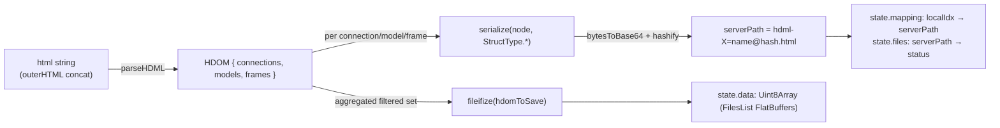
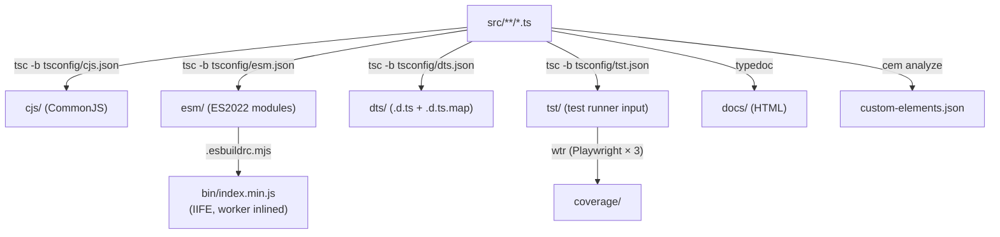

# Architecture

**Scope:** end-to-end data flow from `<hdml-*>` elements in the page to a serialized
FlatBuffers payload posted to the HDIO server, plus the build pipeline that turns
[src/](../src/) into the four shipped artifacts.

Adjacent reading:
[docs/components.md](components.md) for per-element attribute reference ·
[docs/hdio-client.md](hdio-client.md) for the worker / HTTP layer ·
[docs/decisions.md](decisions.md) for *why* it's shaped this way.

## Two element families

## The `hdom-changed` event bus

`HdomElement` (in [src/hdom/HdomElement.ts](../src/hdom/HdomElement.ts)) is the single point
where every HDOM custom element notifies the rest of the page that the declarative document
has changed. The base class dispatches a `CustomEvent<HdomElement>` named **`hdom-changed`**
on the `document` whenever the element is connected, disconnected, or any observed attribute
changes (see [src/hdom/HdomElement.ts:12-49](../src/hdom/HdomElement.ts#L12-L49)).

Properties of this event:

- **Target:** `document` (not the element itself — listeners attach to `document`).
- **`bubbles: false`, `composed: false`, `cancelable: false`** — fire-and-forget.
- **`detail`** is the element instance, typed `HdomElement` but actually one of the concrete
  subclasses.

Every subclass in `src/hdom/Hdml*.ts` is a thin shell that only declares its `@property`
fields keyed by `*_ATTRS_LIST` enums from `@hdml/types`. They do not override lifecycle hooks
— Lit's `attributeChangedCallback` reaches `HdomElement`, which dispatches.

The canonical listener is `<hdml-io>`: see
[src/hdio/HdmlIo.ts:101-113](../src/hdio/HdmlIo.ts#L101-L113). When fired, it walks the
document for `hdml-connection`, `hdml-model`, `hdml-frame` elements and re-posts their
`outerHTML` to the Worker.

## The hdml-io → Worker → HDIO chain

`<hdml-io>` is **not** an `HdomElement` — it extends `LitElement` directly, because it does
not represent HDML state, it observes it. It owns three concerns:

1. **Lifecycle.** On `connectedCallback`, it either spawns a `Worker` (IIFE build) or sets
   `#messagable = globalThis.self` (ESM/CJS build — same-thread fallback driven by the
   `_script === "_script"` sentinel). On `disconnectedCallback` it tears that down. See
   [src/hdio/HdmlIo.ts:51-76](../src/hdio/HdmlIo.ts#L51-L76).
2. **Property sync.** `host` / `tenant` / `token` changes are debounced 5ms via
   `throdeb.debounce` (`@hdml/common`) and posted as `{type:"props", data:{host,tenant,token}}`.
3. **HTML sync.** On every `hdom-changed`, debounced 5ms, it concatenates the `outerHTML` of
   every `hdml-connection`, `hdml-model`, and `hdml-frame` in the document and posts
   `{type:"html", data:{html}}`.

The Worker entry [src/hdio/HdmlIo.worker.ts](../src/hdio/HdmlIo.worker.ts) wires
`globalThis.self.onmessage = onmessage` where `onmessage` lives in
[src/hdio/onmessage.ts](../src/hdio/onmessage.ts). It is a tiny router holding three pieces of
state — `host`, `tenant`, `token`, and the cumulative `state = { data, files, mapping }`:

- **`type:"props"`** replaces the `HdioClient` instance (closing any prior one).
- **`type:"html"`** runs `parse(state, html)` (see below) and calls `client.postFiles(state)`.

### Parse + serialize

[src/hdio/parse.ts](../src/hdio/parse.ts) is the only place this repo touches `@hdml/*`'s
binary-serialization surface:

Notes worth knowing before editing:

- The hash is content-addressed: identical content → identical path → skipped on subsequent
  uploads. `state.files` tracks which paths have already been parsed (`"parsed"`) vs marked
  for upload (`"requested-<uid>"`).
- Frame `source` attribute is rewritten in place: an absolute path (`/foo.hdml?hdml-model=m`)
  is reshaped via `sourceToPath`; a same-document reference (`?hdml-model=m`) is resolved via
  `state.mapping`. Diagnostics print to `console.error` if unresolved.

### HTTP

[src/hdio/HdioClient.ts](../src/hdio/HdioClient.ts) wraps `fetch` (polyfilled via
`whatwg-fetch`). All requests go to
`{host}/public/api/v1/{tenant}/{api}{path}?{params}` with `Authorization: Bearer {session}`
and `content-type: application/octet-stream`. Two endpoints are used —
`GET sessions?tenant&token` to bootstrap the session, then
`POST hdio/files` with `state.data.buffer` as the body. Errors decode the JSON body and
re-throw `new Error(message.message || statusText)`. See [docs/hdio-client.md](hdio-client.md).

## Build pipeline

The IIFE build is special: `.esbuildrc.mjs` registers an `onLoad({filter: /\.worker\.js$/})`
handler that *recursively* re-bundles the matched worker file as a minified IIFE, then emits
`const _script = "<bundled-source-as-string>"; export default _script;` in its place. This is
what flips `HdmlIo.ts`'s `_script === "_script"` check from "use main thread" to "spawn
Worker from a Blob URL". The ESM build, having no such plugin, leaves the sentinel intact.
See [docs/decisions.md#why-_script](decisions.md#why-_script).

`npm run build` chains: `clear` → `lint` → `test` → `compile_cjs && compile_esm && compile_dts && compile_bin` → `docs` (TypeDoc). `compile_bin` depends on `compile_esm` having run first (it bundles `./esm/index.js`). See [docs/development.md](development.md).
