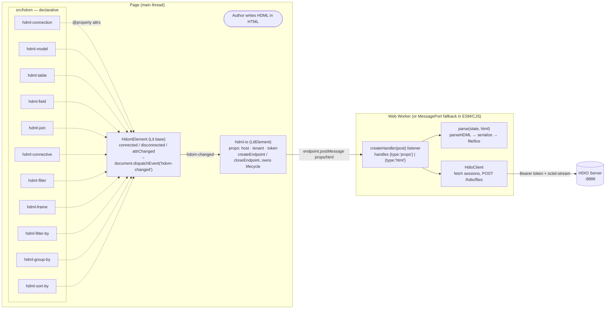
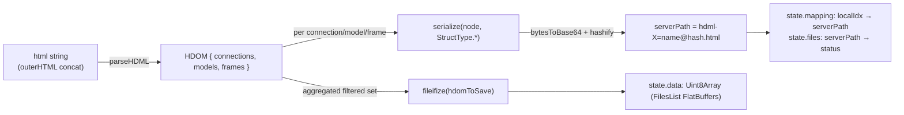
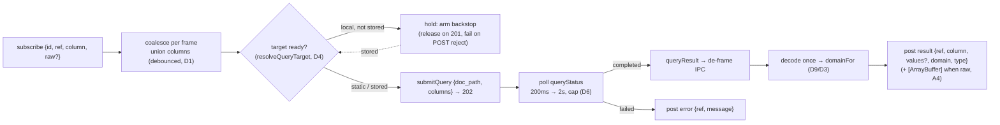
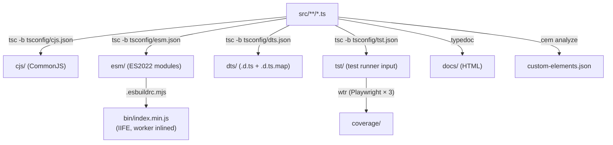

# Architecture

**Scope:** end-to-end data flow from `<hdml-*>` elements in the page to a serialized
FlatBuffers payload posted to the HDIO server, plus the build pipeline that turns
[src/](../src/) into the four shipped artifacts.

Adjacent reading:
[docs/components.md](components.md) for per-element attribute reference ·
[docs/hdio-client.md](hdio-client.md) for the worker / HTTP layer ·
[docs/decisions.md](decisions.md) for *why* it's shaped this way.

## Two element families

> **The boundary (RFC 014/001 Slice A).** The main thread ↔ worker seam
> is `src/hdio/endpoint.ts`: `createEndpoint()` / `closeEndpoint()`. In
> the `esm`/`cjs` builds this checked-in **fallback** returns the `port1`
> of a private `MessageChannel` whose `port2` runs the handler — a
> same-thread, isolated channel that touches **no** global slot
> (superseding the old `globalThis.self`/`window.onmessage` path, A1). In
> the IIFE (`bin`) build the esbuild plugin swaps the whole `endpoint.js`
> module for a `Worker`-spawning form (A2), so `HdmlIo.ts` never branches
> on the build — it holds `#endpoint: null | Endpoint` (`Worker |
> MessagePort`) and calls only `createEndpoint` / `closeEndpoint`. The
> worker handler is `createHandler(post)` (`src/hdio/onmessage.ts`): its
> `client` / `state` are closure state (one endpoint, one client, A3),
> and `post(msg, transfer?)` is the outbound sink, wired to
> `self.postMessage` in the real worker and to `port2.postMessage` in the
> fallback — both in the transfer-list form `postMessage(msg, transfer ??
> [])` (A4).

## The `hdom-changed` event bus

`HdomElement` (in [src/hdom/HdomElement.ts](../src/hdom/HdomElement.ts)) is the single point
where every HDOM custom element notifies the rest of the page that the declarative document
has changed. The base class dispatches a `CustomEvent<HdomElement>` named **`hdom-changed`**
on the `document` whenever the element is connected, disconnected, or any observed attribute
changes (see [src/hdom/HdomElement.ts:12-49](../src/hdom/HdomElement.ts#L12-L49)).

Properties of this event:

- **Target:** `document` (not the element itself — listeners attach to `document`).
- **`bubbles: false`, `composed: false`, `cancelable: false`** — fire-and-forget.
- **`detail`** is the element instance, typed `HdomElement` but actually one of the concrete
  subclasses.

Every subclass in `src/hdom/Hdml*.ts` is a thin shell that only declares its `@property`
fields keyed by `*_ATTRS_LIST` enums from `@hdml/types`. They do not override lifecycle hooks
— Lit's `attributeChangedCallback` reaches `HdomElement`, which dispatches.

The canonical listener is `<hdml-io>`: see
[src/hdio/HdmlIo.ts:101-113](../src/hdio/HdmlIo.ts#L101-L113). When fired, it walks the
document for `hdml-connection`, `hdml-model`, `hdml-frame` elements and re-posts their
`outerHTML` to the Worker.

## The hdml-io → Worker → HDIO chain

`<hdml-io>` is **not** an `HdomElement` — it extends `LitElement` directly, because it does
not represent HDML state, it observes it. It owns three concerns:

1. **Lifecycle.** On `connectedCallback`, it calls `createEndpoint()` and assigns
   `#endpoint.onmessage` (which also *starts* the fallback `port1`, so worker→main
   messages can arrive later). It never branches on the build — the `endpoint.ts` seam
   returns a `Worker` (IIFE build) or a `MessagePort` (esm/cjs fallback). On
   `disconnectedCallback` it calls `closeEndpoint(#endpoint)` (terminate vs close, handled
   inside the seam). See
   [src/hdio/HdmlIo.ts:65-90](../src/hdio/HdmlIo.ts#L65-L90).
2. **Property sync.** `host` / `tenant` / `token` changes are debounced 5ms via
   `throdeb.debounce` (`@hdml/common`) and posted as `{type:"props", data:{host,tenant,token}}`.
3. **HTML sync.** On every `hdom-changed`, debounced 5ms, it concatenates the `outerHTML` of
   every `hdml-connection`, `hdml-model`, and `hdml-frame` in the document and posts
   `{type:"html", data:{html}}`.

The Worker entry [src/hdio/HdmlIo.worker.ts](../src/hdio/HdmlIo.worker.ts) — the only file
that touches `self` — wires `self.onmessage = createHandler((msg, t) => self.postMessage(msg,
t ?? []))`. `createHandler(post)` lives in [src/hdio/onmessage.ts](../src/hdio/onmessage.ts);
the fallback wires the same handler onto `port2` instead. Its `client` and `state = { data,
registry }` are **closure** state (one endpoint, one client), not module globals:

- **`type:"props"`** (re)constructs the `HdioClient`, closing any prior one; reads
  `config.queryReadyTimeout` (the D4 gate backstop).
- **`type:"html"`** runs `parse(state, html)` (see below) and calls
  `client.postDocument(state.data)`, folding the 201 via `recordStored` — which also
  **releases** any query frames gated on a now-`stored` ref (a POST rejection instead
  **fails** them).
- **`type:"subscribe"` / `type:"unsubscribe"`** open / close a `(ref, column)`
  subscription, driving the reactive query engine (see [The query leg](#the-query-leg) below).

The message envelope is a discriminated union on `type` (RFC §2.5) — inbound `props` /
`html` / `oidc-callback` / `subscribe` / `unsubscribe`, outbound `auth` / `result` /
`error`. All are routed after Step 07. See
[docs/hdio-client.md](hdio-client.md#worker-message-protocol).

### Parse + serialize

[src/hdio/parse.ts](../src/hdio/parse.ts) is the only place this repo touches `@hdml/*`'s
binary-serialization surface:

Notes worth knowing before editing:

- The hash is content-addressed: identical content → identical path → skipped on subsequent
  uploads. `state.files` tracks which paths have already been parsed (`"parsed"`) vs marked
  for upload (`"requested-<uid>"`).
- Frame `source` attribute is rewritten in place: an absolute path (`/foo.hdml?hdml-model=m`)
  is reshaped via `sourceToPath`; a same-document reference (`?hdml-model=m`) is resolved via
  `state.mapping`. Diagnostics print to `console.error` if unresolved.

### The query leg

The reactive data-binding engine (RFC §5, Slice D) lives in the same
[onmessage.ts](../src/hdio/onmessage.ts) closure. A subscriber binds a `(ref, column)`; the
worker coalesces per frame, gates the first query until the target is server-side, submits
**one** query, polls it to completion, decodes the result once, and delivers a
ready-to-render column back to the main thread:

The **worker query-target map** is the `ref → {key, stored}` registry already in `state`
(the C6 map `resolveQueryTarget` reads): a local `?hdml-{kind}={name}` ref resolves to
`dynamic:{key}` gated on `stored`, a static `/…​.html?…` ref to a `/…​.hdml` artifact path
with no gate. **Supersession (D5):** each frame carries a monotonic generation; a widened
union bumps it, and a superseded run **discards** its late completion rather than delivering
it (a still-`pending` superseded job is best-effort cancelled, running jobs never — server
`Cancel` cannot abort a live Trino query). See
[docs/hdio-client.md](hdio-client.md#the-query-leg-slice-d).

### HTTP

[src/hdio/HdioClient.ts](../src/hdio/HdioClient.ts) wraps `fetch` (polyfilled via
`whatwg-fetch`). All requests go to
`{host}/public/api/v1/{tenant}/{api}{path}?{params}` with `Authorization: Bearer {session}`
and `content-type: application/octet-stream`. Two endpoints are used —
`GET sessions?tenant&token` to bootstrap the session, then
`POST hdio/files` with `state.data.buffer` as the body. Errors decode the JSON body and
re-throw `new Error(message.message || statusText)`. See [docs/hdio-client.md](hdio-client.md).

## Build pipeline

The IIFE build is special: `.esbuildrc.mjs` registers an `onLoad({filter: /endpoint\.js$/})`
handler that resolves `HdmlIo.worker.js` next to `endpoint.js`, *recursively* re-bundles it as
a minified IIFE, and returns a module whose `contents` define `createEndpoint` (Blob-URL-spawn
a `Worker` from that bundled string) and `closeEndpoint` (`ep.terminate()`) in place of the
checked-in fallback. Because the plugin replaces the **whole** `endpoint.js` module, the
`onmessage` / `@hdml/parser` graph never lands in the main bundle — it lives only inside the
worker string (A2). The esm/cjs builds have no such plugin, so they keep the checked-in
`MessageChannel` fallback. See [docs/decisions.md#the-endpointts-seam](decisions.md#the-endpointts-seam).

`npm run build` chains: `clear` → `lint` → `test` → `compile_cjs && compile_esm && compile_dts && compile_bin` → `docs` (TypeDoc). `compile_bin` depends on `compile_esm` having run first (it bundles `./esm/index.js`). See [docs/development.md](development.md).
