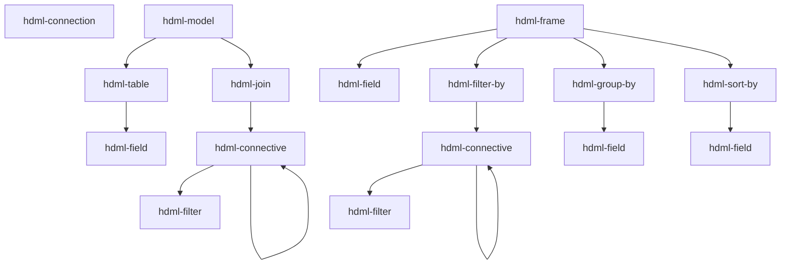

# Components reference

**Scope:** every `hdml-*` custom element this package registers — tag name, role, attributes,
and the typical parent/child it expects. All facts here are pulled from the JSDoc on each
class; treat the class file as source of truth and update it alongside any change here.

Adjacent reading: [docs/architecture.md](architecture.md) for the `hdom-changed` lifecycle ·
[docs/hdio-client.md](hdio-client.md) for `<hdml-io>` (the host element, not listed here
because it is not a `HdqlElement`).

## The three families

- **`hdql/`** — HyperData **Query** Language: declarative HDML data modelling; every element
  extends [`HdqlElement`](../src/hdql/HdqlElement.ts), defines `@property` fields keyed by
  `*_ATTRS_LIST` enums from `@hdml/types`, and renders `<slot></slot>`. The element does **no
  work itself** — it just keeps DOM-attribute state and fires `hdom-changed` on the
  `document`.
- **`hdio/`** — one element (`<hdml-io>`) that observes the document and uploads to HDIO.
  See [docs/hdio-client.md](hdio-client.md).
- **`hdvl/`** — HyperData **Visualisation** Language: the display elements. All **21 tags are
  registered** by the `./hdvl` entry; every element extends
  [`HdvlElement`](../src/hdvl/base.ts) except `hdml-fallback`, takes its tag and attribute keys
  from [`src/hdvl/vocabulary.ts`](../src/hdvl/vocabulary.ts), and **never fires
  `hdom-changed`** — a display element changes no part of the HDML document, so display
  invalidation travels the scheduler path only. Bodies land per slice over RFC 016/001; see
  [Display elements](#display-elements-hdvl) below for what is implemented today.

`hdql` / `hdvl` name **modules**, never tag prefixes — every tag in this package is
`hdml-*` (RFC 016/001 §2.1).

## Composition rules



A `hdml-frame`'s `source` attribute references another `hdml-model` or `hdml-frame`, either
within the same document or via an HDIO path.

## Elements

### `hdml-connection` — [src/hdql/HdmlConnection.ts](../src/hdql/HdmlConnection.ts)

A named connection to a database. Attribute applicability depends on `type`.

| Attribute | Notes |
|---|---|
| `name` | identifier |
| `description` | free text |
| `type` | one of `postgresql`, `mysql`, `mssql`, `mariadb`, `oracle`, `clickhouse`, `druid`, `ignite`, `redshift`, `bigquery`, `googlesheets`, `elasticsearch`, `mongodb`, `snowflake` |
| `ssl` | boolean string, JDBC-style types |
| `host`, `port`, `user`, `password` | network/auth (subset of types) |
| `project-id` | `bigquery` |
| `credentials-key` | base64 GCP creds JSON (`bigquery`, `googlesheets`) |
| `sheet-id` | `googlesheets` |
| `region`, `access-key`, `secret-key` | `elasticsearch` (AWS) |
| `schema` | `mongodb` |
| `account`, `warehouse`, `database`, `role` | `snowflake` |

See the source JSDoc for which attribute applies to which `type`.

### `hdml-model` — [src/hdql/HdmlModel.ts](../src/hdql/HdmlModel.ts)

Container for an entity-relationship graph (tables joined together).

| Attribute | |
|---|---|
| `name` | identifier |
| `description` | free text |

**Allowed children:** `hdml-table`, `hdml-join`.

### `hdml-table` — [src/hdql/HdmlTable.ts](../src/hdql/HdmlTable.ts)

A physical table, view, materialized view, or SQL query inside a model.

| Attribute | |
|---|---|
| `name` | identifier within the model |
| `type` | `table` or `query` |
| `identifier` | three-tier name (back-quoted) for `type=table`, or SQL for `type=query` |
| `description` | free text |

**Allowed children:** `hdml-field`.

### `hdml-field` — [src/hdql/HdmlField.ts](../src/hdql/HdmlField.ts)

A typed field. Reused inside `hdml-table`, `hdml-frame`, `hdml-group-by`, `hdml-sort-by`.

| Attribute | |
|---|---|
| `name` | identifier in the HDML context |
| `description` | free text |
| `origin` | source-column name (in `hdml-table`) or parent-field name (in `hdml-frame`) |
| `clause` | raw SQL clause; takes precedence over `origin` |
| `type` | `int-8 \| int-16 \| int-32 \| int-64 \| float-16 \| float-32 \| float-64 \| binary \| utf-8 \| decimal \| date \| time \| timestamp` |
| `aggregation` | `none \| count \| countDistinct \| countDistinctApprox \| sum \| avg \| min \| max` |
| `order` | `none \| asc \| desc` (meaningful only inside `hdml-sort-by`) |
| `scale`, `precision` | for `type=decimal` |
| `unit` | `second \| millisecond \| microsecond \| nanosecond` (for `type=time`/`timestamp`) |
| `timezone` | `UTC`, `GMT`, `GMT-12`..`GMT+14` (for `type=timestamp`) |

### `hdml-join` — [src/hdql/HdmlJoin.ts](../src/hdql/HdmlJoin.ts)

A join between two `hdml-table`s within an `hdml-model`.

| Attribute | |
|---|---|
| `type` | `cross \| inner \| full \| left \| right \| full-outer \| left-outer \| right-outer` |
| `left`, `right` | `hdml-table.name` references |
| `description` | free text |

**Allowed children:** an `hdml-connective` (carrying the join condition).

### `hdml-connective` — [src/hdql/HdmlConnective.ts](../src/hdql/HdmlConnective.ts)

Logical operator wrapper. Used under `hdml-join` (join condition) **or** under
`hdml-filter-by` (row filter).

| Attribute | |
|---|---|
| `operator` | `and \| or \| none` |

**Allowed children:** any mix of `hdml-filter` and nested `hdml-connective`.

### `hdml-filter` — [src/hdql/HdmlFilter.ts](../src/hdql/HdmlFilter.ts)

One predicate. Always nested under `hdml-connective`.

| Attribute | Required when |
|---|---|
| `type` | `keys` (joins only — uses `left`/`right`) · `expr` (uses `clause`) · `named` (uses `name`, `field`, `values`) |
| `left`, `right` | `type=keys` — `hdml-field.name` references |
| `clause` | `type=expr` — SQL-like, format depends on whether it's inside `hdml-model > hdml-join` or `hdml-frame > hdml-filter-by` |
| `name` | `type=named` — one of `equals \| not-equals \| contains \| not-contains \| starts-with \| ends-with \| greater \| greater-equal \| less \| less-equal \| is-null \| is-not-null \| between` |
| `field`, `values` | `type=named` |

### `hdml-frame` — [src/hdql/HdmlFrame.ts](../src/hdql/HdmlFrame.ts)

A derived dataset on top of an `hdml-model` or another `hdml-frame`.

| Attribute | |
|---|---|
| `name` | identifier |
| `description` | free text |
| `source` | parent reference. Either an HDIO path with a query — `/path/to/file.hdml?hdml-model=m` — or a same-document reference — `?hdml-frame=f` |
| `offset` | `number` (`SQL OFFSET`) |
| `limit` | `number` (`SQL LIMIT`) |

**Required children:** at least one `hdml-field`. Optional: `hdml-filter-by`,
`hdml-group-by`, `hdml-sort-by`.

`source` is rewritten by [src/hdio/parse.ts](../src/hdio/parse.ts) before serialization —
absolute paths via `sourceToPath`, same-document references via the in-memory mapping.

**Parent field naming.** What the frame sees from its `source` depends on the source kind:

- `source="?hdml-model=m"` (or an external `/path?hdml-model=m`) — the model exposes every
  field as **`"{table-name}_{field-name}"`**. In a multi-table model whose `hdml-table`s are
  `amazon` and `apple`, the parent's `close` columns reach the frame as `amazon_close` and
  `apple_close` — **never** the bare `close`. Reference them by that compound name in
  `origin`, and inside any `clause` SQL. This is true even when the model has only one table.
  The rewrite is done by `@hdml/stringifier` (`getModelSQL`).
- `source="?hdml-frame=f"` (or an external `/path?hdml-frame=f`) — the parent frame exposes
  fields by their declared `name`, with no rewriting.

### `hdml-filter-by` — [src/hdql/HdmlFilterBy.ts](../src/hdql/HdmlFilterBy.ts)

Marker container for row filters inside `hdml-frame`. No attributes.

**Allowed children:** exactly one `hdml-connective` (which wraps the `hdml-filter`s).

### `hdml-group-by` — [src/hdql/HdmlGroupBy.ts](../src/hdql/HdmlGroupBy.ts)

Group rows by one or more fields. No attributes.

**Required children:** ≥1 `hdml-field`.

### `hdml-sort-by` — [src/hdql/HdmlSortBy.ts](../src/hdql/HdmlSortBy.ts)

Sort the frame by one or more fields. No attributes; per-field direction comes from
`hdml-field`'s `order` attribute.

**Required children:** ≥1 `hdml-field`.

## Display elements (`hdvl/`)

The display half registers **21 tags**, in seven families
([`HDVL_FAMILIES`](../src/hdvl/vocabulary.ts)): `view`, `plane`, `scale`, `mark`,
`container`, `guide`, `fallback`. Only the four structural elements below have bodies as of
this commit — see [Registered but inert](#registered-but-inert) for the rest.

Two constructed UA stylesheets ([`src/hdvl/ua.ts`](../src/hdvl/ua.ts)) supply every box
default. The **element sheet** is adopted by every HDVL shadow root as one shared instance and
is host-qualified throughout, so a rule written for the view can never reach a mark; the
**document sheet** carries only the two `hdml-fallback` rules, because they are the one thing
that must work on light DOM *before* upgrade. Every default is a `:host` rule, which any
author rule from the outer document beats.

Every display element except the view is `position: absolute; inset: 0` and renders
`<div class="plot"><slot></slot></div>` in its shadow. `.plot` **is** the host's content box,
so a slotted child resolves against its parent's *content* box — which is what makes a
plane's `8px 8px 24px 40px` gutter inset everything below it, and what SPEC §3 means by "a
guide's containing block is its scale". Because every element is positioned with no
`z-index`, **document order is paint order**.

### `hdml-view` — [src/hdvl/view.ts](../src/hdvl/view.ts)

The only display element that owns pixels: it holds the shadow root, the single `<svg>`
surface, and the collapsed `<slot>` that keeps every descendant's box measurable. It sets
`role="img"` on itself at connect (an author `role` is not overwritten), which prunes the
whole subtree — including an unupgraded `hdml-fallback` — from the accessibility tree.

| | |
|---|---|
| **Attributes** | `source` — the default data source for the subtree, nearest-ancestor-wins |
| **Children** | any number of planes, plus at most one `hdml-fallback` |
| **UA box** | `display: block; aspect-ratio: 2 / 1; position: relative` — a 2∶1 graphics box with no CSS at all, so `width: 100%` alone yields a chart rather than a collapsed box |
| **States** | `:state(loading)` from connect. Nothing clears it yet: with no frame, every widget's scene is empty, which is exactly what `loading` describes |

Its `<svg>` is created in the SVG namespace and sized to the view; **nothing draws into it
yet** — the renderer is a later slice. The `ResizeObserver`, the resolution index and the
frame scheduler are likewise not here; `invalidate()` currently sets a flag and bumps a
counter (`view.dirty` / `view.dirtyCount`).

### `hdml-cartesian-plane` · `hdml-polar-plane` — [plane-cartesian.ts](../src/hdvl/plane-cartesian.ts) · [plane-polar.ts](../src/hdvl/plane-polar.ts)

A **geometric anchor**: a CSS box plus the projection that gives positional channels their
screen meaning. A plane contributes no dimension of its own and emits nothing — the
multidimensional space is built by the scale chain inside it.

| | |
|---|---|
| **Attributes** | `source` |
| **Parent** | `hdml-view` |
| **Children** | scales (and, through them, widgets and guides) |
| **UA box** | `position: absolute; inset: 0; container-type: size`, plus a padding gutter: `8px 8px 24px 40px` cartesian, `8px` polar — the gutter zero-CSS guides spill into |
| **States** | `:state(loading)`, alongside the view |

`container-type: size` is what makes `@container` — not `@media` — the correct selector for
responsive guides: a chart in a 300 px sidebar must respond to the *plane*, not the viewport.
The `Projection` each plane supplies lands with the frame (cartesian) and with the polar
slice (polar).

### `hdml-fallback` — [src/hdvl/fallback.ts](../src/hdvl/fallback.ts)

Light-DOM flow content shown only while the view is **not upgraded** — "your browser can't
render this chart", or a table of the same numbers. It is **not vocabulary**: it is exempt
from every validator rule, is never slotted, and is never revived.

It is a bare `HTMLElement` with **no shadow root, no adopted stylesheet and no attributes**,
and that is deliberate. The element sheet begins with a generic
`:host { position: absolute; inset: 0 }`; adopting it would absolutely position the author's
flow content in precisely the window this element exists for. Its whole behaviour is two
document-sheet rules and no JavaScript:

```css
hdml-view:not(:defined) > hdml-fallback { display: block }
hdml-view:defined       > hdml-fallback { display: none  }
```

so no script, a failed script, or a pre-upgrade page renders the fallback, and an upgraded one
does not. Registration exists only so tag support can be queried, so an unknown-element
warning stays quiet, and so "at most one fallback" is countable.

### Registered but inert

The other seventeen tags are **registered as of this commit and carry no behaviour yet** —
each declares its tag, its family and its observed attributes, and nothing else. They are
listed here so the tag surface is discoverable; do not read an entry as a description of
working behaviour.

| Tag | Family | Module | Body lands in |
|---|---|---|---|
| `hdml-continuous-scale` | scale | [scale-continuous.ts](../src/hdvl/scale-continuous.ts) | Slice C (the three scale elements, `Scale` whole) |
| `hdml-datetime-scale` | scale | [scale-datetime.ts](../src/hdvl/scale-datetime.ts) | Slice C |
| `hdml-ordinal-scale` | scale | [scale-ordinal.ts](../src/hdvl/scale-ordinal.ts) | Slice C |
| `hdml-line` | mark | [mark-line.ts](../src/hdvl/mark-line.ts) | Slice D |
| `hdml-rule` | mark | [mark-rule.ts](../src/hdvl/mark-rule.ts) | Slice D |
| `hdml-area` | mark | [mark-area.ts](../src/hdvl/mark-area.ts) | Slice D |
| `hdml-bar` | mark | [mark-bar.ts](../src/hdvl/mark-bar.ts) | Slice D |
| `hdml-point` | mark | [mark-point.ts](../src/hdvl/mark-point.ts) | Slice D |
| `hdml-arc` | mark | [mark-arc.ts](../src/hdvl/mark-arc.ts) | Slice D, radial forms in Slice F |
| `hdml-pie` | mark | [layout-pie.ts](../src/hdvl/layout-pie.ts) | Slice F |
| `hdml-axis` | guide | [guide-axis.ts](../src/hdvl/guide-axis.ts) | Slice E |
| `hdml-grid` | guide | [guide-grid.ts](../src/hdvl/guide-grid.ts) | Slice E |
| `hdml-tick` | guide | [guide-tick.ts](../src/hdvl/guide-tick.ts) | Slice E |
| `hdml-label` | guide | [guide-label.ts](../src/hdvl/guide-label.ts) | Slice E |
| `hdml-legend` | guide | [guide-legend.ts](../src/hdvl/guide-legend.ts) | Slice H |
| `hdml-stack` | container | [container-stack.ts](../src/hdvl/container-stack.ts) | Slice G |
| `hdml-cluster` | container | [container-cluster.ts](../src/hdvl/container-cluster.ts) | Slice G |

`hdml-pie` is a **mark**, not a container: a container "is not a painter", and a pie paints.

The five guides take **no `source`** and bind no columns — a guide is a function of the
resolved scale, its own box and its computed style.

`hdml-area`, `hdml-bar` and `hdml-stack` observe a `hidden` attribute. Because
`HTMLElement.hidden` is a platform **boolean** IDL property, the class field behind it is
named `hiddenAttr`; the observed attribute is still `hidden`, and the platform's own property
is left alone.

### The `--hdml-*` registry

All chart appearance is CSS custom properties, and the **complete 35-property registry** —
31 base properties plus the four `_hover` paint variants — is registered with
`CSS.registerProperty` at import time
([`src/hdvl/properties.ts`](../src/hdvl/properties.ts)). Every one of them **inherits**, which
is what makes plane-level scoping and theme-at-the-view work. Registration is guarded
**per property**, so a page that loads two builds of this package ends up with a complete
registry rather than one truncated at the first duplicate.

The full table of names, syntaxes and initial values is SPEC §9; `properties.ts` exports
`HDVL_PROPERTIES` so the set can be asserted against without re-deriving it. (Like `./hdql`,
the `./hdvl` entry re-exports no class or module symbol beyond the vocabulary — the tag
registrations are its public surface.)

## Authoring example

```html
<hdml-connection name="warehouse" type="postgresql"
                 host="db" user="ro" password="${env.DB_PW}" ssl="false">
</hdml-connection>

<hdml-model name="sales">
  <hdml-table name="orders"
              type="table"
              identifier="`warehouse`.`public`.`orders`">
    <hdml-field name="id"     type="int-64"/>
    <hdml-field name="amount" type="decimal" scale="2" precision="12"/>
    <hdml-field name="ts"     type="timestamp" unit="millisecond"/>
  </hdml-table>
</hdml-model>

<hdml-frame name="big-orders" source="?hdml-model=sales" limit="100">
  <hdml-field name="id"/>
  <hdml-field name="amount" aggregation="sum"/>
  <hdml-filter-by>
    <hdml-connective operator="and">
      <hdml-filter type="named" name="greater" field="amount" values="1000"/>
    </hdml-connective>
  </hdml-filter-by>
  <hdml-sort-by>
    <hdml-field name="amount" order="desc"/>
  </hdml-sort-by>
</hdml-frame>

<hdml-io host="https://hdio.example" tenant="acme" token="…"></hdml-io>
```

When the `<hdml-io>` is wired up, this entire subtree is parsed in a Worker and POSTed as
FlatBuffers. See [docs/hdio-client.md](hdio-client.md).

`<hdml-io>` is not an `HdqlElement`; its full attribute/protocol reference lives in
[docs/hdio-client.md](hdio-client.md). It takes `host` / `tenant` and one of two auth modes,
selected by the **`mode`** attribute:

| `mode` | Auth flow |
|---|---|
| `token` (default) | The `token` attribute is a single-use **handoff code** redeemed for the access/refresh pair (§3.2). |
| `oidc` | Full-page redirect to the IdP; on return, `?code&state` is exchanged for tokens (§3.3). No `token` needed. |

`mode` is an `<hdml-io>`-local attribute (no `@hdml/types` `*_ATTRS_LIST` enum), so it is
declared directly on the class.

### The subscription bus (data-binding consumers)

Beyond uploading the document, `<hdml-io>` exposes a **subscription bus** so data-binding
consumers (charts, axes, legends) can bind a `(source-ref, column)` and receive live query
results (RFC 014/001 §5.8, D8). The seam is specified so **any** consumer can implement it, and
this repo now ships both sides: hdml-io's, described below, and the display half's in
[`src/hdvl/subscribe.ts`](../src/hdvl/subscribe.ts) — see
[architecture.md](architecture.md#data-binding).

- `<hdml-io>` announces `hdml-io-ready` on `document` when it connects, and listens there for a
  `bubbles`/`composed` **request event**. A consumer, on its own connect, both listens for
  `hdml-io-ready` and dispatches its request (re-dispatching on ready); subscriptions de-dupe
  by `id`, so the handshake is race-free whichever connects first.
- Each worker result is fanned out to every subscriber of that `(ref, column)`; teardown rides
  an `AbortSignal` (component disconnect → `unsubscribe`).

The **event names and the D4 timeout are read from a shared `window.HDML_CONFIG`** both repos
read (the sync point) — the settled defaults:

| `HDML_CONFIG` field | Default |
|---|---|
| `queryReadyTimeout` | `10000` (ms; the stored-gate backstop forwarded to the worker) |
| `readyEvent` | `"hdml-io-ready"` |
| `requestEvent` | `"hdml-io-request"` |

The exact request `detail` schema, the delivery mechanism, and the consumer-side attribute
that holds the ref + `&column=` are **co-designed with the consumer repo** and are not fixed
here (§8). Full protocol in [docs/hdio-client.md](hdio-client.md#the-discovery-bus--subscription-registry-step-08-d7d8).
