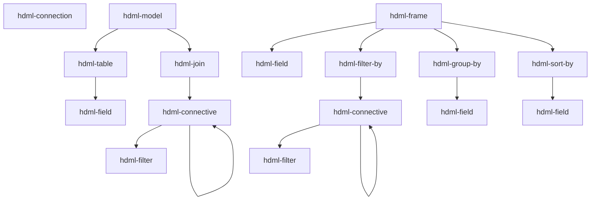

# Components reference

**Scope:** every `hdml-*` custom element this package registers — tag name, role, attributes,
and the typical parent/child it expects. All facts here are pulled from the JSDoc on each
class; treat the class file as source of truth and update it alongside any change here.

Adjacent reading: [docs/architecture.md](architecture.md) for the `hdom-changed` lifecycle ·
[docs/hdio-client.md](hdio-client.md) for `<hdml-io>` (the host element, not listed here
because it is not a `HdomElement`).

## The two families

- **`hdom/`** — declarative HDML; every element extends
  [`HdomElement`](../src/hdom/HdomElement.ts), defines `@property` fields keyed by
  `*_ATTRS_LIST` enums from `@hdml/types`, and renders `<slot></slot>`. The element does **no
  work itself** — it just keeps DOM-attribute state and fires `hdom-changed` on the
  `document`.
- **`hdio/`** — one element (`<hdml-io>`) that observes the document and uploads to HDIO.
  See [docs/hdio-client.md](hdio-client.md).

## Composition rules



A `hdml-frame`'s `source` attribute references another `hdml-model` or `hdml-frame`, either
within the same document or via an HDIO path.

## Elements

### `hdml-connection` — [src/hdom/HdmlConnection.ts](../src/hdom/HdmlConnection.ts)

A named connection to a database. Attribute applicability depends on `type`.

| Attribute | Notes |
|---|---|
| `name` | identifier |
| `description` | free text |
| `type` | one of `postgresql`, `mysql`, `mssql`, `mariadb`, `oracle`, `clickhouse`, `druid`, `ignite`, `redshift`, `bigquery`, `googlesheets`, `elasticsearch`, `mongodb`, `snowflake` |
| `ssl` | boolean string, JDBC-style types |
| `host`, `port`, `user`, `password` | network/auth (subset of types) |
| `project-id` | `bigquery` |
| `credentials-key` | base64 GCP creds JSON (`bigquery`, `googlesheets`) |
| `sheet-id` | `googlesheets` |
| `region`, `access-key`, `secret-key` | `elasticsearch` (AWS) |
| `schema` | `mongodb` |
| `account`, `warehouse`, `database`, `role` | `snowflake` |

See the source JSDoc for which attribute applies to which `type`.

### `hdml-model` — [src/hdom/HdmlModel.ts](../src/hdom/HdmlModel.ts)

Container for an entity-relationship graph (tables joined together).

| Attribute | |
|---|---|
| `name` | identifier |
| `description` | free text |

**Allowed children:** `hdml-table`, `hdml-join`.

### `hdml-table` — [src/hdom/HdmlTable.ts](../src/hdom/HdmlTable.ts)

A physical table, view, materialized view, or SQL query inside a model.

| Attribute | |
|---|---|
| `name` | identifier within the model |
| `type` | `table` or `query` |
| `identifier` | three-tier name (back-quoted) for `type=table`, or SQL for `type=query` |
| `description` | free text |

**Allowed children:** `hdml-field`.

### `hdml-field` — [src/hdom/HdmlField.ts](../src/hdom/HdmlField.ts)

A typed field. Reused inside `hdml-table`, `hdml-frame`, `hdml-group-by`, `hdml-sort-by`.

| Attribute | |
|---|---|
| `name` | identifier in the HDML context |
| `description` | free text |
| `origin` | source-column name (in `hdml-table`) or parent-field name (in `hdml-frame`) |
| `clause` | raw SQL clause; takes precedence over `origin` |
| `type` | `int-8 \| int-16 \| int-32 \| int-64 \| float-16 \| float-32 \| float-64 \| binary \| utf-8 \| decimal \| date \| time \| timestamp` |
| `aggregation` | `none \| count \| countDistinct \| countDistinctApprox \| sum \| avg \| min \| max` |
| `order` | `none \| asc \| desc` (meaningful only inside `hdml-sort-by`) |
| `scale`, `precision` | for `type=decimal` |
| `unit` | `second \| millisecond \| microsecond \| nanosecond` (for `type=time`/`timestamp`) |
| `timezone` | `UTC`, `GMT`, `GMT-12`..`GMT+14` (for `type=timestamp`) |

### `hdml-join` — [src/hdom/HdmlJoin.ts](../src/hdom/HdmlJoin.ts)

A join between two `hdml-table`s within an `hdml-model`.

| Attribute | |
|---|---|
| `type` | `cross \| inner \| full \| left \| right \| full-outer \| left-outer \| right-outer` |
| `left`, `right` | `hdml-table.name` references |
| `description` | free text |

**Allowed children:** an `hdml-connective` (carrying the join condition).

### `hdml-connective` — [src/hdom/HdmlConnective.ts](../src/hdom/HdmlConnective.ts)

Logical operator wrapper. Used under `hdml-join` (join condition) **or** under
`hdml-filter-by` (row filter).

| Attribute | |
|---|---|
| `operator` | `and \| or \| none` |

**Allowed children:** any mix of `hdml-filter` and nested `hdml-connective`.

### `hdml-filter` — [src/hdom/HdmlFilter.ts](../src/hdom/HdmlFilter.ts)

One predicate. Always nested under `hdml-connective`.

| Attribute | Required when |
|---|---|
| `type` | `keys` (joins only — uses `left`/`right`) · `expr` (uses `clause`) · `named` (uses `name`, `field`, `values`) |
| `left`, `right` | `type=keys` — `hdml-field.name` references |
| `clause` | `type=expr` — SQL-like, format depends on whether it's inside `hdml-model > hdml-join` or `hdml-frame > hdml-filter-by` |
| `name` | `type=named` — one of `equals \| not-equals \| contains \| not-contains \| starts-with \| ends-with \| greater \| greater-equal \| less \| less-equal \| is-null \| is-not-null \| between` |
| `field`, `values` | `type=named` |

### `hdml-frame` — [src/hdom/HdmlFrame.ts](../src/hdom/HdmlFrame.ts)

A derived dataset on top of an `hdml-model` or another `hdml-frame`.

| Attribute | |
|---|---|
| `name` | identifier |
| `description` | free text |
| `source` | parent reference. Either an HDIO path with a query — `/path/to/file.hdml?hdml-model=m` — or a same-document reference — `?hdml-frame=f` |
| `offset` | `number` (`SQL OFFSET`) |
| `limit` | `number` (`SQL LIMIT`) |

**Required children:** at least one `hdml-field`. Optional: `hdml-filter-by`,
`hdml-group-by`, `hdml-sort-by`.

`source` is rewritten by [src/hdio/parse.ts](../src/hdio/parse.ts) before serialization —
absolute paths via `sourceToPath`, same-document references via the in-memory mapping.

**Parent field naming.** What the frame sees from its `source` depends on the source kind:

- `source="?hdml-model=m"` (or an external `/path?hdml-model=m`) — the model exposes every
  field as **`"{table-name}_{field-name}"`**. In a multi-table model whose `hdml-table`s are
  `amazon` and `apple`, the parent's `close` columns reach the frame as `amazon_close` and
  `apple_close` — **never** the bare `close`. Reference them by that compound name in
  `origin`, and inside any `clause` SQL. This is true even when the model has only one table.
  The rewrite is done by `@hdml/stringifier` (`getModelSQL`).
- `source="?hdml-frame=f"` (or an external `/path?hdml-frame=f`) — the parent frame exposes
  fields by their declared `name`, with no rewriting.

### `hdml-filter-by` — [src/hdom/HdmlFilterBy.ts](../src/hdom/HdmlFilterBy.ts)

Marker container for row filters inside `hdml-frame`. No attributes.

**Allowed children:** exactly one `hdml-connective` (which wraps the `hdml-filter`s).

### `hdml-group-by` — [src/hdom/HdmlGroupBy.ts](../src/hdom/HdmlGroupBy.ts)

Group rows by one or more fields. No attributes.

**Required children:** ≥1 `hdml-field`.

### `hdml-sort-by` — [src/hdom/HdmlSortBy.ts](../src/hdom/HdmlSortBy.ts)

Sort the frame by one or more fields. No attributes; per-field direction comes from
`hdml-field`'s `order` attribute.

**Required children:** ≥1 `hdml-field`.

## Authoring example

```html
<hdml-connection name="warehouse" type="postgresql"
                 host="db" user="ro" password="${env.DB_PW}" ssl="false">
</hdml-connection>

<hdml-model name="sales">
  <hdml-table name="orders"
              type="table"
              identifier="`warehouse`.`public`.`orders`">
    <hdml-field name="id"     type="int-64"/>
    <hdml-field name="amount" type="decimal" scale="2" precision="12"/>
    <hdml-field name="ts"     type="timestamp" unit="millisecond"/>
  </hdml-table>
</hdml-model>

<hdml-frame name="big-orders" source="?hdml-model=sales" limit="100">
  <hdml-field name="id"/>
  <hdml-field name="amount" aggregation="sum"/>
  <hdml-filter-by>
    <hdml-connective operator="and">
      <hdml-filter type="named" name="greater" field="amount" values="1000"/>
    </hdml-connective>
  </hdml-filter-by>
  <hdml-sort-by>
    <hdml-field name="amount" order="desc"/>
  </hdml-sort-by>
</hdml-frame>

<hdml-io host="https://hdio.example" tenant="acme" token="…"></hdml-io>
```

When the `<hdml-io>` is wired up, this entire subtree is parsed in a Worker and POSTed as
FlatBuffers. See [docs/hdio-client.md](hdio-client.md).

`<hdml-io>` is not an `HdomElement`; its full attribute/protocol reference lives in
[docs/hdio-client.md](hdio-client.md). It takes `host` / `tenant` and one of two auth modes,
selected by the **`mode`** attribute:

| `mode` | Auth flow |
|---|---|
| `token` (default) | The `token` attribute is a single-use **handoff code** redeemed for the access/refresh pair (§3.2). |
| `oidc` | Full-page redirect to the IdP; on return, `?code&state` is exchanged for tokens (§3.3). No `token` needed. |

`mode` is an `<hdml-io>`-local attribute (no `@hdml/types` `*_ATTRS_LIST` enum), so it is
declared directly on the class.
