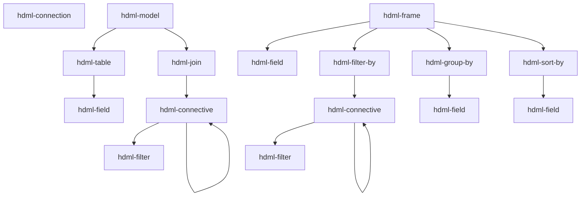

# Components reference

**Scope:** every `hdml-*` custom element this package registers — tag name, role, attributes,
and the typical parent/child it expects. All facts here are pulled from the JSDoc on each
class; treat the class file as source of truth and update it alongside any change here.

Adjacent reading: [docs/architecture.md](architecture.md) for the `hdom-changed` lifecycle ·
[docs/hdio-client.md](hdio-client.md) for `<hdml-io>` (the host element, not listed here
because it is not a `HdqlElement`).

## The three families

- **`hdql/`** — HyperData **Query** Language: declarative HDML data modelling; every element
  extends [`HdqlElement`](../src/hdql/HdqlElement.ts), defines `@property` fields keyed by
  `*_ATTRS_LIST` enums from `@hdml/types`, and renders `<slot></slot>`. The element does **no
  work itself** — it just keeps DOM-attribute state and fires `hdom-changed` on the
  `document`.
- **`hdio/`** — one element (`<hdml-io>`) that observes the document and uploads to HDIO.
  See [docs/hdio-client.md](hdio-client.md).
- **`hdvl/`** — HyperData **Visualisation** Language: the display elements. All **21 tags are
  registered** by the `./hdvl` entry; every element extends
  [`HdvlElement`](../src/hdvl/base.ts) except `hdml-fallback`, takes its tag and attribute keys
  from [`src/hdvl/vocabulary.ts`](../src/hdvl/vocabulary.ts), and **never fires
  `hdom-changed`** — a display element changes no part of the HDML document, so display
  invalidation travels the scheduler path only. Bodies land per slice over RFC 016/001; see
  [Display elements](#display-elements-hdvl) below for what is implemented today.

`hdql` / `hdvl` name **modules**, never tag prefixes — every tag in this package is
`hdml-*` (RFC 016/001 §2.1).

## Composition rules



A `hdml-frame`'s `source` attribute references another `hdml-model` or `hdml-frame`, either
within the same document or via an HDIO path.

## Elements

### `hdml-connection` — [src/hdql/HdmlConnection.ts](../src/hdql/HdmlConnection.ts)

A named connection to a database. Attribute applicability depends on `type`.

| Attribute | Notes |
|---|---|
| `name` | identifier |
| `description` | free text |
| `type` | one of `postgresql`, `mysql`, `mssql`, `mariadb`, `oracle`, `clickhouse`, `druid`, `ignite`, `redshift`, `bigquery`, `googlesheets`, `elasticsearch`, `mongodb`, `snowflake` |
| `ssl` | boolean string, JDBC-style types |
| `host`, `port`, `user`, `password` | network/auth (subset of types) |
| `project-id` | `bigquery` |
| `credentials-key` | base64 GCP creds JSON (`bigquery`, `googlesheets`) |
| `sheet-id` | `googlesheets` |
| `region`, `access-key`, `secret-key` | `elasticsearch` (AWS) |
| `schema` | `mongodb` |
| `account`, `warehouse`, `database`, `role` | `snowflake` |

See the source JSDoc for which attribute applies to which `type`.

### `hdml-model` — [src/hdql/HdmlModel.ts](../src/hdql/HdmlModel.ts)

Container for an entity-relationship graph (tables joined together).

| Attribute | |
|---|---|
| `name` | identifier |
| `description` | free text |

**Allowed children:** `hdml-table`, `hdml-join`.

### `hdml-table` — [src/hdql/HdmlTable.ts](../src/hdql/HdmlTable.ts)

A physical table, view, materialized view, or SQL query inside a model.

| Attribute | |
|---|---|
| `name` | identifier within the model |
| `type` | `table` or `query` |
| `identifier` | three-tier name (back-quoted) for `type=table`, or SQL for `type=query` |
| `description` | free text |

**Allowed children:** `hdml-field`.

### `hdml-field` — [src/hdql/HdmlField.ts](../src/hdql/HdmlField.ts)

A typed field. Reused inside `hdml-table`, `hdml-frame`, `hdml-group-by`, `hdml-sort-by`.

| Attribute | |
|---|---|
| `name` | identifier in the HDML context |
| `description` | free text |
| `origin` | source-column name (in `hdml-table`) or parent-field name (in `hdml-frame`) |
| `clause` | raw SQL clause; takes precedence over `origin` |
| `type` | `int-8 \| int-16 \| int-32 \| int-64 \| float-16 \| float-32 \| float-64 \| binary \| utf-8 \| decimal \| date \| time \| timestamp` |
| `aggregation` | `none \| count \| countDistinct \| countDistinctApprox \| sum \| avg \| min \| max` |
| `order` | `none \| asc \| desc` (meaningful only inside `hdml-sort-by`) |
| `scale`, `precision` | for `type=decimal` |
| `unit` | `second \| millisecond \| microsecond \| nanosecond` (for `type=time`/`timestamp`) |
| `timezone` | `UTC`, `GMT`, `GMT-12`..`GMT+14` (for `type=timestamp`) |

### `hdml-join` — [src/hdql/HdmlJoin.ts](../src/hdql/HdmlJoin.ts)

A join between two `hdml-table`s within an `hdml-model`.

| Attribute | |
|---|---|
| `type` | `cross \| inner \| full \| left \| right \| full-outer \| left-outer \| right-outer` |
| `left`, `right` | `hdml-table.name` references |
| `description` | free text |

**Allowed children:** an `hdml-connective` (carrying the join condition).

### `hdml-connective` — [src/hdql/HdmlConnective.ts](../src/hdql/HdmlConnective.ts)

Logical operator wrapper. Used under `hdml-join` (join condition) **or** under
`hdml-filter-by` (row filter).

| Attribute | |
|---|---|
| `operator` | `and \| or \| none` |

**Allowed children:** any mix of `hdml-filter` and nested `hdml-connective`.

### `hdml-filter` — [src/hdql/HdmlFilter.ts](../src/hdql/HdmlFilter.ts)

One predicate. Always nested under `hdml-connective`.

| Attribute | Required when |
|---|---|
| `type` | `keys` (joins only — uses `left`/`right`) · `expr` (uses `clause`) · `named` (uses `name`, `field`, `values`) |
| `left`, `right` | `type=keys` — `hdml-field.name` references |
| `clause` | `type=expr` — SQL-like, format depends on whether it's inside `hdml-model > hdml-join` or `hdml-frame > hdml-filter-by` |
| `name` | `type=named` — one of `equals \| not-equals \| contains \| not-contains \| starts-with \| ends-with \| greater \| greater-equal \| less \| less-equal \| is-null \| is-not-null \| between` |
| `field`, `values` | `type=named` |

### `hdml-frame` — [src/hdql/HdmlFrame.ts](../src/hdql/HdmlFrame.ts)

A derived dataset on top of an `hdml-model` or another `hdml-frame`.

| Attribute | |
|---|---|
| `name` | identifier |
| `description` | free text |
| `source` | parent reference. Either an HDIO path with a query — `/path/to/file.hdml?hdml-model=m` — or a same-document reference — `?hdml-frame=f` |
| `offset` | `number` (`SQL OFFSET`) |
| `limit` | `number` (`SQL LIMIT`) |

**Required children:** at least one `hdml-field`. Optional: `hdml-filter-by`,
`hdml-group-by`, `hdml-sort-by`.

`source` is rewritten by [src/hdio/parse.ts](../src/hdio/parse.ts) before serialization —
absolute paths via `sourceToPath`, same-document references via the in-memory mapping.

**Parent field naming.** What the frame sees from its `source` depends on the source kind:

- `source="?hdml-model=m"` (or an external `/path?hdml-model=m`) — the model exposes every
  field as **`"{table-name}_{field-name}"`**. In a multi-table model whose `hdml-table`s are
  `amazon` and `apple`, the parent's `close` columns reach the frame as `amazon_close` and
  `apple_close` — **never** the bare `close`. Reference them by that compound name in
  `origin`, and inside any `clause` SQL. This is true even when the model has only one table.
  The rewrite is done by `@hdml/stringifier` (`getModelSQL`).
- `source="?hdml-frame=f"` (or an external `/path?hdml-frame=f`) — the parent frame exposes
  fields by their declared `name`, with no rewriting.

### `hdml-filter-by` — [src/hdql/HdmlFilterBy.ts](../src/hdql/HdmlFilterBy.ts)

Marker container for row filters inside `hdml-frame`. No attributes.

**Allowed children:** exactly one `hdml-connective` (which wraps the `hdml-filter`s).

### `hdml-group-by` — [src/hdql/HdmlGroupBy.ts](../src/hdql/HdmlGroupBy.ts)

Group rows by one or more fields. No attributes.

**Required children:** ≥1 `hdml-field`.

### `hdml-sort-by` — [src/hdql/HdmlSortBy.ts](../src/hdql/HdmlSortBy.ts)

Sort the frame by one or more fields. No attributes; per-field direction comes from
`hdml-field`'s `order` attribute.

**Required children:** ≥1 `hdml-field`.

## Display elements (`hdvl/`)

The display half registers **21 tags**, in seven families
([`HDVL_FAMILIES`](../src/hdvl/vocabulary.ts)): `view`, `plane`, `scale`, `mark`,
`container`, `guide`, `fallback`. **Twenty of them have bodies** as of this commit — the
four structural elements, the three scales, **all six marks**, `hdml-pie`, **four of the
five guides** and **both layout containers** — see
[Registered but inert](#registered-but-inert) for the one that does not.

Two constructed UA stylesheets ([`src/hdvl/ua.ts`](../src/hdvl/ua.ts)) supply every box
default. The **element sheet** is adopted by every HDVL shadow root as one shared instance and
is host-qualified throughout, so a rule written for the view can never reach a mark; the
**document sheet** carries only the two `hdml-fallback` rules, because they are the one thing
that must work on light DOM *before* upgrade. Every default is a `:host` rule, which any
author rule from the outer document beats.

Every display element except the view is `position: absolute; inset: 0` and renders
`<div class="plot"><slot></slot></div>` in its shadow. `.plot` **is** the host's content box,
so a slotted child resolves against its parent's *content* box — which is what makes a
plane's `8px 8px 24px 40px` gutter inset everything below it, and what SPEC §3 means by "a
guide's containing block is its scale". Because every element is positioned with no
`z-index`, **document order is paint order**.

### `hdml-view` — [src/hdvl/view.ts](../src/hdvl/view.ts)

The only display element that owns pixels: it holds the shadow root, the single `<svg>`
surface, and the collapsed `<slot>` that keeps every descendant's box measurable. It sets
`role="img"` on itself at connect (an author `role` is not overwritten), which prunes the
whole subtree — including an unupgraded `hdml-fallback` — from the accessibility tree.

| | |
|---|---|
| **Attributes** | `source` — the default data source for the subtree, nearest-ancestor-wins |
| **Children** | any number of planes, plus at most one `hdml-fallback` |
| **UA box** | `display: block; aspect-ratio: 2 / 1; position: relative` — a 2∶1 graphics box with no CSS at all, so `width: 100%` alone yields a chart rather than a collapsed box |
| **States** | `:state(loading)` from connect, and **derived** from the first frame on — from §3.4's quantifier over the reconciler's desired set. `:state(empty)` is computed from the frame's **mark**-node count and gated on `loading`, so the two can never both be set; `:state(error)` is the validator's and `:state(hover)` the pointer path's |

Its `<svg>` is created in the SVG namespace, sized to the view, and is **the one surface the
whole view paints into** — the SVG renderer diffs against it by `(widget uid, node index)`.
The view also owns the single `ResizeObserver` over itself and every descendant, the
capturing `transitionrun` listener for the UA sentinel, the resolution index, and the
coalescing one-`requestAnimationFrame` MEASURE → COMPUTE → PAINT loop. `invalidate()` marks
the view dirty and requests a frame (`view.dirty` / `view.dirtyCount` / `view.framesRun`
expose the coalescing for assertions).

### `hdml-cartesian-plane` · `hdml-polar-plane` — [plane-cartesian.ts](../src/hdvl/plane-cartesian.ts) · [plane-polar.ts](../src/hdvl/plane-polar.ts)

A **geometric anchor**: a CSS box plus the projection that gives positional channels their
screen meaning. A plane contributes no dimension of its own and emits nothing — the
multidimensional space is built by the scale chain inside it.

| | |
|---|---|
| **Attributes** | `source` |
| **Parent** | `hdml-view` |
| **Children** | scales (and, through them, widgets and guides) |
| **UA box** | `position: absolute; inset: 0; container-type: size`, plus a padding gutter: `8px 8px 24px 40px` cartesian, `8px` polar — the gutter zero-CSS guides spill into |
| **States** | `:state(loading)`, alongside the view |

`container-type: size` is what makes `@container` — not `@media` — the correct selector for
responsive guides: a chart in a 300 px sidebar must respond to the *plane*, not the viewport.
**Both planes supply their own `Projection`** — the seam every mark projects through,
declared in [mark.ts](../src/hdvl/mark.ts) and read duck-typed, so a mark never names a
channel. The whole of the plane-kind difference is the *composition*: the identity pair for
cartesian, `polarPoint` about the pole for polar. Everything else — the chain lookup, the
drop rule, the ordinal test — is shared by `createProjection`, so the two planes cannot
disagree about when a row drops, and **no widget carries a plane branch**. The **pole** is
the centre of the radius-channel scale's content box, or the plane's where no radius scale
exists, read off the MEASURE snapshot and resolved per widget, because the widget's own
chain says which radius scale serves it.

**A pure pie chain has no radius scale, and still has a radial range.** SPEC §3 states the
two together — *"the pole is the box's center and the range is `[0, min(content-width,
content-height) / 2]`; when no radius scale exists (a pure pie chain), the plane's content
box serves"* — so the pole and the ceiling are two readings of **one box**, which is why
`plane-polar.ts` resolves the box and derives both rather than resolving the fallback twice.
The seam is `Projection.span(channel)`: a channel's range in its own unit, the scale's
`range()` where one serves and otherwise **whatever the plane supplies**. A cartesian plane
supplies nothing, so `span("y")` with no y scale is `null` exactly as `scale("y")?.range()`
was; the polar plane supplies the radial default for its **second** channel only, since an
angular range is `--hdml-angle-start`/`-end` on the angle scale and there is nothing to read
without one. Four readers of *"the other channel's range"* — `hdml-arc`'s ceiling,
`hdml-rule`'s span, `hdml-grid`'s crossing extent and `guideAcross` — now ask the plane
instead of the scale, so there is one answer and not four (R12).

*Landed at step 28*, as a **correction**: step 22 implemented §3's fallback for the pole and
not for the range, and no fixture caught it because every polar fixture and every gated
corpus page until then carried a radius scale. The whole of `08-pie-doughnut` and
`12-coverage` B — five figures — painted **nothing at all**: an empty scene, no
`:state(error)`, no diagnostic. It is the failure mode §1.5 exists to name.

### `hdml-fallback` — [src/hdvl/fallback.ts](../src/hdvl/fallback.ts)

Light-DOM flow content shown only while the view is **not upgraded** — "your browser can't
render this chart", or a table of the same numbers. It is **not vocabulary**: it is exempt
from every validator rule, is never slotted, and is never revived.

It is a bare `HTMLElement` with **no shadow root, no adopted stylesheet and no attributes**,
and that is deliberate. The element sheet begins with a generic
`:host { position: absolute; inset: 0 }`; adopting it would absolutely position the author's
flow content in precisely the window this element exists for. Its whole behaviour is two
document-sheet rules and no JavaScript:

```css
hdml-view:not(:defined) > hdml-fallback { display: block }
hdml-view:defined       > hdml-fallback { display: none  }
```

so no script, a failed script, or a pre-upgrade page renders the fallback, and an upgraded one
does not. Registration exists only so tag support can be queried, so an unknown-element
warning stays quiet, and so "at most one fallback" is countable.

### `hdml-continuous-scale` · `hdml-datetime-scale` · `hdml-ordinal-scale`

[scale-continuous.ts](../src/hdvl/scale-continuous.ts) ·
[scale-datetime.ts](../src/hdvl/scale-datetime.ts) ·
[scale-ordinal.ts](../src/hdvl/scale-ordinal.ts), over the shared
[scale.ts](../src/hdvl/scale.ts).

A `domain → range` map. **The tag *is* the kind** — string ↔ ordinal, number ↔ continuous,
datetime ↔ datetime — which is what makes V2 one rule rather than a lookup table, and what
makes discrete-vs-ramp colour the tag you wrote rather than a mode derived from the data.
A scale **emits no group at all**: it resolves a domain and a range for the widgets below it
and paints nothing itself.

| | |
|---|---|
| **Shared attributes** | `channel` (**mandatory**), `min`, `max`, `values`, `reverse`, `source` |
| **Continuous only** | `type=linear\|log\|sqrt\|pow\|symlog`, `base`, `exponent`, `constant`, `nice`, `zero`, `clamp` |
| **Datetime only** | `zone=utc\|local\|<IANA>`, `nice`, `clamp` |
| **Ordinal only** | `sort=domain\|ascending\|descending` |
| **Parent** | a plane, or another scale |
| **Children** | scales **xor** widgets — never both (V13) |

**Domain sources.** `values` uses the same first-character grammar as a channel binding: a
bare identifier is a **column** of the effective `source`, a `[` is a **literal array**. A
column opens an ordinary `raw: false` subscription on the `values` slot, so a scale is an
ordinary data subscriber and a scale and a mark binding the same column coalesce into one
query. A literal opens **no subscription at all**, which is what keeps a literal-only page
out of `:state(loading)`. `min` / `max` override their endpoint **per endpoint**, so
`min="0"` beside a derived ceiling is legal and common. There is no third rule and no
widget-union fallback; an endpoint with no source is **V8**, an error naming the channel and
both fixes.

A legal source that **returns nothing** — a zero-row column — is a different thing entirely:
the domain is *unresolved but legal*, `domain()` is `null`, the scale paints nothing and the
view goes to `:state(empty)`. It is never a diagnostic.

**Modifiers, and which kind each is meaningful on** (a modifier on the wrong kind is **V18**):

| Modifier | Kinds | Effect |
|---|---|---|
| `zero` | continuous | extends a **derived** endpoint to include 0 |
| `nice` | continuous, datetime | moves **derived** endpoints out to the next tick-step multiple; the optional value is its own target count, bare `nice` = 10 |
| `clamp` | continuous, datetime | out-of-domain values project to the range **edge** |
| `sort` | ordinal | `domain` keeps first-occurrence row order; `ascending`/`descending` by code point |
| `reverse` | **any** | reverses the range mapping; the domain is untouched |

Resolution order is fixed at **domain → `zero` → `nice`**: `zero` may create the endpoint
`nice` then rounds, never the reverse. `nice` moves derived endpoints **only**, so on a fully
authored domain it is a no-op rather than an error (V15) — and it is computed from the domain
and its own count, never from pixels, so a resize cannot move the data.

**`nice` rounds to the scale's own ladder**, not to the linear one. SPEC §6 names only the
datetime case (*"the step comes from the calendar ladder"*); the same rule is applied to every
kind, decided under D1 at step 25:

| Scale | `nice` rounds to |
|---|---|
| ordinal | — (V18: `nice` is continuous/datetime only) |
| continuous `linear`, `pow`, `sqrt` | the `{1, 2, 5} × 10ⁿ` ladder. §4.8's pow ladder **is** the numeric ladder in value space, so `sqrt` needs no rule of its own |
| continuous `log` | the enclosing **power of the base** — `[12.5, 1250]` → `[10, 10000]` |
| continuous `symlog` | per endpoint: the numeric ladder inside the linear region `abs(v) ≤ C`, the power of the base outside it |
| datetime | the calendar ladder (month/year boundaries) |

The log row is not cosmetic. Running the linear ladder on a log domain widens `[12.5, 1250]`
to `[0, 1400]`, and a log domain that touches zero is a **V2 error** that projects nothing —
so an opt-in `nice` could turn a legal page into a blank figure. `nice` never invents a legal
domain either: a `log` endpoint that is already zero or negative is left exactly where it is,
so V2 still reports it.

**Ranges come from boxes** — each scale's own **content box**, so its padding insets only its
own range:

| Channel | Range | Direction |
|---|---|---|
| `x` | `[contentLeft, contentRight]` | left → right |
| `y` | `[contentBottom, contentTop]` | bottom → top, so **descending** in view coordinates |
| `radius` | `[0, min(contentW, contentH) / 2]` | pole outward |
| `angle` | `--hdml-angle-start` → `--hdml-angle-end`, in degrees | clockwise from 12 o'clock |
| `size` | `--hdml-size-min` → `--hdml-size-max`, in CSS px | — |
| `color` | **none** — `paint()` instead | — |

**`paint()`** is `color`-only and `range()` is `null` there; both are contracts, not
omissions. An ordinal colour scale assigns domain slot *k* the *k*-th `--hdml-palette` entry
and returns `null` once the palette is exhausted — two series sharing a colour is a silent
wrong chart, where `null` is visible. A continuous one interpolates `--hdml-color-interpolate`
in `--hdml-color-interpolate-space` via `color-mix()`, so the mark ramp and the legend's ramp
bar are the same computed gradient because both call the same `paint()`.

Each scale dispatches **`hdml-scale-change`** `{channel, domain, range}` when its resolved
pair changes — a new delivery, a modifier re-resolving, or **its box resizing**.

### `hdml-line` · `hdml-rule` — [mark-line.ts](../src/hdvl/mark-line.ts) · [mark-rule.ts](../src/hdvl/mark-rule.ts)

The first two marks. Both are row-wise pure — mark *i* = f(row *i*, scales) — and both
project through their plane's `Projection` rather than through `x` and `y`, so the polar
plane reaches them without either file changing. **Measured at step 26**: `hdml-line`,
`hdml-area` and `hdml-point` all paint under a polar plane with a **zero-line** diff, which is
H7 discharged rather than asserted — the fixtures are in
[`mark-polar.test.ts`](../src/hdvl/mark-polar.test.ts).

| | |
|---|---|
| **`hdml-line` attributes** | `x`, `y`, `angle`, `radius`, `color`, `closed`, `source` |
| **`hdml-rule` attributes** | `x`, `y`, `source` — **no visual channel** |
| **Parent** | a chain-tip scale (or, later, a container) |
| **Children** | none |
| **UA box** | `position: absolute; inset: 0; overflow: hidden` — the `overflow` *is* SPEC §6's clip-to-the-plot-area rule, so an author rule beats it |

**`closed` is `hdml-line`'s polar radar loop** (SPEC §7: *"+ `closed` for radar loops"*). It
is a boolean attribute — presence, not value — and it sets the `path` node's `closed` flag,
which the SVG renderer turns into a `Z` per subpath: the loop costs **no extra vertex**, so
hit resolution still sees one vertex per row. It is scoped to the plane's **channels**, not
its kind: under a cartesian plane the attribute is **inert** and the emitted node is
byte-identical to one written without it, because SPEC grants the loop to the polar form and
a cartesian line is not a radar. It is not a diagnostic; no V-rule covers it.

**`hdml-area`'s `closed` is the same predicate with a different consequence** (SPEC §7,
amended 2026-08-24). Every region that element emits is *already* a closed outline, so on a
cartesian plane the attribute is **inert** and the node is byte-identical without it. Under a
polar plane it is not: that outline runs the upper edge from the first category to the last,
cuts in to the lower edge and runs back, so it closes **through the pole** and leaves a
wedge-shaped notch between the last category and the first. `closed` therefore makes the
region **two subpaths** — an outer ring and an inner one — instead of one joined outline.
They are already counter-wound, because the lower edge is emitted reversed, so the default
`nonzero` fill rule fills the annulus and leaves the hole empty: **no fill rule is authored,
none is added to the scene contract, and the renderer is untouched.** A band whose inner edge
is `r0="0"` degenerates to a ring of coincident poles, encloses nothing, and fills to the
centre. See [decisions.md](decisions.md).

`hdml-line` emits **one** stroked `path` for the whole series, `fill: null`, curved by
`--hdml-curve-type`. Its node's `i` is therefore `-1` — a node built from every row has no
single source row — and row identity lives in its `vertices`, which is also what hit
resolution reads. `hdml-rule` emits **one path per row**, each carrying a real `i` and
spanning the *other* channel's `range()` end to end; a rule therefore needs an ancestor
scale for the channel it did **not** bind, and V1 says so with its usual message.

A `null`, a non-finite, or a value outside an ordinal domain means the row produces **no
mark**. A path *breaks* — a new subpath, a visible gap, never bridged, because each run is
curved independently — and a discrete mark is simply omitted. Missing renders as *absent*,
never as zero. An out-of-domain ordinal value prints one console notice naming it; if
*every* row drops, the **scale** errors.

A continuous value outside the domain **projects truthfully** and is clipped by the box,
never clamped into it. A bound `color` channel wins over the sheet.

### `hdml-area` · `hdml-bar` — [mark-area.ts](../src/hdvl/mark-area.ts) · [mark-bar.ts](../src/hdvl/mark-bar.ts)

The **ranged** marks. Both are written against the ranged form as the primitive and resolve
the simple form into it before any geometry exists, so `y="v"` and `y0="0" y1="v"` produce
byte-identical scenes and a layout container can supply a per-row baseline without either
file changing.

| | |
|---|---|
| **`hdml-area` attributes** | `x`, `x0`, `x1`, `y`, `y0`, `y1`, `angle`, `radius`, `r0`, `r1`, `color`, `closed`, `hidden`, `source` |
| **`hdml-bar` attributes** | `x`, `x0`, `x1`, `y`, `y0`, `y1`, `color`, `hidden`, `source` — **cartesian only**, by design |
| **Parent** | a chain-tip scale (or, later, a container) |
| **Children** | none |
| **UA box** | as the other marks |

**`y` is sugar for `y0="0"`** (polar `radius` for `r0="0"`), and the sugar is expressed as a
synthetic **scalar** binding — the same object shape the literal `y0="0"` produces — so
nothing below the resolver can tell which form the author wrote. There is no
`if (y0 !== null)` branch anywhere in either element.

`hdml-area` emits **one filled `path`** for the whole series, `i: -1`, with row identity in
its per-vertex `i`. Each contiguous stretch of rows is one **closed** subpath: the upper edge
forward, a line across, then the lower edge **reversed** — or, under `closed` on a polar
plane, **two** subpaths and no cap at all (above). What the attribute changes is how many
subpaths a region has, never the node's `closed` flag, which is always `true`. The lower edge is reversed *before*
it is curved, not after — a curve fitted to a reversed point list is not the reverse of the
curve fitted to the forward one, because `natural`'s solve is global over its run and
`bezier` picks its tangents per segment. A gap breaks **both** edges at the same row, and a
stretch of fewer than two rows yields no region at all.

`hdml-bar` emits **one `rect` per row**, each with a real `i`, and its **orientation is
derived, never authored** — the band-filling side is whichever channel resolves an *ordinal*
scale, so `x="cat" y="n"` stands the bars up and `x="n" y="cat"` lays them down from the same
markup. There is no orientation attribute and there must not be one. With no ordinal scale in
scope there is no band, and it paints nothing rather than inventing a width.

**`hdml-bar` is one of the two widgets that read `bandOf().width`** — `hdml-arc`'s
ordinal-angle slice is the other (step 26). It *spans* the band, centred by construction;
every other lookup — an area's vertex included — resolves to `centre`, and nothing ever
resolves to a band edge. A row whose two ends are equal is a real
datum and gets a **zero-extent** rect; missing is still *absent, never zero*.

**A rect's `w` is not a copy of `bandOf().width`.** It projects the band's two edges —
`start` and `start + width` — through `Projection.point` and takes their difference, which
is what lets one implementation serve both planes and both orientations. The consequence is
arithmetic, and step 30's corpus gate is where it first mattered: on a band whose edges are
not dyadic rationals, `(start + width) − start` differs from `width` in the last ulps, so a
test may assert the **low** edge with `strictEqual` and must assert the far one within rule
3's tolerance. `04-grouped-stacked` — `W = 544`, twelve categories, `--hdml-bandwidth: 0.75`
— has no exact edge but `start`.

Both are **filled**, so a bound `color` wins over `--hdml-fill-color` and over its `_hover`
variant, and neither also strokes: `strokeWidth` is `0` and `stroke` is `null`. A **varying**
`color` — a column or a literal array — is an **error** on `hdml-area` and `hdml-line`, whose
single `path` node carries a single paint; it is legal on `hdml-bar`, which resolves a colour
per row and emits a node per row. See [decisions.md](decisions.md).

### `hdml-point` · `hdml-arc` — [mark-point.ts](../src/hdvl/mark-point.ts) · [mark-arc.ts](../src/hdvl/mark-arc.ts)

The **discrete** marks — one node per row, each carrying its own source row index. With them
every mark in the vocabulary paints.

| | |
|---|---|
| **`hdml-point` attributes** | `x`, `y`, `angle`, `radius`, `color`, `size`, `source` — the only tag that publishes `size` |
| **`hdml-arc` attributes** | `a0`, `a1`, `angle`, `radius`, `r0`, `r1`, `color`, `source` — **polar only**, by design, the mirror of `hdml-bar` |
| **Parent** | a chain-tip scale (or, later, a container) |
| **Children** | none |
| **UA box** | as the other marks |

`hdml-point` emits **one `ellipse` per row**, or one `rect` under `--hdml-tick-style: rect`,
both centred on the projected point and sharing one extent — so switching the property moves
nothing. **The registered initial is `rect`**, not `ellipse`: every corpus page that wants
dots says `--hdml-tick-style: ellipse` explicitly.

The extent comes from `--hdml-tick-width`/`-height`, or from the `size` channel when bound,
and **both forms are diameters** — an `ellipse` takes half of each. A bound `size` supplies
*both* extents, so the glyph is a circle and the two tick properties are ignored: the channel
is one number and there is no second one to keep an aspect ratio against. The ramp is the
**scale's** — `--hdml-size-min`/`-max` are the `size` channel's *range*, read once in
[scale.ts](../src/hdvl/scale.ts) from the size scale's own box — so the widget calls
`project()` and interpolates nothing, and a value past the domain projects past
`--hdml-size-max` rather than clamping.

`hdml-arc` emits **one parameterised `arc` per row** — `{cx, cy, r0, r1, a0, a1}`, never a
pre-serialized path: the annulus and the 360° two-command case are the renderer's business,
and parameters hit-test and clip more simply. Angles are **degrees**, `0` at 12 o'clock,
increasing clockwise, so `a0`/`a1` come straight off the projection with no conversion.

Its three radial cases are not one rule: `r0` **and** `r1` bound is the author's on both
edges; `radius` bound is sugar for `r1` with a synthetic lower edge, mirroring the area's `y`
sugar; **nothing bound is the full radius range**, which the ranged resolver cannot express
because `null` is exactly what it returns for an unbound channel — and that third case is what
makes the pure `a0`/`a1` form interchangeable with `hdml-pie`. `--hdml-inner-radius` supplies
the **synthetic** `r0` only: an authored `r0` may legally paint inside the hole, because
authored data is sacred. A percentage in it resolves against the radial ceiling; a length is
already px.

**Its second angle form is `angle` on an *ordinal* scale** (SPEC §7), and a slice is §4.4's
**band**: `a0 = bandOf().start`, `a1 = start + width`. So an arc fills its band exactly as a
bar does, `--hdml-bandwidth` is what controls the gap between slices, and a solid Nightingale
rose is one `--hdml-bandwidth: 1` declaration on the angle scale. The band comes from
`Scale.bandOf` and never from a `360 / n` of the arc's own: the angular range is
`--hdml-angle-start`/`-end` and need be neither a full turn nor ascending, and §4.4's
denominator is `n − 1 + b`. *(Decided 2026-08-24, with the user, at step 26 — see
[decisions.md](decisions.md).)* The three radial cases above are unchanged under it.

Both marks are **filled** and neither strokes, and both carry a **per-row `color`** honestly,
which is why the varying-`color` error is the two path widgets' alone.

**`hdml-arc`'s geometry is a free function, and `hdml-pie` is its second caller.** `scene()`
on both tags is one call to `sectorScene`, which owns everything from the pole down — §5's N,
§4.7's drop and its notice, the three radial cases, `--hdml-inner-radius`, the node and
§3.4.1's `empty`. The only thing the two tags differ in is the **angle form** each supplies:
the arc's ranged pair or ordinal band, the pie's derived prefix sum. There is exactly one
`k: "arc"` node literal in the project, and that is why.

### `hdml-axis` · `hdml-grid` — [guide-axis.ts](../src/hdvl/guide-axis.ts) · [guide-grid.ts](../src/hdvl/guide-grid.ts)

The first two of the five guides. A guide takes **no `source`**, binds no columns and
implements no `Binder`: it is a function of the resolved scale, its own box and its computed
style. Its one input from the document is `channel`, and a channel with no scale in scope is
already V1's error — the same condition the geometry sees as "nothing to span".

| | |
|---|---|
| **`hdml-axis` attributes** | `channel` — **and nothing else**. §6.5 is explicit that it takes no `count`/`step`/`values`, and `AXIS_ATTRS_LIST` has one member, so the whole-range span is not a default that could be argued down |
| **`hdml-grid` attributes** | `channel`, `count`, `step`, `values` |
| **Parent** | a scale (its containing block, so CSS placement resolves against the plot area) |
| **Emits** | axis: one stroked `path` over the whole range. grid: one `path` per tick, across the plane |
| **Group role** | `guide` — never `mark`, which is what keeps `:state(empty)` a statement about data |

**What an axis spans is the scale's `range()`, not its own box** — §4.3 gives a positional
scale a range taken from *that scale's* content box, the same rule `hdml-rule` follows.
**Where it sits across that span is its own box**: the edge nearest the scale, derived from
the two measured boxes by [guide-spec.ts](../src/hdvl/guide-spec.ts). Below the plot that is
the top edge; above it, the bottom one. Nothing is authored — SPEC §7 gives the tag no
`position` attribute — so moving the guide with one CSS rule moves the line with it.
`hdml-label` reuses the identical derivation for its anchor and baseline.

**A grid's positions come from `scale.ticks(spec)` and are never re-derived.** §4.8's ladders
have one implementation and `kernel/` owns it, so a grid and a label written with the same
`step=` land on the same pixels because there is one generator, not because two agree. The
three attributes are *modes*, not options — `step=` states the interval exactly and invokes
no tick algorithm — and a guide **forwards** all three rather than resolving between them:
`Scale.ticks` tests `values`, then `step`, then `count`, and that is the whole of the
precedence. Writing two of them is V16's error, live since step 24. An attribute present but empty
reads as absent. On an **ordinal** scale a grid lands on band **centres**, never edges.

`step=`'s multiples are generated over an **integer index range**, and where the step has an
integer reciprocal (`0.05`, `0.2`, `0.001` — nearly every one an author writes) as `i /
divisor`, exactly as §4.8's own ladder is. That is not tidiness: `0.35 / 0.05` is
`6.999999999999999`, so the obvious `ceil(lo / step) … floor(hi / step)` **drops a domain's
last tick** — the top gridline and the top label, with no diagnostic. Found at step 25 on
`05-scatter`, the first page in the project to run a `step=` guide over a domain it did not
choose itself.

A guide node carries `i: -1` and **no vertices**: `i` is a source row index and `vertices`
are projected *data* vertices, and a guide has neither. Hit resolution therefore never
resolves to a guide, which is correct — it implements no `datumAt` and could answer nothing.

#### Under a polar plane (§6.5, SPEC §9)

**All four guides paint under both planes, through one code path.** `guide-spec.ts` used to
carry a `readonly [Channel, Channel]` naming `x`/`y` and refuse every other plane outright;
step 27 **deleted it**. A guide now asks the plane's `Projection` what it composes, exactly
as a mark does, and each element reads the answer back as two facts — *is my own channel this
plane's first* and *is there a pole* — so no guide element names a channel at all.

| Guide | On the plane's first (angular) channel | On its second (radial) channel |
|---|---|---|
| `hdml-axis` | a **ring**: one `arc` node at the radial ceiling, spanning the whole turn | a **spoke**: the same straight `path` a cartesian axis draws |
| `hdml-grid` | a **spoke per tick** — the unchanged straight branch | `--hdml-grid-shape`: a **ring per tick** (`circle`) or a **closed polygon per tick** (`polygon`) |
| `hdml-tick` | a glyph on the projected point — **no change to the element at all** | the same |
| `hdml-label` | a run on the projected point, placement derived per tick | the same |

**An angular axis is a ring because a turn's two ends are the same point** — the straight
span every other case draws would degenerate to nothing. It is an `arc` node and not a
`path`, for the reason arcs exist at all: `Segment` carries lines and cubics, so a circle
spelled as a path would be an approximation of one. Its `r0 === r1` — a zero-thickness
annulus, which is what a stroked ring is, and honest in a way `r0: 0` would not be (that
spells *a filled disc* and merely happens to stroke the same outline over a full turn).
`--hdml-grid-shape: circle` emits the identical node at each tick's radius, so a ring has one
implementation and not two.

**`--hdml-grid-shape: polygon` walks the ANGLE SCALE's positions**, and *the scale's* is
load-bearing: `10-radar` writes `hdml-grid channel="radius" count="5"` over six categories,
so a polygon built from the grid's own spec would have five sides. The vertices are
`ticks({})` on the other channel — the whole ordinal domain, since §4.8's thinning returns it
for an empty spec — which is why a radar's rings meet its spokes: one generator, not two that
agree. The property is only ever consulted on a radial guide under a pole, so a cartesian
`hdml-grid` cannot be talked into a circle.

**Where a polar guide sits across its channel is the other channel's range, not its box.**
Under a cartesian plane a guide's `across` is a **view coordinate**, and the UA sheet gives x
and y guides gutter boxes, so its own measured box *is* the author's statement (see
`guideEdge`, above). Under a polar plane the other channel's range is in **degrees or a
radius** and no box edge is a value in either — and a polar guide's box is the plane's
(`inset: 0`) anyway, so there would be nothing to read. The one honest source left is that
range's **far end**: the rim for a guide repeating around it, the end of the turn for one
repeating outward. On the full turn every corpus polar page **but one** writes, `360deg`
**is** `0deg`, so a radial guide lands on the twelve-o'clock spoke. `12-coverage` B is the
exception — a gauge sweeping `-120deg` to `120deg` — and its angular guide lands on the
radial range's far end, the rim, which is the same rule read on the other channel.

**UA placement (SPEC §3).** An x-channel `hdml-axis` / `hdml-tick` / `hdml-label` is placed
just below the plot (`top: 100%`), a y-channel one just left of it (`right: 100%`), each
spilling into the plane's gutter — which is what the gutter is for, and why the two take
their extent (`24px` high, `40px` wide) from the very numbers that set the plane's padding.
`hdml-grid` needs **no rule of its own**: the generic `:host` box rule is already `inset: 0`,
which is SPEC §3's grid row verbatim. Each placement rule **resets the opposite offset
explicitly** (`bottom: auto`, `left: auto`); without that, `inset: 0` would leave the far
offset in force and over-constrain the box to zero extent — a guide that renders, measures
nothing, and reports no error. Every rule is `:host(<tag>[channel="…"])`, so it is
host-qualified per tag *and* per channel, and any author rule from the outer document beats
it.

### `hdml-tick` · `hdml-label` — [guide-tick.ts](../src/hdvl/guide-tick.ts) · [guide-label.ts](../src/hdvl/guide-label.ts)

The other two positional guides, and everything the section above says about a guide holds
here: no `source`, no columns, no `Binder`, `role: "guide"`, `i: -1` and no vertices, the
same UA placement, and — since step 27 — the same behaviour under both planes.

| | |
|---|---|
| **`hdml-tick` attributes** | `channel`, `count`, `step`, `values` |
| **`hdml-label` attributes** | `channel`, `count`, `step`, `values`, `format` |
| **Parent** | a scale |
| **Emits** | tick: one `rect` or `ellipse` per tick. label: one `text` per tick |

**They are separate elements on purpose, and SPEC §7 says why.** The PoC made `text` a third
`--hdml-tick-style` value beside `rect`/`ellipse`. Swapping `rect`→`ellipse` changes how a
division *looks*; swapping →`text` changes *what the reader is told* — the data/style line —
and text falls on the data side. Two consequences the implementation owes:

- **Their densities are independent.** `hdml-tick count="12"` beside `hdml-label count="6"`
  — mark every month, label every other — is the corpus idiom, and each element reads its
  own spec with no coupling to the other.
- **`format` is content, not presentation**, which is why it is an attribute rather than a
  property, and why V14 exists.

**A tick's extent is a DIAMETER in both forms.** `--hdml-tick-width` / `-height` size the
glyph, `--hdml-tick-style` shapes it (registered initial `rect`, not `ellipse`), and an
`ellipse` takes **half** of each — reading a width as a radius draws every glyph at twice
its declared size and no scene assertion catches it, so the test asserts against the
*computed property*. Both forms are centred on the same point, so switching the property
moves nothing. It is **filled**, so `--hdml-fill-color` is its property; that initial is
`currentColor`, so an unstyled tick paints in the inherited text colour.

**Where a tick's `decorative: true` lives.** §6.5 calls a tick glyph decoration and §5.10
gives decoration an `aria-hidden` floor — but §2.5 puts `decorative` on the `text` node
**alone**, and a `rect` has no such field. That is not an omission: `decorative` exists on
`text` because text is the one node kind that would otherwise be exposed *and* selectable, so
the tick/label distinction has to be written down there and nowhere else. A tick's
decorative-ness is carried by **the node kind it emits** — it emits no `text`, `hdml-view` is
`role="img"` (which prunes the whole SVG subtree), and a bare SVG shape contributes nothing
to the accessibility tree anyway. The invariant is asserted directly: nothing `hdml-tick`
paints is a `text` node.

**A label's anchor and baseline are DERIVED, never authored.** SPEC §7 gives the tag no
`position` attribute, so §6.5's *"which edge of its own box the scale's axis runs along"* is
computed rather than declared. **One predicate covers both planes: the per-axis sign of the
outward normal** — the direction the glyphs hang away from the plot. The plane supplies the
normal and `guidePlacement` reads its two components; a component pointing at higher
coordinates runs the text on (`start` across x, `top` down y), one pointing at lower
coordinates runs it back (`end`, `bottom`), and a component pointing along neither leaves the
run **centred** on its tick.

Under a plane composing in **view space** the normal is constant and axis-aligned — `(0, ±1)`
for a guide on the plane's first channel, `(±1, 0)` for one on its second, its sign taken
from `guideEdge`'s near edge against the scale box's centre. **That single zero component is
why §6.5's four cartesian rows each carry a `middle`.** Under a plane composing **about a
pole** the normal is radial — the point itself, less the pole — so it turns with the ring and
the placement is resolved per tick rather than once for the set. That is the whole difference
between the two.

| Guide | Sits | Normal | `anchor` | `baseline` |
|---|---|---|---|---|
| x-channel | below the plot | `(0, +)` | `middle` | `top` |
| x-channel | above the plot | `(0, −)` | `middle` | `bottom` |
| y-channel | left of the plot | `(−, 0)` | `end` | `middle` |
| y-channel | right of the plot | `(+, 0)` | `start` | `middle` |
| polar, any channel | at 12 o'clock | `(0, −)` | `middle` | `bottom` |
| polar, any channel | at 3 o'clock | `(+, 0)` | `start` | `middle` |
| polar, any channel | at 4:30 | `(+, +)` | `start` | `top` |

The deadband is **relative to the normal's own magnitude** (`1e-6` of it), because the polar
normal is a radius long and the cartesian one is a unit vector: `cos(π / 2)` is `6.1e-17`, so
a three-o'clock tick's vertical component is fifteen orders of magnitude under the threshold
while the smallest angle an author can distinguish is nine orders over it. A tick **on** the
pole has no direction at all and resolves to `middle`/`middle` — the truthful answer rather
than a guarded one.

**A label does not call `measureText`.** The `text` node carries `anchor` and `baseline` and
the renderer does the placing, so a measured width buys it nothing. What needs the §5.3 seam
is *flow* — `hdml-legend` lays a swatch and its name out sequentially — and collision or
overflow handling on a dense axis, neither of which §6.5 asks for.

#### Formatting a label set (§4.9, SPEC §7)

`format` carries a **CLDR skeleton** ([UTS #35](https://unicode.org/reports/tr35/)) — a
*number* skeleton on continuous channels, a *date-field* skeleton on datetime ones. It exists
only on `hdml-label` and `hdml-legend`; nothing else has text to format. The **locale**
resolves from the nearest `lang` — read at the **view**, so a label and the scale it labels
always agree; there is no `locale` attribute and no implicit engine state.

Three cases, and each has exactly one implementation:

| Resolved scale | What is rendered |
|---|---|
| **ordinal** | the domain strings, **verbatim** — there is nothing to format, and a `format` here is **V14**'s error |
| **datetime** | per value, **in the scale's `timeZone`** — a `MMM` label over a zone-sensitive instant is a different month in `UTC` than in `America/New_York` |
| **continuous** | the whole set at once, through `formatCompactSet` |

**The shared compact prefix is a property of the label *set*, not of the format string.** An
axis reads `0.9M, 1.2M, 1.5M`, never `900K, 1.2M, 1.5M`: one compact part is derived from the
largest-magnitude value and applied to every value, which is why `kernel/format-skeleton.ts`
exposes a set function and **no per-value compact entry point**. That function is *total* — a
skeleton with no compact stem formats value by value, and one that maps to no option bag
(including the empty string a label with no `format` carries) falls through to the locale's
default — so the continuous branch calls it unconditionally.

### `hdml-pie` — [layout-pie.ts](../src/hdvl/layout-pie.ts)

The **one cross-row layout widget**, and a **mark**, not a container: a container "is not a
painter", and a pie paints. §6.3 makes it *"the same, with one cross-row `derive()` in data
space before projection"*, and the implementation is exactly that sentence — it hands its own
angle form to `hdml-arc`'s `sectorScene` and inherits the pole, the three radial cases,
`--hdml-inner-radius`, §4.7's drop and the `arc` node unchanged. **SPEC's claim that 08-A's
pie and 08-C's `hdml-arc a0/a1` over the same numbers are interchangeable is therefore a
property of the code, not a promise about it**, and the test asserts the two scenes agree
node for node.

| | |
|---|---|
| **Attributes** | `angle` (required, V19), `color` (optional), `source` |
| **Parent** | a tip scale, inside a polar plane |
| **Emits** | one `arc` per row, exactly as `hdml-arc` |
| **Group role** | `mark` — its slices count for `:state(empty)` |

Its derive, in full:

```
total = Σ non-null, non-negative values
  any value < 0  → V7 error (unit: the pie)
  null           → excluded from the total, no slice
  total === 0    → :state(empty), no slices
a0ₖ = (Σ_{j<k} vⱼ) / total       a1ₖ = a0ₖ + vₖ / total
```

- **It normalises to FRACTIONS**, so its angle scale is always `min="0" max="1"` — authored
  by the page, never derived. That is what makes the pure `a0`/`a1` form take the same domain.
- **`a1ₖ` is computed as `acc / total`, not `a0ₖ + vₖ / total`.** Algebraically identical, and
  only the first closes the circle: `acc` after the last row is the same sum, accumulated in
  the same order, that `total` is, so the final `a1` is **exactly** the angular range's end.
  Summing the quotients instead leaves a hairline the renderer draws.
- **A `null` costs nothing and takes nothing** — no slice and no term — so the slice after it
  starts where the slice before it ended and the remaining slices still close the turn.
- **Row order is slice order, and nothing sorts.** The duty to pin it attaches to the
  **frame** (`hdml-sort-by`) and is **V7**'s, reported where the validator can see the frame.
- **It publishes no radial attribute at all**, so its radial extent is always the arc's third
  case: the full range, floored by `--hdml-inner-radius`. 08-B declares that on the widget and
  08-D on the plane; the property inherits and the widget reads it, so the two are the same
  geometry.
- **§12 duty 4**: the prefix sum allocates its own array. A delivered column is a view over a
  buffer the worker still owns, and it is read and never written.

## Layout containers

A layout container **relates an ordered set of sibling marks** (SPEC §7). It sits at a
chain tip exactly as a widget does, occupies a real inspectable box, emits **no scene group
of its own**, and is the **error unit** for everything below it — an invalid child
invalidates the whole container (§1.5, §3.5), which is why `resolve.ts` gives every
descendant the *outermost* container as its `unit`.

The division of labour is fixed and is what makes the model hold: the **container** carries
the relation, its parameters and the **shared independent channel**; the **child tag**
carries the geometry kind; child **attributes** carry the series column and identity; CSS
styles. Grouped ↔ stacked is the container's tag name, children untouched.

**Both containers re-parameterise ordinary marks and neither changes one.** The two seams
live in [`container.ts`](../src/hdvl/container.ts), which a container writes during COMPUTE
and two readers consult:

| Seam | Written by | Read by | What it changes |
|---|---|---|---|
| the **ranged override** | `hdml-stack` (and both containers' shared-channel hoist) | `mark.ts`'s `rangedValuesOf`, before it reads attributes | a child's `(low, high)` pair for one channel |
| the **band slot** | `hdml-cluster` | `scale.ts`'s `chainScaleOf` | the *scale* a clustered widget resolves — §4.4's band taken inside the outer one |

The ordering is the whole synchronisation mechanism and it is a property of the walk, not a
new phase: `resolve.ts` lists a view's elements in document order and `schedule.ts` walks
that list, so a container's `scene(ctx)` has always run before the children that read what
it wrote. Entries are keyed by the **child** and fenced by `owner === child.parentElement`,
so a child moved out of its container stops reading one on the next frame without anything
having to clear it.

**`hidden` is the platform's.** SPEC §7 gives every widget a `hidden` attribute meaning
*"withheld from painting; its container re-derives without it"*. Since step 29 that is
`HTMLElement.hidden` — the same attribute, with the platform's own layout and accessibility
consequences — read once, in `subscribe.ts`'s `paintSuppressed`, so every widget honours it
and no widget spells it. The class field behind the observed attribute is still named
`hiddenAttr`, because a `null | string` field named `hidden` would shadow the boolean IDL
property and not type-check. See [decisions.md](decisions.md).

### `hdml-stack` — [src/hdvl/container-stack.ts](../src/hdvl/container-stack.ts)

Supplies each child's **baseline**, so band *k*'s top **is** band *k+1*'s baseline.

| | |
|---|---|
| **Attributes** | `x` / `y` — the shared independent channel (V6); `offset`; `hidden`; `source` |
| **Children** | all-`hdml-bar` **or** all-`hdml-area` — one tag per stack (V17) |
| **Scene group** | none — `scene(ctx)` derives and returns `null` |
| **Requires** | a **continuous** dependent-channel scale and a **cartesian** plane (V17) |

Its derive, in full, over the **rendered** children in DOM order:

```
y0ₖ[i] = Σ_{j<k} (yⱼ[i] ?? 0)        k = child index, bottom-up = DOM order
y1ₖ[i] = yₖ[i] === null ? absent : y0ₖ[i] + yₖ[i]
offset="normalize" → both ÷ Σ_all (yⱼ[i] ?? 0);  a zero total → no bands for row i
```

- **The children are ordinary ranged marks** (H8). §6.4 makes the ranged form the primitive
  a container *compiles into*, so child *k* renders as a plain ranged mark from `y0ₖ` to
  `y0ₖ + yₖ`. `mark-bar.ts` gained **not one line** at the step that landed this.
- **A `null` contributes 0 and renders nothing** — child *k* drops row *i* while the
  children above it stay anchored, *"rather than collapsing the column"* (§7).
- **It hoists the shared channel too.** V6 forbids a child from binding it, so a stacked
  `hdml-bar` has no `x` attribute to read; the container's own resolved pair is published
  onto every rendered child through the same override. The stack's `x` is therefore the
  **container's** subscription — it implements `Binder`.
- **Curve properties are read from the STACK**, not its children (SPEC §9's reader column,
  §7's tearing argument): band *k*'s top is band *k+1*'s baseline, so per-child curves would
  tear the shared edges. A child's `--hdml-curve-*` still *computes* — it is a registered
  inheriting property — and is never read. `mark-area.ts` asks
  `container.ts`'s `curveSourceOf` for the element to read them off.
- **`hidden` on a child rebases the rest and no scale domain follows** (§6: a domain is the
  author's statement, never a live union). The axis ceiling stays put.
- **§12 duty 4**: the derive allocates its own `Float64Array` per endpoint, with `NaN` as
  the absent cell. A delivered column is a view over a buffer the worker still owns.

### `hdml-cluster` — [src/hdvl/container-cluster.ts](../src/hdvl/container-cluster.ts)

**Subdivides the band** among its rendered children — SPEC §7's *"anonymous inner band
scale whose domain is the children in DOM order"*.

| | |
|---|---|
| **Attributes** | `x` / `y` — the shared independent channel (V6); `source` |
| **Children** | `hdml-bar` or `hdml-stack` — stack-in-cluster is V17's only legal nesting |
| **Scene group** | none — `scene(ctx)` slots and returns `null` |
| **Requires** | the shared channel's scale to be **ordinal** (V17) |

- **★ The inner band is `kernel/scale-band.ts` at `b = 1`** (R19), not `outer.width / n`:
  §6.4 gives the subdivision no authorable gap, and `b` is an ordinary parameter of the one
  band formula. `--hdml-bandwidth` still opens the gap between *categories*, on the outer
  band, where the scale reads it.
- **Slot is the child index and slot count the rendered-child count** — both derived from
  structure, *"as `<ol>` numbers its `<li>`s"*. This is what retired the
  `--hdml-band-slot` / `--hdml-band-slots` pair: no validator can check a cascade, and
  adding a series and forgetting the count silently overlapped bars.
- **It declares no channel of its own** and is invisible to V1 and to channel resolution.
  What changes is the *scale a clustered widget resolves*; the scale everything else
  resolves is untouched, so a guide over it still addresses the category and never a slot.
- **A `hidden` child re-derives the subdivision**; CSS order does not.

### Registered but inert

One tag is **registered and carries no behaviour yet** — it declares its tag, its family and
its observed attributes, and nothing else. It is listed here so the tag surface is
discoverable; do not read the entry as a description of working behaviour.

| Tag | Family | Module | Body lands in |
|---|---|---|---|
| `hdml-legend` | guide | [guide-legend.ts](../src/hdvl/guide-legend.ts) | Slice H |

The five guides take **no `source`** and bind no columns — a guide is a function of the
resolved scale, its own box and its computed style.

### The `--hdml-*` registry

All chart appearance is CSS custom properties, and the **complete 35-property registry** —
31 base properties plus the four `_hover` paint variants — is registered with
`CSS.registerProperty` at import time
([`src/hdvl/properties.ts`](../src/hdvl/properties.ts)). Every one of them **inherits**, which
is what makes plane-level scoping and theme-at-the-view work. Registration is guarded
**per property**, so a page that loads two builds of this package ends up with a complete
registry rather than one truncated at the first duplicate.

The full table of names, syntaxes and initial values is SPEC §9; `properties.ts` exports
`HDVL_PROPERTIES` so the set can be asserted against without re-deriving it. (Like `./hdql`,
the `./hdvl` entry re-exports no class or module symbol beyond the vocabulary — the tag
registrations are its public surface.)

## Authoring example

```html
<hdml-connection name="warehouse" type="postgresql"
                 host="db" user="ro" password="${env.DB_PW}" ssl="false">
</hdml-connection>

<hdml-model name="sales">
  <hdml-table name="orders"
              type="table"
              identifier="`warehouse`.`public`.`orders`">
    <hdml-field name="id"     type="int-64"/>
    <hdml-field name="amount" type="decimal" scale="2" precision="12"/>
    <hdml-field name="ts"     type="timestamp" unit="millisecond"/>
  </hdml-table>
</hdml-model>

<hdml-frame name="big-orders" source="?hdml-model=sales" limit="100">
  <hdml-field name="id"/>
  <hdml-field name="amount" aggregation="sum"/>
  <hdml-filter-by>
    <hdml-connective operator="and">
      <hdml-filter type="named" name="greater" field="amount" values="1000"/>
    </hdml-connective>
  </hdml-filter-by>
  <hdml-sort-by>
    <hdml-field name="amount" order="desc"/>
  </hdml-sort-by>
</hdml-frame>

<hdml-io host="https://hdio.example" tenant="acme" token="…"></hdml-io>
```

When the `<hdml-io>` is wired up, this entire subtree is parsed in a Worker and POSTed as
FlatBuffers. See [docs/hdio-client.md](hdio-client.md).

`<hdml-io>` is not an `HdqlElement`; its full attribute/protocol reference lives in
[docs/hdio-client.md](hdio-client.md). It takes `host` / `tenant` and one of two auth modes,
selected by the **`mode`** attribute:

| `mode` | Auth flow |
|---|---|
| `token` (default) | The `token` attribute is a single-use **handoff code** redeemed for the access/refresh pair (§3.2). |
| `oidc` | Full-page redirect to the IdP; on return, `?code&state` is exchanged for tokens (§3.3). No `token` needed. |

`mode` is an `<hdml-io>`-local attribute (no `@hdml/types` `*_ATTRS_LIST` enum), so it is
declared directly on the class.

### The subscription bus (data-binding consumers)

Beyond uploading the document, `<hdml-io>` exposes a **subscription bus** so data-binding
consumers (charts, axes, legends) can bind a `(source-ref, column)` and receive live query
results (RFC 014/001 §5.8, D8). The seam is specified so **any** consumer can implement it, and
this repo now ships both sides: hdml-io's, described below, and the display half's in
[`src/hdvl/subscribe.ts`](../src/hdvl/subscribe.ts) — see
[architecture.md](architecture.md#data-binding).

- `<hdml-io>` announces `hdml-io-ready` on `document` when it connects, and listens there for a
  `bubbles`/`composed` **request event**. A consumer, on its own connect, both listens for
  `hdml-io-ready` and dispatches its request (re-dispatching on ready); subscriptions de-dupe
  by `id`, so the handshake is race-free whichever connects first.
- Each worker result is fanned out to every subscriber of that `(ref, column)`; teardown rides
  an `AbortSignal` (component disconnect → `unsubscribe`).

The **event names and the D4 timeout are read from a shared `window.HDML_CONFIG`** both repos
read (the sync point) — the settled defaults:

| `HDML_CONFIG` field | Default |
|---|---|
| `queryReadyTimeout` | `10000` (ms; the stored-gate backstop forwarded to the worker) |
| `readyEvent` | `"hdml-io-ready"` |
| `requestEvent` | `"hdml-io-request"` |

The exact request `detail` schema, the delivery mechanism, and the consumer-side attribute
that holds the ref + `&column=` are **co-designed with the consumer repo** and are not fixed
here (§8). Full protocol in [docs/hdio-client.md](hdio-client.md#the-discovery-bus--subscription-registry-step-08-d7d8).
