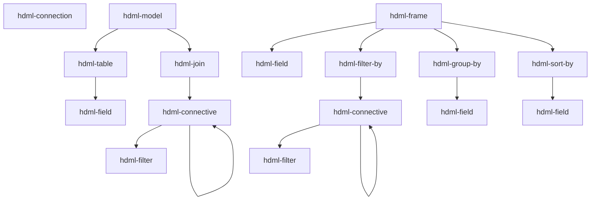

# Components reference

**Scope:** every `hdml-*` custom element this package registers — tag name, role, attributes,
and the typical parent/child it expects. All facts here are pulled from the JSDoc on each
class; treat the class file as source of truth and update it alongside any change here.

Adjacent reading: [docs/architecture.md](architecture.md) for the `hdom-changed` lifecycle ·
[docs/hdio-client.md](hdio-client.md) for `<hdml-io>` (the host element, not listed here
because it is not a `HdqlElement`).

## The three families

- **`hdql/`** — HyperData **Query** Language: declarative HDML data modelling; every element
  extends [`HdqlElement`](../src/hdql/HdqlElement.ts), defines `@property` fields keyed by
  `*_ATTRS_LIST` enums from `@hdml/types`, and renders `<slot></slot>`. The element does **no
  work itself** — it just keeps DOM-attribute state and fires `hdom-changed` on the
  `document`.
- **`hdio/`** — one element (`<hdml-io>`) that observes the document and uploads to HDIO.
  See [docs/hdio-client.md](hdio-client.md).
- **`hdvl/`** — HyperData **Visualisation** Language: the display elements. All **21 tags are
  registered** by the `./hdvl` entry; every element extends
  [`HdvlElement`](../src/hdvl/base.ts) except `hdml-fallback`, takes its tag and attribute keys
  from [`src/hdvl/vocabulary.ts`](../src/hdvl/vocabulary.ts), and **never fires
  `hdom-changed`** — a display element changes no part of the HDML document, so display
  invalidation travels the scheduler path only. Bodies land per slice over RFC 016/001; see
  [Display elements](#display-elements-hdvl) below for what is implemented today.

`hdql` / `hdvl` name **modules**, never tag prefixes — every tag in this package is
`hdml-*` (RFC 016/001 §2.1).

## Composition rules



A `hdml-frame`'s `source` attribute references another `hdml-model` or `hdml-frame`, either
within the same document or via an HDIO path.

## Elements

### `hdml-connection` — [src/hdql/HdmlConnection.ts](../src/hdql/HdmlConnection.ts)

A named connection to a database. Attribute applicability depends on `type`.

| Attribute | Notes |
|---|---|
| `name` | identifier |
| `description` | free text |
| `type` | one of `postgresql`, `mysql`, `mssql`, `mariadb`, `oracle`, `clickhouse`, `druid`, `ignite`, `redshift`, `bigquery`, `googlesheets`, `elasticsearch`, `mongodb`, `snowflake` |
| `ssl` | boolean string, JDBC-style types |
| `host`, `port`, `user`, `password` | network/auth (subset of types) |
| `project-id` | `bigquery` |
| `credentials-key` | base64 GCP creds JSON (`bigquery`, `googlesheets`) |
| `sheet-id` | `googlesheets` |
| `region`, `access-key`, `secret-key` | `elasticsearch` (AWS) |
| `schema` | `mongodb` |
| `account`, `warehouse`, `database`, `role` | `snowflake` |

See the source JSDoc for which attribute applies to which `type`.

### `hdml-model` — [src/hdql/HdmlModel.ts](../src/hdql/HdmlModel.ts)

Container for an entity-relationship graph (tables joined together).

| Attribute | |
|---|---|
| `name` | identifier |
| `description` | free text |

**Allowed children:** `hdml-table`, `hdml-join`.

### `hdml-table` — [src/hdql/HdmlTable.ts](../src/hdql/HdmlTable.ts)

A physical table, view, materialized view, or SQL query inside a model.

| Attribute | |
|---|---|
| `name` | identifier within the model |
| `type` | `table` or `query` |
| `identifier` | three-tier name (back-quoted) for `type=table`, or SQL for `type=query` |
| `description` | free text |

**Allowed children:** `hdml-field`.

### `hdml-field` — [src/hdql/HdmlField.ts](../src/hdql/HdmlField.ts)

A typed field. Reused inside `hdml-table`, `hdml-frame`, `hdml-group-by`, `hdml-sort-by`.

| Attribute | |
|---|---|
| `name` | identifier in the HDML context |
| `description` | free text |
| `origin` | source-column name (in `hdml-table`) or parent-field name (in `hdml-frame`) |
| `clause` | raw SQL clause; takes precedence over `origin` |
| `type` | `int-8 \| int-16 \| int-32 \| int-64 \| float-16 \| float-32 \| float-64 \| binary \| utf-8 \| decimal \| date \| time \| timestamp` |
| `aggregation` | `none \| count \| countDistinct \| countDistinctApprox \| sum \| avg \| min \| max` |
| `order` | `none \| asc \| desc` (meaningful only inside `hdml-sort-by`) |
| `scale`, `precision` | for `type=decimal` |
| `unit` | `second \| millisecond \| microsecond \| nanosecond` (for `type=time`/`timestamp`) |
| `timezone` | `UTC`, `GMT`, `GMT-12`..`GMT+14` (for `type=timestamp`) |

### `hdml-join` — [src/hdql/HdmlJoin.ts](../src/hdql/HdmlJoin.ts)

A join between two `hdml-table`s within an `hdml-model`.

| Attribute | |
|---|---|
| `type` | `cross \| inner \| full \| left \| right \| full-outer \| left-outer \| right-outer` |
| `left`, `right` | `hdml-table.name` references |
| `description` | free text |

**Allowed children:** an `hdml-connective` (carrying the join condition).

### `hdml-connective` — [src/hdql/HdmlConnective.ts](../src/hdql/HdmlConnective.ts)

Logical operator wrapper. Used under `hdml-join` (join condition) **or** under
`hdml-filter-by` (row filter).

| Attribute | |
|---|---|
| `operator` | `and \| or \| none` |

**Allowed children:** any mix of `hdml-filter` and nested `hdml-connective`.

### `hdml-filter` — [src/hdql/HdmlFilter.ts](../src/hdql/HdmlFilter.ts)

One predicate. Always nested under `hdml-connective`.

| Attribute | Required when |
|---|---|
| `type` | `keys` (joins only — uses `left`/`right`) · `expr` (uses `clause`) · `named` (uses `name`, `field`, `values`) |
| `left`, `right` | `type=keys` — `hdml-field.name` references |
| `clause` | `type=expr` — SQL-like, format depends on whether it's inside `hdml-model > hdml-join` or `hdml-frame > hdml-filter-by` |
| `name` | `type=named` — one of `equals \| not-equals \| contains \| not-contains \| starts-with \| ends-with \| greater \| greater-equal \| less \| less-equal \| is-null \| is-not-null \| between` |
| `field`, `values` | `type=named` |

### `hdml-frame` — [src/hdql/HdmlFrame.ts](../src/hdql/HdmlFrame.ts)

A derived dataset on top of an `hdml-model` or another `hdml-frame`.

| Attribute | |
|---|---|
| `name` | identifier |
| `description` | free text |
| `source` | parent reference. Either an HDIO path with a query — `/path/to/file.hdml?hdml-model=m` — or a same-document reference — `?hdml-frame=f` |
| `offset` | `number` (`SQL OFFSET`) |
| `limit` | `number` (`SQL LIMIT`) |

**Required children:** at least one `hdml-field`. Optional: `hdml-filter-by`,
`hdml-group-by`, `hdml-sort-by`.

`source` is rewritten by [src/hdio/parse.ts](../src/hdio/parse.ts) before serialization —
absolute paths via `sourceToPath`, same-document references via the in-memory mapping.

**Parent field naming.** What the frame sees from its `source` depends on the source kind:

- `source="?hdml-model=m"` (or an external `/path?hdml-model=m`) — the model exposes every
  field as **`"{table-name}_{field-name}"`**. In a multi-table model whose `hdml-table`s are
  `amazon` and `apple`, the parent's `close` columns reach the frame as `amazon_close` and
  `apple_close` — **never** the bare `close`. Reference them by that compound name in
  `origin`, and inside any `clause` SQL. This is true even when the model has only one table.
  The rewrite is done by `@hdml/stringifier` (`getModelSQL`).
- `source="?hdml-frame=f"` (or an external `/path?hdml-frame=f`) — the parent frame exposes
  fields by their declared `name`, with no rewriting.

### `hdml-filter-by` — [src/hdql/HdmlFilterBy.ts](../src/hdql/HdmlFilterBy.ts)

Marker container for row filters inside `hdml-frame`. No attributes.

**Allowed children:** exactly one `hdml-connective` (which wraps the `hdml-filter`s).

### `hdml-group-by` — [src/hdql/HdmlGroupBy.ts](../src/hdql/HdmlGroupBy.ts)

Group rows by one or more fields. No attributes.

**Required children:** ≥1 `hdml-field`.

### `hdml-sort-by` — [src/hdql/HdmlSortBy.ts](../src/hdql/HdmlSortBy.ts)

Sort the frame by one or more fields. No attributes; per-field direction comes from
`hdml-field`'s `order` attribute.

**Required children:** ≥1 `hdml-field`.

## Display elements (`hdvl/`)

The display half registers **21 tags**, in seven families
([`HDVL_FAMILIES`](../src/hdvl/vocabulary.ts)): `view`, `plane`, `scale`, `mark`,
`container`, `guide`, `fallback`. Fifteen of them have bodies as of this commit — the four
structural elements, the three scales, **all six marks** and two of the five guides — see
[Registered but inert](#registered-but-inert) for the six that do not.

Two constructed UA stylesheets ([`src/hdvl/ua.ts`](../src/hdvl/ua.ts)) supply every box
default. The **element sheet** is adopted by every HDVL shadow root as one shared instance and
is host-qualified throughout, so a rule written for the view can never reach a mark; the
**document sheet** carries only the two `hdml-fallback` rules, because they are the one thing
that must work on light DOM *before* upgrade. Every default is a `:host` rule, which any
author rule from the outer document beats.

Every display element except the view is `position: absolute; inset: 0` and renders
`<div class="plot"><slot></slot></div>` in its shadow. `.plot` **is** the host's content box,
so a slotted child resolves against its parent's *content* box — which is what makes a
plane's `8px 8px 24px 40px` gutter inset everything below it, and what SPEC §3 means by "a
guide's containing block is its scale". Because every element is positioned with no
`z-index`, **document order is paint order**.

### `hdml-view` — [src/hdvl/view.ts](../src/hdvl/view.ts)

The only display element that owns pixels: it holds the shadow root, the single `<svg>`
surface, and the collapsed `<slot>` that keeps every descendant's box measurable. It sets
`role="img"` on itself at connect (an author `role` is not overwritten), which prunes the
whole subtree — including an unupgraded `hdml-fallback` — from the accessibility tree.

| | |
|---|---|
| **Attributes** | `source` — the default data source for the subtree, nearest-ancestor-wins |
| **Children** | any number of planes, plus at most one `hdml-fallback` |
| **UA box** | `display: block; aspect-ratio: 2 / 1; position: relative` — a 2∶1 graphics box with no CSS at all, so `width: 100%` alone yields a chart rather than a collapsed box |
| **States** | `:state(loading)` from connect, and **derived** from the first frame on — from §3.4's quantifier over the reconciler's desired set. `:state(empty)` is computed from the frame's **mark**-node count and gated on `loading`, so the two can never both be set; `:state(error)` is the validator's and `:state(hover)` the pointer path's |

Its `<svg>` is created in the SVG namespace, sized to the view, and is **the one surface the
whole view paints into** — the SVG renderer diffs against it by `(widget uid, node index)`.
The view also owns the single `ResizeObserver` over itself and every descendant, the
capturing `transitionrun` listener for the UA sentinel, the resolution index, and the
coalescing one-`requestAnimationFrame` MEASURE → COMPUTE → PAINT loop. `invalidate()` marks
the view dirty and requests a frame (`view.dirty` / `view.dirtyCount` / `view.framesRun`
expose the coalescing for assertions).

### `hdml-cartesian-plane` · `hdml-polar-plane` — [plane-cartesian.ts](../src/hdvl/plane-cartesian.ts) · [plane-polar.ts](../src/hdvl/plane-polar.ts)

A **geometric anchor**: a CSS box plus the projection that gives positional channels their
screen meaning. A plane contributes no dimension of its own and emits nothing — the
multidimensional space is built by the scale chain inside it.

| | |
|---|---|
| **Attributes** | `source` |
| **Parent** | `hdml-view` |
| **Children** | scales (and, through them, widgets and guides) |
| **UA box** | `position: absolute; inset: 0; container-type: size`, plus a padding gutter: `8px 8px 24px 40px` cartesian, `8px` polar — the gutter zero-CSS guides spill into |
| **States** | `:state(loading)`, alongside the view |

`container-type: size` is what makes `@container` — not `@media` — the correct selector for
responsive guides: a chart in a 300 px sidebar must respond to the *plane*, not the viewport.
**Both planes supply their own `Projection`** — the seam every mark projects through,
declared in [mark.ts](../src/hdvl/mark.ts) and read duck-typed, so a mark never names a
channel. The whole of the plane-kind difference is the *composition*: the identity pair for
cartesian, `polarPoint` about the pole for polar. Everything else — the chain lookup, the
drop rule, the ordinal test — is shared by `createProjection`, so the two planes cannot
disagree about when a row drops, and **no widget carries a plane branch**. The **pole** is
the centre of the radius-channel scale's content box, or the plane's where no radius scale
exists, read off the MEASURE snapshot and resolved per widget, because the widget's own
chain says which radius scale serves it.

### `hdml-fallback` — [src/hdvl/fallback.ts](../src/hdvl/fallback.ts)

Light-DOM flow content shown only while the view is **not upgraded** — "your browser can't
render this chart", or a table of the same numbers. It is **not vocabulary**: it is exempt
from every validator rule, is never slotted, and is never revived.

It is a bare `HTMLElement` with **no shadow root, no adopted stylesheet and no attributes**,
and that is deliberate. The element sheet begins with a generic
`:host { position: absolute; inset: 0 }`; adopting it would absolutely position the author's
flow content in precisely the window this element exists for. Its whole behaviour is two
document-sheet rules and no JavaScript:

```css
hdml-view:not(:defined) > hdml-fallback { display: block }
hdml-view:defined       > hdml-fallback { display: none  }
```

so no script, a failed script, or a pre-upgrade page renders the fallback, and an upgraded one
does not. Registration exists only so tag support can be queried, so an unknown-element
warning stays quiet, and so "at most one fallback" is countable.

### `hdml-continuous-scale` · `hdml-datetime-scale` · `hdml-ordinal-scale`

[scale-continuous.ts](../src/hdvl/scale-continuous.ts) ·
[scale-datetime.ts](../src/hdvl/scale-datetime.ts) ·
[scale-ordinal.ts](../src/hdvl/scale-ordinal.ts), over the shared
[scale.ts](../src/hdvl/scale.ts).

A `domain → range` map. **The tag *is* the kind** — string ↔ ordinal, number ↔ continuous,
datetime ↔ datetime — which is what makes V2 one rule rather than a lookup table, and what
makes discrete-vs-ramp colour the tag you wrote rather than a mode derived from the data.
A scale **emits no group at all**: it resolves a domain and a range for the widgets below it
and paints nothing itself.

| | |
|---|---|
| **Shared attributes** | `channel` (**mandatory**), `min`, `max`, `values`, `reverse`, `source` |
| **Continuous only** | `type=linear\|log\|sqrt\|pow\|symlog`, `base`, `exponent`, `constant`, `nice`, `zero`, `clamp` |
| **Datetime only** | `zone=utc\|local\|<IANA>`, `nice`, `clamp` |
| **Ordinal only** | `sort=domain\|ascending\|descending` |
| **Parent** | a plane, or another scale |
| **Children** | scales **xor** widgets — never both (V13) |

**Domain sources.** `values` uses the same first-character grammar as a channel binding: a
bare identifier is a **column** of the effective `source`, a `[` is a **literal array**. A
column opens an ordinary `raw: false` subscription on the `values` slot, so a scale is an
ordinary data subscriber and a scale and a mark binding the same column coalesce into one
query. A literal opens **no subscription at all**, which is what keeps a literal-only page
out of `:state(loading)`. `min` / `max` override their endpoint **per endpoint**, so
`min="0"` beside a derived ceiling is legal and common. There is no third rule and no
widget-union fallback; an endpoint with no source is **V8**, an error naming the channel and
both fixes.

A legal source that **returns nothing** — a zero-row column — is a different thing entirely:
the domain is *unresolved but legal*, `domain()` is `null`, the scale paints nothing and the
view goes to `:state(empty)`. It is never a diagnostic.

**Modifiers, and which kind each is meaningful on** (a modifier on the wrong kind is **V18**):

| Modifier | Kinds | Effect |
|---|---|---|
| `zero` | continuous | extends a **derived** endpoint to include 0 |
| `nice` | continuous, datetime | moves **derived** endpoints out to the next tick-step multiple; the optional value is its own target count, bare `nice` = 10 |
| `clamp` | continuous, datetime | out-of-domain values project to the range **edge** |
| `sort` | ordinal | `domain` keeps first-occurrence row order; `ascending`/`descending` by code point |
| `reverse` | **any** | reverses the range mapping; the domain is untouched |

Resolution order is fixed at **domain → `zero` → `nice`**: `zero` may create the endpoint
`nice` then rounds, never the reverse. `nice` moves derived endpoints **only**, so on a fully
authored domain it is a no-op rather than an error (V15) — and it is computed from the domain
and its own count, never from pixels, so a resize cannot move the data.

**Ranges come from boxes** — each scale's own **content box**, so its padding insets only its
own range:

| Channel | Range | Direction |
|---|---|---|
| `x` | `[contentLeft, contentRight]` | left → right |
| `y` | `[contentBottom, contentTop]` | bottom → top, so **descending** in view coordinates |
| `radius` | `[0, min(contentW, contentH) / 2]` | pole outward |
| `angle` | `--hdml-angle-start` → `--hdml-angle-end`, in degrees | clockwise from 12 o'clock |
| `size` | `--hdml-size-min` → `--hdml-size-max`, in CSS px | — |
| `color` | **none** — `paint()` instead | — |

**`paint()`** is `color`-only and `range()` is `null` there; both are contracts, not
omissions. An ordinal colour scale assigns domain slot *k* the *k*-th `--hdml-palette` entry
and returns `null` once the palette is exhausted — two series sharing a colour is a silent
wrong chart, where `null` is visible. A continuous one interpolates `--hdml-color-interpolate`
in `--hdml-color-interpolate-space` via `color-mix()`, so the mark ramp and the legend's ramp
bar are the same computed gradient because both call the same `paint()`.

Each scale dispatches **`hdml-scale-change`** `{channel, domain, range}` when its resolved
pair changes — a new delivery, a modifier re-resolving, or **its box resizing**.

### `hdml-line` · `hdml-rule` — [mark-line.ts](../src/hdvl/mark-line.ts) · [mark-rule.ts](../src/hdvl/mark-rule.ts)

The first two marks. Both are row-wise pure — mark *i* = f(row *i*, scales) — and both
project through their plane's `Projection` rather than through `x` and `y`, so the polar
plane reaches them without either file changing.

| | |
|---|---|
| **`hdml-line` attributes** | `x`, `y`, `angle`, `radius`, `color`, `closed`, `source` |
| **`hdml-rule` attributes** | `x`, `y`, `source` — **no visual channel** |
| **Parent** | a chain-tip scale (or, later, a container) |
| **Children** | none |
| **UA box** | `position: absolute; inset: 0; overflow: hidden` — the `overflow` *is* SPEC §6's clip-to-the-plot-area rule, so an author rule beats it |

`hdml-line` emits **one** stroked `path` for the whole series, `fill: null`, curved by
`--hdml-curve-type`. Its node's `i` is therefore `-1` — a node built from every row has no
single source row — and row identity lives in its `vertices`, which is also what hit
resolution reads. `hdml-rule` emits **one path per row**, each carrying a real `i` and
spanning the *other* channel's `range()` end to end; a rule therefore needs an ancestor
scale for the channel it did **not** bind, and V1 says so with its usual message.

A `null`, a non-finite, or a value outside an ordinal domain means the row produces **no
mark**. A path *breaks* — a new subpath, a visible gap, never bridged, because each run is
curved independently — and a discrete mark is simply omitted. Missing renders as *absent*,
never as zero. An out-of-domain ordinal value prints one console notice naming it; if
*every* row drops, the **scale** errors.

A continuous value outside the domain **projects truthfully** and is clipped by the box,
never clamped into it. A bound `color` channel wins over the sheet.

### `hdml-area` · `hdml-bar` — [mark-area.ts](../src/hdvl/mark-area.ts) · [mark-bar.ts](../src/hdvl/mark-bar.ts)

The **ranged** marks. Both are written against the ranged form as the primitive and resolve
the simple form into it before any geometry exists, so `y="v"` and `y0="0" y1="v"` produce
byte-identical scenes and a layout container can supply a per-row baseline without either
file changing.

| | |
|---|---|
| **`hdml-area` attributes** | `x`, `x0`, `x1`, `y`, `y0`, `y1`, `angle`, `radius`, `r0`, `r1`, `color`, `closed`, `hidden`, `source` |
| **`hdml-bar` attributes** | `x`, `x0`, `x1`, `y`, `y0`, `y1`, `color`, `hidden`, `source` — **cartesian only**, by design |
| **Parent** | a chain-tip scale (or, later, a container) |
| **Children** | none |
| **UA box** | as the other marks |

**`y` is sugar for `y0="0"`** (polar `radius` for `r0="0"`), and the sugar is expressed as a
synthetic **scalar** binding — the same object shape the literal `y0="0"` produces — so
nothing below the resolver can tell which form the author wrote. There is no
`if (y0 !== null)` branch anywhere in either element.

`hdml-area` emits **one filled `path`** for the whole series, `i: -1`, with row identity in
its per-vertex `i`. Each contiguous stretch of rows is one **closed** subpath: the upper edge
forward, a line across, then the lower edge **reversed**. The lower edge is reversed *before*
it is curved, not after — a curve fitted to a reversed point list is not the reverse of the
curve fitted to the forward one, because `natural`'s solve is global over its run and
`bezier` picks its tangents per segment. A gap breaks **both** edges at the same row, and a
stretch of fewer than two rows yields no region at all.

`hdml-bar` emits **one `rect` per row**, each with a real `i`, and its **orientation is
derived, never authored** — the band-filling side is whichever channel resolves an *ordinal*
scale, so `x="cat" y="n"` stands the bars up and `x="n" y="cat"` lays them down from the same
markup. There is no orientation attribute and there must not be one. With no ordinal scale in
scope there is no band, and it paints nothing rather than inventing a width.

**`hdml-bar` is the one widget in the project that reads `bandOf().width`.** It *spans* the
band, centred by construction; every other lookup — an area's vertex included — resolves to
`centre`, and nothing ever resolves to a band edge. A row whose two ends are equal is a real
datum and gets a **zero-extent** rect; missing is still *absent, never zero*.

Both are **filled**, so a bound `color` wins over `--hdml-fill-color` and over its `_hover`
variant, and neither also strokes: `strokeWidth` is `0` and `stroke` is `null`. A **varying**
`color` — a column or a literal array — is an **error** on `hdml-area` and `hdml-line`, whose
single `path` node carries a single paint; it is legal on `hdml-bar`, which resolves a colour
per row and emits a node per row. See [decisions.md](decisions.md).

### `hdml-point` · `hdml-arc` — [mark-point.ts](../src/hdvl/mark-point.ts) · [mark-arc.ts](../src/hdvl/mark-arc.ts)

The **discrete** marks — one node per row, each carrying its own source row index. With them
every mark in the vocabulary paints.

| | |
|---|---|
| **`hdml-point` attributes** | `x`, `y`, `angle`, `radius`, `color`, `size`, `source` — the only tag that publishes `size` |
| **`hdml-arc` attributes** | `a0`, `a1`, `angle`, `radius`, `r0`, `r1`, `color`, `source` — **polar only**, by design, the mirror of `hdml-bar` |
| **Parent** | a chain-tip scale (or, later, a container) |
| **Children** | none |
| **UA box** | as the other marks |

`hdml-point` emits **one `ellipse` per row**, or one `rect` under `--hdml-tick-style: rect`,
both centred on the projected point and sharing one extent — so switching the property moves
nothing. **The registered initial is `rect`**, not `ellipse`: every corpus page that wants
dots says `--hdml-tick-style: ellipse` explicitly.

The extent comes from `--hdml-tick-width`/`-height`, or from the `size` channel when bound,
and **both forms are diameters** — an `ellipse` takes half of each. A bound `size` supplies
*both* extents, so the glyph is a circle and the two tick properties are ignored: the channel
is one number and there is no second one to keep an aspect ratio against. The ramp is the
**scale's** — `--hdml-size-min`/`-max` are the `size` channel's *range*, read once in
[scale.ts](../src/hdvl/scale.ts) from the size scale's own box — so the widget calls
`project()` and interpolates nothing, and a value past the domain projects past
`--hdml-size-max` rather than clamping.

`hdml-arc` emits **one parameterised `arc` per row** — `{cx, cy, r0, r1, a0, a1}`, never a
pre-serialized path: the annulus and the 360° two-command case are the renderer's business,
and parameters hit-test and clip more simply. Angles are **degrees**, `0` at 12 o'clock,
increasing clockwise, so `a0`/`a1` come straight off the projection with no conversion.

Its three radial cases are not one rule: `r0` **and** `r1` bound is the author's on both
edges; `radius` bound is sugar for `r1` with a synthetic lower edge, mirroring the area's `y`
sugar; **nothing bound is the full radius range**, which the ranged resolver cannot express
because `null` is exactly what it returns for an unbound channel — and that third case is what
makes the pure `a0`/`a1` form interchangeable with `hdml-pie`. `--hdml-inner-radius` supplies
the **synthetic** `r0` only: an authored `r0` may legally paint inside the hole, because
authored data is sacred. A percentage in it resolves against the radial ceiling; a length is
already px.

Its second angle form — `angle` on an *ordinal* scale, equal slices — lands with the polar
guides, and it paints nothing meanwhile. Both marks are **filled** and neither strokes, and
both carry a **per-row `color`** honestly, which is why the varying-`color` error is the two
path widgets' alone.

### `hdml-axis` · `hdml-grid` — [guide-axis.ts](../src/hdvl/guide-axis.ts) · [guide-grid.ts](../src/hdvl/guide-grid.ts)

The first two of the five guides. A guide takes **no `source`**, binds no columns and
implements no `Binder`: it is a function of the resolved scale, its own box and its computed
style. Its one input from the document is `channel`, and a channel with no scale in scope is
already V1's error — the same condition the geometry sees as "nothing to span".

| | |
|---|---|
| **`hdml-axis` attributes** | `channel` — **and nothing else**. §6.5 is explicit that it takes no `count`/`step`/`values`, and `AXIS_ATTRS_LIST` has one member, so the whole-range span is not a default that could be argued down |
| **`hdml-grid` attributes** | `channel`, `count`, `step`, `values` |
| **Parent** | a scale (its containing block, so CSS placement resolves against the plot area) |
| **Emits** | axis: one stroked `path` over the whole range. grid: one `path` per tick, across the plane |
| **Group role** | `guide` — never `mark`, which is what keeps `:state(empty)` a statement about data |

**What an axis spans is the scale's `range()`, not its own box** — §4.3 gives a positional
scale a range taken from *that scale's* content box, the same rule `hdml-rule` follows.
**Where it sits across that span is its own box**: the edge nearest the scale, derived from
the two measured boxes by [guide-spec.ts](../src/hdvl/guide-spec.ts). Below the plot that is
the top edge; above it, the bottom one. Nothing is authored — SPEC §7 gives the tag no
`position` attribute — so moving the guide with one CSS rule moves the line with it.
`hdml-label` reuses the identical derivation for its anchor and baseline.

**A grid's positions come from `scale.ticks(spec)` and are never re-derived.** §4.8's ladders
have one implementation and `kernel/` owns it, so a grid and a label written with the same
`step=` land on the same pixels because there is one generator, not because two agree. The
three attributes are *modes*, not options — `step=` states the interval exactly and invokes
no tick algorithm — and a guide **forwards** all three rather than resolving between them:
`Scale.ticks` tests `values`, then `step`, then `count`, and that is the whole of the
precedence. Writing two of them is V16's error, from step 24. An attribute present but empty
reads as absent. On an **ordinal** scale a grid lands on band **centres**, never edges.

A guide node carries `i: -1` and **no vertices**: `i` is a source row index and `vertices`
are projected *data* vertices, and a guide has neither. Hit resolution therefore never
resolves to a guide, which is correct — it implements no `datumAt` and could answer nothing.

The `--hdml-grid-shape` `circle` / `polygon` forms, and every guide under a polar plane, land
with `hdml-pie` in Slice F. Until then a guide resolved under a polar plane paints **nothing**
rather than a straight segment through polar space.

**UA placement (SPEC §3).** An x-channel `hdml-axis` / `hdml-tick` / `hdml-label` is placed
just below the plot (`top: 100%`), a y-channel one just left of it (`right: 100%`), each
spilling into the plane's gutter — which is what the gutter is for, and why the two take
their extent (`24px` high, `40px` wide) from the very numbers that set the plane's padding.
`hdml-grid` needs **no rule of its own**: the generic `:host` box rule is already `inset: 0`,
which is SPEC §3's grid row verbatim. Each placement rule **resets the opposite offset
explicitly** (`bottom: auto`, `left: auto`); without that, `inset: 0` would leave the far
offset in force and over-constrain the box to zero extent — a guide that renders, measures
nothing, and reports no error. Every rule is `:host(<tag>[channel="…"])`, so it is
host-qualified per tag *and* per channel, and any author rule from the outer document beats
it.

### Registered but inert

The other six tags are **registered as of this commit and carry no behaviour yet** —
each declares its tag, its family and its observed attributes, and nothing else. They are
listed here so the tag surface is discoverable; do not read an entry as a description of
working behaviour.

| Tag | Family | Module | Body lands in |
|---|---|---|---|
| `hdml-pie` | mark | [layout-pie.ts](../src/hdvl/layout-pie.ts) | Slice F |
| `hdml-tick` | guide | [guide-tick.ts](../src/hdvl/guide-tick.ts) | Slice E |
| `hdml-label` | guide | [guide-label.ts](../src/hdvl/guide-label.ts) | Slice E |
| `hdml-legend` | guide | [guide-legend.ts](../src/hdvl/guide-legend.ts) | Slice H |
| `hdml-stack` | container | [container-stack.ts](../src/hdvl/container-stack.ts) | Slice G |
| `hdml-cluster` | container | [container-cluster.ts](../src/hdvl/container-cluster.ts) | Slice G |

`hdml-pie` is a **mark**, not a container: a container "is not a painter", and a pie paints.

The five guides take **no `source`** and bind no columns — a guide is a function of the
resolved scale, its own box and its computed style.

`hdml-area`, `hdml-bar` and `hdml-stack` observe a `hidden` attribute. Because
`HTMLElement.hidden` is a platform **boolean** IDL property, the class field behind it is
named `hiddenAttr`; the observed attribute is still `hidden`, and the platform's own property
is left alone. **Nothing reads it yet** — the two marks with bodies observe it and do not
consult it, because whether HDVL's `hidden` *is* the platform's is a semantic question the
container slice decides.

### The `--hdml-*` registry

All chart appearance is CSS custom properties, and the **complete 35-property registry** —
31 base properties plus the four `_hover` paint variants — is registered with
`CSS.registerProperty` at import time
([`src/hdvl/properties.ts`](../src/hdvl/properties.ts)). Every one of them **inherits**, which
is what makes plane-level scoping and theme-at-the-view work. Registration is guarded
**per property**, so a page that loads two builds of this package ends up with a complete
registry rather than one truncated at the first duplicate.

The full table of names, syntaxes and initial values is SPEC §9; `properties.ts` exports
`HDVL_PROPERTIES` so the set can be asserted against without re-deriving it. (Like `./hdql`,
the `./hdvl` entry re-exports no class or module symbol beyond the vocabulary — the tag
registrations are its public surface.)

## Authoring example

```html
<hdml-connection name="warehouse" type="postgresql"
                 host="db" user="ro" password="${env.DB_PW}" ssl="false">
</hdml-connection>

<hdml-model name="sales">
  <hdml-table name="orders"
              type="table"
              identifier="`warehouse`.`public`.`orders`">
    <hdml-field name="id"     type="int-64"/>
    <hdml-field name="amount" type="decimal" scale="2" precision="12"/>
    <hdml-field name="ts"     type="timestamp" unit="millisecond"/>
  </hdml-table>
</hdml-model>

<hdml-frame name="big-orders" source="?hdml-model=sales" limit="100">
  <hdml-field name="id"/>
  <hdml-field name="amount" aggregation="sum"/>
  <hdml-filter-by>
    <hdml-connective operator="and">
      <hdml-filter type="named" name="greater" field="amount" values="1000"/>
    </hdml-connective>
  </hdml-filter-by>
  <hdml-sort-by>
    <hdml-field name="amount" order="desc"/>
  </hdml-sort-by>
</hdml-frame>

<hdml-io host="https://hdio.example" tenant="acme" token="…"></hdml-io>
```

When the `<hdml-io>` is wired up, this entire subtree is parsed in a Worker and POSTed as
FlatBuffers. See [docs/hdio-client.md](hdio-client.md).

`<hdml-io>` is not an `HdqlElement`; its full attribute/protocol reference lives in
[docs/hdio-client.md](hdio-client.md). It takes `host` / `tenant` and one of two auth modes,
selected by the **`mode`** attribute:

| `mode` | Auth flow |
|---|---|
| `token` (default) | The `token` attribute is a single-use **handoff code** redeemed for the access/refresh pair (§3.2). |
| `oidc` | Full-page redirect to the IdP; on return, `?code&state` is exchanged for tokens (§3.3). No `token` needed. |

`mode` is an `<hdml-io>`-local attribute (no `@hdml/types` `*_ATTRS_LIST` enum), so it is
declared directly on the class.

### The subscription bus (data-binding consumers)

Beyond uploading the document, `<hdml-io>` exposes a **subscription bus** so data-binding
consumers (charts, axes, legends) can bind a `(source-ref, column)` and receive live query
results (RFC 014/001 §5.8, D8). The seam is specified so **any** consumer can implement it, and
this repo now ships both sides: hdml-io's, described below, and the display half's in
[`src/hdvl/subscribe.ts`](../src/hdvl/subscribe.ts) — see
[architecture.md](architecture.md#data-binding).

- `<hdml-io>` announces `hdml-io-ready` on `document` when it connects, and listens there for a
  `bubbles`/`composed` **request event**. A consumer, on its own connect, both listens for
  `hdml-io-ready` and dispatches its request (re-dispatching on ready); subscriptions de-dupe
  by `id`, so the handshake is race-free whichever connects first.
- Each worker result is fanned out to every subscriber of that `(ref, column)`; teardown rides
  an `AbortSignal` (component disconnect → `unsubscribe`).

The **event names and the D4 timeout are read from a shared `window.HDML_CONFIG`** both repos
read (the sync point) — the settled defaults:

| `HDML_CONFIG` field | Default |
|---|---|
| `queryReadyTimeout` | `10000` (ms; the stored-gate backstop forwarded to the worker) |
| `readyEvent` | `"hdml-io-ready"` |
| `requestEvent` | `"hdml-io-request"` |

The exact request `detail` schema, the delivery mechanism, and the consumer-side attribute
that holds the ref + `&column=` are **co-designed with the consumer repo** and are not fixed
here (§8). Full protocol in [docs/hdio-client.md](hdio-client.md#the-discovery-bus--subscription-registry-step-08-d7d8).
