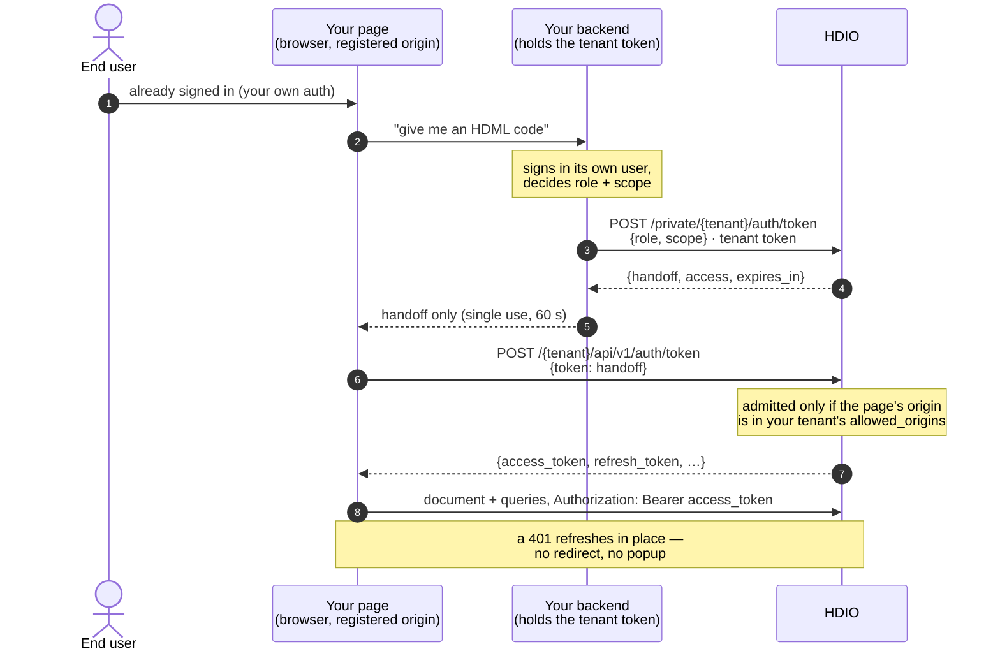
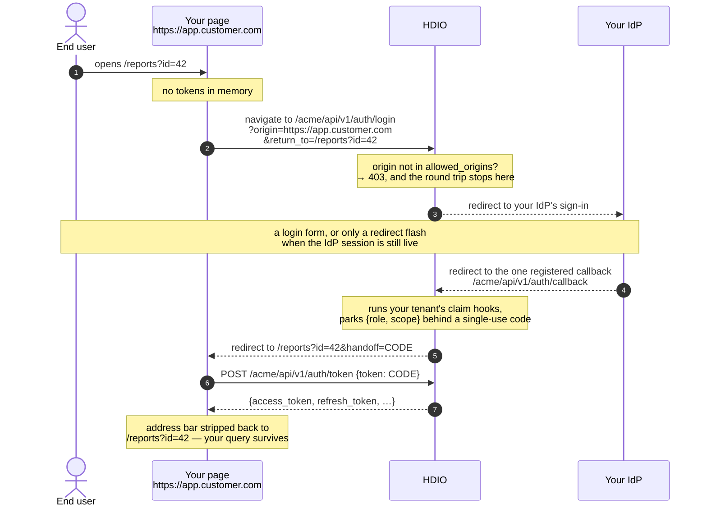

# Embedding HDML charts in your app

Install: `npm install @hdml/components@0.0.2-alpha.25`. Or, with no build step, load the
bundle from a CDN:
`<script src="https://cdn.jsdelivr.net/npm/@hdml/components@0.0.2-alpha.25/bin/index.min.js"></script>`
([the zero-build variant](#zero-build-load-the-bundle-from-a-cdn)).

Every example below uses `https://hdio.example` for your HDIO server and `acme` for your
tenant. Substitute your own.

## Embed HDML charts in your own app

*"My app already knows who its user is. I want charts in it, authenticated as that user."*

There are two ways to do that. In **Path 1**, your backend asks HDIO for a single-use code
on the user's behalf and hands it to the page. In **Path 2**, the page sends the user
through your identity provider (IdP), with HDIO brokering the login.

**Most embedders want Path 1, and it needs no HDML code at all**: one call from your
backend, one attribute on the page, and one setting on your tenant.

## Which path you want

| Your situation | Use |
|---|---|
| You have a backend that already signs your users in | **[Path 1](#path-1--your-app-authenticates-hdio-trusts-it)** |
| You have no backend, or HDML *is* the whole app (a portal of charts) | **[Path 2](#path-2--hdio-brokers-your-idp)** |
| You want HDIO to be your identity provider, with its own users and passwords | **Neither.** HDIO is not an identity provider. It trusts your app (Path 1) or your IdP (Path 2) |

## Path 1 — your app authenticates, HDIO trusts it



The handoff, in three steps:

- **Your backend mints a code.** It calls HDIO with your **tenant token**, which is a
  server-side secret that never reaches a browser. It passes the `role` and `scope` *your*
  app decided for this user, and gets back a single-use `handoff` code.
- **Your page sets the code on `<hdml-io>`** as its `token` attribute.
- **`<hdml-io>` redeems the code** for an access/refresh token pair, then uploads the
  document and runs its queries. You write none of that.

### The sample

**a. Your backend** (any language; Node shown). It holds the tenant token, signs in its own
user, and mints a handoff:

```js
// POST /api/hdml-token  — your app's own authenticated route.
app.post("/api/hdml-token", requireYourOwnLogin, async (req, res) => {
  // Your authorization decides role + scope. This is the whole point:
  // the decision belongs to the app that knows the user.
  const role = req.user.isAdmin ? "admin" : "viewer"; // required: HDIO answers 400 without it
  const scope = { region: req.user.region };

  const r = await fetch("https://hdio.example/private/acme/auth/token", {
    method: "POST",
    headers: {
      "content-type": "application/json",
      // The TENANT token. Server-side only — it never reaches a browser.
      authorization: `Bearer ${process.env.HDIO_TENANT_TOKEN}`,
    },
    body: JSON.stringify({ role, scope }),
  });
  if (!r.ok) return res.status(502).end();
  const { handoff } = await r.json();   // also returns a server-side `access`
  res.json({ handoff });                // the browser gets ONLY the handoff
});
```

The HDIO call it makes:

| | |
|---|---|
| **Request** | `POST https://hdio.example/private/acme/auth/token` |
| **Auth** | `Authorization: Bearer <tenant token>` |
| **Body** | `{ "role": "viewer", "scope": { "region": "eu" } }`. `role` is **required** and must be a role your tenant's access policy defines. `scope` is free-form |
| **Success** | **200** `{ "handoff": "…", "access": "…", "expires_in": 900 }` |
| **Failures** | **400** `role is required`. **502** when your tenant's token hook refuses the request: HDIO never issues a token it could not enrich |

`handoff` is the code for the browser. `access` is an access token your **backend** can use
directly for server-to-server calls. Never send it to the page.

**b. Your page, with a bundler (Vite, webpack, esbuild …).** Fetch the handoff, then set it
on the element:

```html
<!doctype html>
<meta charset="utf-8" />
<script type="module">
  import "@hdml/components";              // registers <hdml-io> + the data elements
  import "@hdml/components/hdvl";         // registers the display elements

  const res = await fetch("/api/hdml-token", { credentials: "include" });
  const { handoff } = await res.json();

  const io = document.createElement("hdml-io");
  io.setAttribute("host", "https://hdio.example");
  io.setAttribute("tenant", "acme");
  io.setAttribute("token", handoff);      // single-use; redeemed once
  document.body.appendChild(io);
</script>

<hdml-frame name="orders" source="/sales.html?hdml-frame=orders"></hdml-frame>

<hdml-view style="width: 640px; height: 320px">
  <hdml-cartesian-plane source="?hdml-frame=orders">
    <!-- scales, marks, guides … -->
  </hdml-cartesian-plane>
</hdml-view>
```

Or, if your server renders the page, put the code straight into the markup. This is
equivalent:

```html
<hdml-io host="https://hdio.example" tenant="acme" token="{{ handoff }}"></hdml-io>
```

The display elements, scales, marks and guides that go inside `<hdml-view>` are all in
[components.md](components.md#display-elements-hdvl).

#### Zero-build: load the bundle from a CDN

The published bundle registers **every** element, data and display, with its worker
inlined. Pin the version. An embed that floats on `@latest` is an embed that breaks on
someone else's release.

```html
<!-- Zero-build: the IIFE registers every element, workers inlined. -->
<script src="https://cdn.jsdelivr.net/npm/@hdml/components@0.0.2-alpha.25/bin/index.min.js"></script>
<script type="module">
  const res = await fetch("/api/hdml-token", { credentials: "include" });
  const { handoff } = await res.json();

  const io = document.createElement("hdml-io");
  io.setAttribute("host", "https://hdio.example");
  io.setAttribute("tenant", "acme");
  io.setAttribute("token", handoff);
  document.body.appendChild(io);
</script>
```

The rest of the page is unchanged.

**c. The one HDIO-side setup step: register your page's origin.** The page calls HDIO from
the browser, so HDIO must admit its origin. That holds even though no IdP is involved:

```http
PUT /private/acme/origins
Host: hdio.example
Authorization: Bearer <tenant token>
Content-Type: application/json

{ "origins": ["https://app.customer.com", "http://127.0.0.1:5173"] }
```

| | |
|---|---|
| **Success** | **204**, empty body. The list **replaces** the previous one in full |
| **Rules** | **Exact origins only**: scheme + host + an optional non-default port. No path, no trailing slash, no wildcard. `http://` is accepted only for `localhost`, `127.0.0.1` and `[::1]`. At most 20 entries |
| **Failures** | **400** naming the first bad entry. The write is all-or-nothing |
| **Read it back** | `GET /private/acme/origins` with the same header → **200** `{ "origins": [...] }` |
| **Revoke embedding** | `PUT` `{ "origins": [] }` |

That is the whole setup. No IdP, no redirect URI, no popup. Renewal is automatic: a 401 on
any call refreshes once and retries.

## Path 2 — HDIO brokers your IdP

Use Path 2 when there is no backend of yours to mint a code: a portal where the charts
*are* the app, or a static page. The page carries no token. `<hdml-io>` sends the browser
to HDIO, HDIO sends it to **your tenant's own** IdP, and the browser comes back to the same
page with a single-use code that the element redeems exactly as in Path 1.

### The sample

**a. Your page, with a bundler.** One attribute and no script of your own:

```html
<!doctype html>
<meta charset="utf-8" />
<script type="module">
  import "@hdml/components";
  import "@hdml/components/hdvl";
</script>

<!-- No token. The element navigates to HDIO, HDIO brokers your IdP,
     and the browser comes back to THIS url with ?handoff=… which the
     element redeems and strips. Your own query params survive. -->
<hdml-io host="https://hdio.example" tenant="acme" mode="oidc"></hdml-io>

<hdml-view style="width: 640px; height: 320px">…</hdml-view>
```

[The CDN bundle](#zero-build-load-the-bundle-from-a-cdn) works here too: replace the module
script with the `<script src>` line and keep the `<hdml-io … mode="oidc">` element.

**b. The one-time IdP registration.** Do this once in your IdP's console. Google is shown,
and any conforming OIDC provider takes the same shape:

```
Authorized redirect URI:
  https://hdio.example/acme/api/v1/auth/callback

  — exactly one, for the whole tenant, forever.
  — NOT your page URL. Your pages are governed by `allowed_origins`
    on the HDIO side, which is an EXACT origin list: one entry per
    origin your pages are served from, not per page.
```

**c. The HDIO side, once.** Give your tenant its IdP client:

```http
PUT /private/acme/sso
Host: hdio.example
Authorization: Bearer <tenant token>
Content-Type: application/json

{ "provider": "oidc",
  "config": {
    "client_id": "…", "client_secret": "…",
    "issuer": "https://accounts.google.com",
    "authorization_endpoint": "https://accounts.google.com/o/oauth2/v2/auth",
    "token_endpoint": "https://oauth2.googleapis.com/token",
    "scopes": ["openid", "email", "profile"] } }
```

→ **204**, empty body.

- **HDIO performs no OIDC discovery.** If you leave the two endpoints out, HDIO uses
  `{issuer}/authorize` and `{issuer}/token`. Google, and most real IdPs, host them
  elsewhere. **Set both explicitly** for any IdP whose endpoints are not exactly those two
  paths.
- **There is no `redirect_uris` field.** Sending one is a **400**. The callback URL in (b)
  is the only one there is, and HDIO derives it itself.
- Optional: `"prompt": "none"` makes a reload silent when the user's IdP session is still
  live. See [Tokens, sessions and reloads](#tokens-sessions-and-reloads).
- The config cannot be read back. Keep your own copy.

Then register your page's origin with **the same `PUT /private/acme/origins` as Path 1**
([step c](#path-1--your-app-authenticates-hdio-trusts-it)). Every page under a listed origin
now works with no further registration.

### The round trip



The page's own query (`?id=42`) rides through the round trip in `return_to` and comes back
intact. The `?handoff=` code is appended to it, redeemed once, and removed from the address
bar. A fragment (`#…`) cannot survive, because a browser never sends one to a server.
[The URL parameters `<hdml-io>` owns](hdio-client.md#the-url-parameters-hdml-io-owns) lists
exactly what the element adds and removes.

## What you must register, once

| | `allowed_origins` | The IdP callback URL |
|---|---|---|
| **Needed by** | **Both** paths | **Path 2 only** |
| **Registered at** | HDIO: `PUT /private/{tenant}/origins` | Your IdP's console, as an authorized redirect URI |
| **Value** | Exact origins: scheme + host + optional non-default port. No path, no wildcard. `http://` only for `localhost`, `127.0.0.1` and `[::1]` | `https://<hdio-host>/{tenant}/api/v1/auth/callback`, byte for byte |
| **How many** | One per origin your pages are served from (at most 20) | **Exactly one per tenant** |
| **When it is wrong** | The browser refuses HDIO's responses, or the login answers 403 | The IdP refuses to redirect back (a `redirect_uri_mismatch`-style error on the IdP's page) |

Both lists grow with the number of **tenants and origins you serve from**, never with the
number of pages. Adding a page under an origin you already listed needs no registration at
all.

## Tokens, sessions and reloads

- **Tokens are held in memory only.** `<hdml-io>` writes nothing to `localStorage`,
  `sessionStorage` or a cookie. Closing the tab forgets them.
- **A 401 refreshes once and retries, in place.** When the access token expires, the
  element spends the refresh token and repeats the call. The user sees nothing.
- **A reload or a new tab costs a round trip, not a login form:**
  - **Path 1:** the page asks your backend for a new handoff, as on first load. Your own
    session is what keeps the user signed in.
  - **Path 2:** the page redirects through HDIO and your IdP again. When the IdP session is
    still live **and** your tenant's SSO config sets `"prompt": "none"`, that redirect is
    silent: a flash, not a form. Without it, the IdP shows its usual account chooser.
- **There is no popup flow.** A popup opened on page load has no user gesture behind it,
  and every modern browser blocks it. A top-level redirect is used instead.
- **There are no third-party cookies.** A session cookie shared from HDIO's origin to your
  page would be a third-party cookie, which current browsers block. Bearer tokens in memory
  and the refresh token replace it.

## Troubleshooting

**1. A request that looks like a hang, but is a CORS refusal.**
- *Cause:* the page's origin is not in your tenant's `allowed_origins`, so the browser
  discards HDIO's response. The browser console shows a CORS error. The page sees only a
  request that never settles into data. In Path 2 the same cause shows as a **403** at
  HDIO's login URL.
- *Fix:* `GET /private/{tenant}/origins`. Compare its entries, character for character,
  with `location.origin` on the page: scheme, host and port all count. Then `PUT` the
  corrected list.

**2. `localhost` stalls about 20 s on every request.**
- *Cause:* through a port forwarder (a devcontainer, a VS Code tunnel, an SSH forward),
  `localhost` resolves to IPv6 `::1` first. Each request waits for that to time out before
  it falls back to IPv4. It looks like a server, CORS or worker hang, and it is none of
  them.
- *Fix:* use `127.0.0.1` everywhere: in `host`, in the page URL you open, and in the origin
  you register. Mixing forms fails differently, because `http://localhost:5173` and
  `http://127.0.0.1:5173` are different origins.

**3. 401 on the redeem.**
- *Cause:* a handoff is **single-use** and lives **60 s** by default. A second redeem, an
  expired code, and an unknown code all answer 401, indistinguishably.
- *Fix:* mint a new code on every page load. Never cache one. Never reuse a URL that
  carried a `?handoff=`: a bookmarked or reloaded one is already spent.

**4. An OIDC redirect loop: HDIO → IdP → your page → HDIO → …**
- *Cause:* an **old bundle**. Before `0.0.2-alpha.25`, the element did not redeem a
  returning `?handoff` ahead of starting a new login. A stale cached copy, or a self-built
  bundle from older sources, does the same.
- *Fix:* upgrade to `0.0.2-alpha.25` or later. On a CDN, pin the version in the URL.

**5. `?handoff=` is still in the address bar.**
- *Cause:* the element strips the parameter as it issues the redeem. If the parameter is
  still there, the redeem never fired: the element never connected, or it connected without
  the attributes it needs.
- *Fix:* check that the page actually loads the bundle and that `<hdml-io>` is in the
  document with the right `host` and `tenant`.

**6. Nothing happens at all.**
- *Cause:* auth is **opt-in**. With neither `mode="oidc"` nor a `token` attribute, the
  element is inert: it sends no request.
- *Fix:* Path 1: set `token`, and check that your backend call returned a handoff. Path 2:
  set `mode="oidc"`.

## Reference

- [hdio-client.md](hdio-client.md): `<hdml-io>` in full. Its
  [attributes](hdio-client.md#element-surface), the
  [URL parameters it owns](hdio-client.md#the-url-parameters-hdml-io-owns), the
  [HTTP calls it makes](hdio-client.md#endpoint-surface), and the worker protocol.
- [components.md](components.md): every `hdml-*` element, data and display.
- [integration.md](integration.md): the [entry points](integration.md#entry-points), the
  bundles, and [what the published package contains](integration.md#the-published-tarball).
