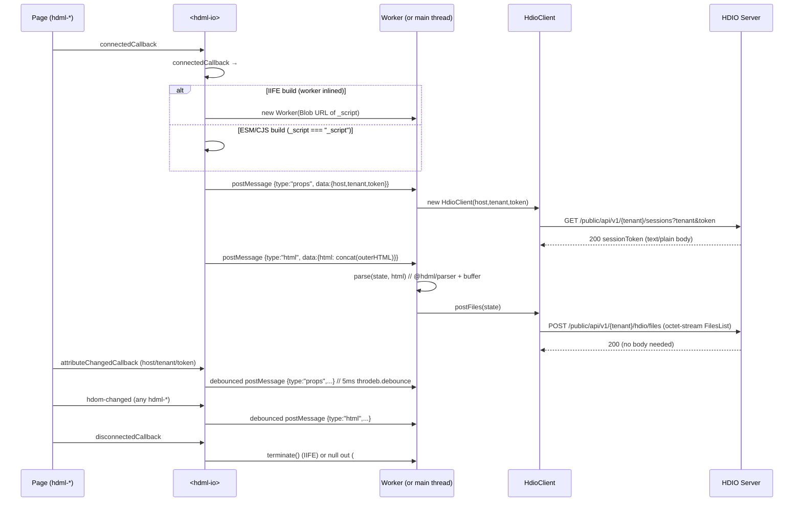

# `<hdml-io>` and the HDIO client

**Scope:** the host element that uploads the HDML document — its attributes, the Worker
message protocol, and the HTTP calls it makes to the HDIO server.

Adjacent reading: [docs/architecture.md](architecture.md) for the end-to-end picture ·
[docs/decisions.md](decisions.md) for the `_script` sentinel that flips between
Worker / main-thread execution.

## Element surface

[src/hdio/HdmlIo.ts](../src/hdio/HdmlIo.ts) registers `<hdml-io>` (extends `LitElement`, not
`HdomElement`). It renders `<slot></slot>` and exposes three attributes:

| Attribute | Type | Purpose |
|---|---|---|
| `host` | string | Base URL of the HDIO server (no trailing slash; `<host>/public/api/v1/...`) |
| `tenant` | string | Tenant identifier — appears in both the URL path and the `sessions` query string |
| `token` | string | Bearer-token-equivalent issued by upstream auth; exchanged for a session token |

Place one `<hdml-io>` in the page **as a sibling** of the `<hdml-*>` declarations — not as a
parent. It listens to `document` for `hdom-changed` events, so any position works as long as
it is connected.

```html
<hdml-io host="https://hdio.example" tenant="acme" token="…"></hdml-io>
```

## Lifecycle



The `props` and `html` posts are independently debounced 5 ms via `throdeb.debounce` from
`@hdml/common` — see [src/hdio/HdmlIo.ts:84-93](../src/hdio/HdmlIo.ts#L84-L93) and
[src/hdio/HdmlIo.ts:121-140](../src/hdio/HdmlIo.ts#L121-L140).

The `html` post concatenates `outerHTML` for *every* `hdml-connection`, `hdml-model`, and
`hdml-frame` in the document. Nested children (tables, fields, joins, etc.) ride along inside
their parent's `outerHTML`; they are not posted separately. See
[src/hdio/HdmlIo.ts:125-133](../src/hdio/HdmlIo.ts#L125-L133).

## Worker message protocol

Implemented in [src/hdio/onmessage.ts](../src/hdio/onmessage.ts).

```ts
type HdmlMessage =
  | { type: "props"; data: { host: string; tenant: string; token: string } }
  | { type: "html";  data: { html: string } }
```

- **`props`** — replaces the in-Worker `HdioClient`, closing any prior one. Empty values are
  not filtered here; `HdioClient`'s constructor checks `host && tenant && token` before
  starting a session.
- **`html`** — calls `parse(state, html)` (see [docs/architecture.md#parse--serialize](architecture.md#parse--serialize)) and then `client.postFiles(state)`. `state` is module-scoped — the cumulative set of parsed/uploaded files persists for the lifetime of the Worker.

There is **no `onerror` / response message back to the main thread**. Errors `console.error`
inside the Worker and the main thread never knows.

## HdioClient

[src/hdio/HdioClient.ts](../src/hdio/HdioClient.ts) wraps `fetch` (polyfilled via
`whatwg-fetch`). Constructor: `(host, tenant, token)`. If any is empty / zero-length, the
client is inert (no session, `postFiles` will await `#initialization!` and reject with
`Cannot read .then of null` — `TODO(confirm: this is intentional; current code does not guard
against empty inputs other than the constructor short-circuit).`

### Endpoint surface

All requests go to `{host}/public/api/v1/{tenant}/{api}{path}{?params}`. Common headers:
`Authorization: Bearer {session}` and `content-type: application/octet-stream`. Mode:
`cors`, redirect: `follow`, cache: `no-cache`.

| When | Method | api | path | params | body |
|---|---|---|---|---|---|
| Bootstrap | `GET` | `sessions` | *(none)* | `tenant`, `token` | none |
| Upload | `POST` | `hdio` | `/files` | *(none)* | `state.data.slice().buffer` (the FlatBuffers `FilesList`) |

The response of `GET sessions` is read as **text** (`await response.text()`) and used as the
session bearer token on subsequent requests. The response of `POST /files` is not consumed on
success.

### Error handling

`!response.ok` → parse the body as JSON `{statusCode?, message?}` and throw
`new Error(message.message || response.statusText)`. Callers (`postFiles` in the worker,
`initialize` from the constructor) `.catch(console.error)`.

`TODO(confirm: whether the HDIO-Server rewrite exposes these exact paths
("/public/api/v1/{tenant}/sessions" and "/hdio/files") — the root workspace CLAUDE.md
mentions /public, /private, /system, /webhook namespaces but does not enumerate session/files
endpoints for this client.)`

## Same-thread fallback (`_script` sentinel)

In the ESM and CJS builds, `import _script from "./HdmlIo.worker"` resolves to the literal
string `"_script"` (the placeholder export in
[src/hdio/HdmlIo.worker.ts:11](../src/hdio/HdmlIo.worker.ts#L11)). `HdmlIo.ts` checks
`_script === "_script"` and, if true, runs the same `onmessage` handler on the main thread by
setting `#messagable = globalThis.self`. *No Worker is created.* This makes the ESM build
viable in environments where Workers are awkward (e.g. test runners, SSR shells), at the cost
of running parsing on the main thread.

In the IIFE build (`bin/index.min.js`), the esbuild plugin in
[.esbuildrc.mjs:8-45](../.esbuildrc.mjs#L8-L45) replaces that sentinel with the bundled
worker source as a string. `HdmlIo` then wraps it in a Blob URL and spawns a real `Worker`.
See [docs/decisions.md#why-_script](decisions.md#why-_script).
