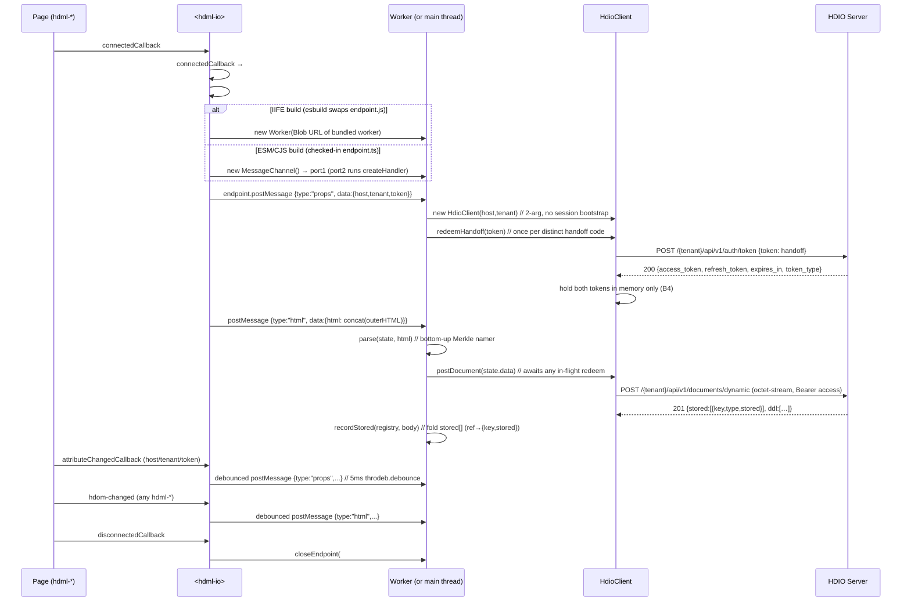

# `<hdml-io>` and the HDIO client

**Scope:** the host element that uploads the HDML document — its attributes, the Worker
message protocol, and the HTTP calls it makes to the HDIO server.

Adjacent reading: [docs/architecture.md](architecture.md) for the end-to-end picture ·
[docs/decisions.md](decisions.md) for the `endpoint.ts` seam that flips between
Worker / MessagePort-fallback execution.

## Element surface

[src/hdio/HdmlIo.ts](../src/hdio/HdmlIo.ts) registers `<hdml-io>` (extends `LitElement`, not
`HdomElement`). It renders `<slot></slot>` and exposes three attributes:

| Attribute | Type | Purpose |
|---|---|---|
| `host` | string | Base URL of the HDIO server (no trailing slash) — the one base every request is sent to |
| `tenant` | string | Tenant identifier — the leading path segment of every request (`/{tenant}/api/v1/…`) |
| `token` | string | Token mode: a **single-use handoff code** the host app's backend minted in issuance step 1, redeemed here for the access/refresh pair (§3.2, B2). Not a bearer token. |

Place one `<hdml-io>` in the page **as a sibling** of the `<hdml-*>` declarations — not as a
parent. It listens to `document` for `hdom-changed` events, so any position works as long as
it is connected.

Auth is **opt-in**: a page that leaves `token` unset (and uses its own client/server
mechanism) leaves `<hdml-io>` inert — no request is sent without an access token. The `mode`
attribute (`token` default / `oidc`) is added in Step 03; this step implements token mode.

```html
<hdml-io host="https://hdio.example" tenant="acme" token="…"></hdml-io>
```

## Lifecycle



The `props` and `html` posts are independently debounced 5 ms via `throdeb.debounce` from
`@hdml/common` — see [src/hdio/HdmlIo.ts:84-93](../src/hdio/HdmlIo.ts#L84-L93) and
[src/hdio/HdmlIo.ts:121-140](../src/hdio/HdmlIo.ts#L121-L140).

The `html` post concatenates `outerHTML` for *every* `hdml-connection`, `hdml-model`, and
`hdml-frame` in the document. Nested children (tables, fields, joins, etc.) ride along inside
their parent's `outerHTML`; they are not posted separately. See
[src/hdio/HdmlIo.ts:125-133](../src/hdio/HdmlIo.ts#L125-L133).

## Worker message protocol

Implemented in [src/hdio/onmessage.ts](../src/hdio/onmessage.ts) as
`createHandler(post)` — the handler is parameterized on its outbound sink
`post(msg, transfer?)`, and its `client` / `state` are **closure** state (one
endpoint, one client). Both directions are a discriminated union on `type`
(RFC 014/001 §2.5) — this supersedes the old two-variant `HdmlMessage`.

**Main → worker** (delivered to the `createHandler` listener):

| `type` | Payload | Wired? |
|---|---|---|
| `props` | `{host, tenant, mode?, token?, config?}` | ✅ Slice A |
| `html` | `{html}` | ✅ Slice A |
| `oidc-callback` | `{code, state}` | ⏳ Step 03 |
| `subscribe` | `{id, ref, column, raw?}` | ⏳ Step 07 |
| `unsubscribe` | `{id}` | ⏳ Step 07 |

**Worker → main** (via `post(msg, transfer?)`):

| `type` | Payload | Transfer | Wired? |
|---|---|---|---|
| `auth` | `{ok, reason?, detail?}` | — | ⏳ Slice B |
| `result` | `{ref, column, values?, domain, type}` | `[ArrayBuffer]` when `values` present | ⏳ Slice D |
| `error` | `{ref?, message}` | — | ⏳ B/D |

- **`props`** — (re)constructs the in-Worker `HdioClient` (2-arg: `host`, `tenant`),
  closing any prior one. In **token mode**, if `data.token` (a handoff code) is present it
  calls `client.redeemHandoff(token)` — but **once per distinct code**: the last redeemed
  code is retained in closure state so a debounced re-`props` carrying the same single-use
  code does not redeem it twice (§3.2, B2). A failed redeem is logged, not re-thrown.
- **`html`** — calls `parse(state, html)` (the bottom-up Merkle namer — see [docs/architecture.md#parse--serialize](architecture.md#parse--serialize)) then `client.postDocument(state.data)`, folding the returned 201 body via `recordStored(state.registry, body)`. `postDocument` internally awaits any in-flight redeem (§3.2), so an `html` that races the auth round-trip still posts with a real `Bearer`. `parse` re-names and re-packs the **whole** document every call (no dedup — every element is re-posted; the server idempotent-skips already-present keys). `state` is closure-scoped and holds the `ref → {key, stored}` registry (keyed by local ref `hdml-{type}={name}`) that survives for the endpoint's lifetime — the substrate for the post→confirm→query handshake (RFC 004 Slice E §8.6, E-L).

The **outbound** variants (`auth` / `result` / `error`) are **declared but not yet routed**
after Slice A: the `props` / `html` handlers never reply, so `post` is never called here. The
sink exists as the seam that Slice B (auth) and Slice D (query results) call; `result`
messages will carry a **transferable `ArrayBuffer`** via the transfer-list form
`post(msg, [buf])` (the source buffer detaches — RFC §2.6, A4). This closes the current
"no message back to the main thread" gap once B/D land.

## HdioClient

[src/hdio/HdioClient.ts](../src/hdio/HdioClient.ts) wraps `fetch` (polyfilled via
`whatwg-fetch`) and is the **sole** HTTP surface to the HDIO server (RFC 014/001 §2.7). It
was rewritten for the post-006 auth surface: there is **no** `session` bootstrap (the dead
`GET …/sessions` leg — and the `Bearer null` it produced — is gone). The access + refresh
tokens live **in memory only** (B4, §3.4): no `sessionStorage`, re-auth on every reload.

Constructor: `(host, tenant)` — two args, no token, no side effect. The client is inert
(`authed === false`) until an explicit `redeemHandoff` (token mode) succeeds.

Surface implemented this step (Slice B, part 1):

```ts
constructor(host: string, tenant: string);
redeemHandoff(code: string): Promise<void>;      // issuance step 2 (§3.2)
refresh(): Promise<void>;                          // silent, on 401 / expiry
postDocument(data: Uint8Array): Promise<unknown>;  // → 201 body
close(): void;                                      // abort in-flight + clear tokens
get authed(): boolean;                              // #access != null
```

`exchangeOidcCode` (OIDC mode) is Step 03; `submitQuery` / `queryStatus` / `queryResult` /
`cancelQuery` are Step 07.

### Endpoint surface

**One** base — the `host` attribute. Every request is sent to `` `${host}${path}` `` (the
dead `/public/api/v1/{tenant}` base is gone). Routes are all verified against
[HDIO-Server handlers.go](../../HDIO-Server/internal/api/handlers.go):

| Call | Method + path | Body | Returns |
|---|---|---|---|
| `redeemHandoff(code)` | `POST /{tenant}/api/v1/auth/token` | `{ token: code }` (JSON) | `{ access_token, refresh_token, expires_in, token_type }` |
| `refresh()` | `POST /{tenant}/api/v1/auth/token/refresh` | `{ refresh_token }` (JSON) | same shape |
| `postDocument(data)` | `POST /{tenant}/api/v1/documents/dynamic` | `data.slice().buffer` (octet-stream `DocumentFilesStruct`) | `201 { stored[], ddl[] }` |

`redeemHandoff` / `refresh` parse the token pair and hold both in memory; `authed` becomes
`true`. Common request options: `mode: cors`, `redirect: follow`, `cache: no-cache`. The body
content-type is set **only when a body is present** — `application/json` for the two auth
POSTs, `application/octet-stream` for the document POST, and **nothing on a bodiless GET**
(the old client sent octet-stream on every request). The `Authorization: Bearer <access>`
header is attached only when a token is held — never `Bearer null`.

`postDocument` awaits any in-flight redeem/refresh first (so an early `html` still carries a
real `Bearer`), then posts. On a **401** it calls `refresh()` and retries **once**; a second
401 surfaces. The **201** `{ stored: [{ key, type, stored }], ddl: [{ name, status,
detail? }] }` (RFC 004 Slice E §7.2) is returned to the caller (the worker's `html` handler),
which folds the confirmed `stored[]` keys into the registry via `recordStored` — both
`stored:true` (freshly written) and `stored:false` (idempotent-skip, already present) mark the
entry present/queryable (E-L). `close()` aborts the instance-held `AbortController` (threaded
onto every request) and nulls both tokens.

### Error handling

`!response.ok` builds an `Error` **without** assuming a JSON body: only a JSON content-type is
parsed (server errors are `{ error }` — see
[HDIO-Server errors.go](../../HDIO-Server/internal/api/errors.go) `WriteError`), and anything
else — a 502 HTML page, an empty 413 — falls back to `response.statusText` or the status code.
This replaces the old unconditional `await response.json()` that threw a parse error on a
non-JSON body and masked the real status. The worker's `props` / `html` handlers
`.catch(console.error)` the surfaced error.

## Same-thread fallback (the `endpoint.ts` seam)

The build-time branch is gone from `HdmlIo.ts`. It holds `#endpoint: null | Endpoint`
(`Worker | MessagePort`) and calls only `createEndpoint()` / `closeEndpoint()` from
[src/hdio/endpoint.ts](../src/hdio/endpoint.ts).

In the ESM and CJS builds, the **checked-in** `endpoint.ts` is the fallback: `createEndpoint`
builds a private `MessageChannel`, wires `createHandler(post)` onto `port2.onmessage`, and
returns `port1` to the element. No global slot is touched — nothing off-page can reach it
(this replaces the pre-Slice-A `globalThis.self` path, which on the main thread hijacked
`window.onmessage`, A1). The handler still runs on the main thread (the fallback is a
correctness/isolation fix, not parallelism — real off-thread work is the IIFE build).

In the IIFE build (`bin/index.min.js`), the esbuild plugin in
[.esbuildrc.mjs](../.esbuildrc.mjs) matches **`endpoint.js`** (not `*.worker.js`) and replaces
the whole module with a `createEndpoint` that Blob-URL-spawns the bundled `HdmlIo.worker.js` as
a real `Worker` (and a `closeEndpoint` that `terminate()`s it). See
[docs/decisions.md#the-endpointts-seam](decisions.md#the-endpointts-seam).
