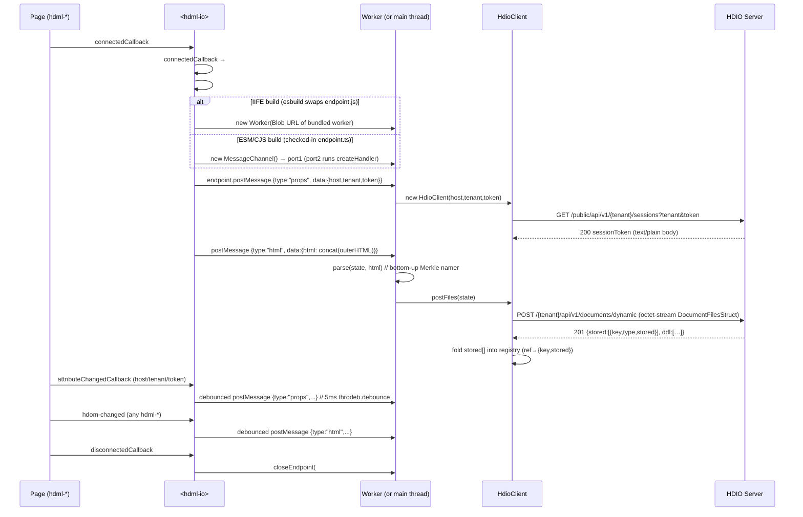

# `<hdml-io>` and the HDIO client

**Scope:** the host element that uploads the HDML document — its attributes, the Worker
message protocol, and the HTTP calls it makes to the HDIO server.

Adjacent reading: [docs/architecture.md](architecture.md) for the end-to-end picture ·
[docs/decisions.md](decisions.md) for the `endpoint.ts` seam that flips between
Worker / MessagePort-fallback execution.

## Element surface

[src/hdio/HdmlIo.ts](../src/hdio/HdmlIo.ts) registers `<hdml-io>` (extends `LitElement`, not
`HdomElement`). It renders `<slot></slot>` and exposes three attributes:

| Attribute | Type | Purpose |
|---|---|---|
| `host` | string | Base URL of the HDIO server (no trailing slash) |
| `tenant` | string | Tenant identifier — appears in both the URL path and the `sessions` query string |
| `token` | string | Bearer-token-equivalent issued by upstream auth; exchanged for a session token |

Place one `<hdml-io>` in the page **as a sibling** of the `<hdml-*>` declarations — not as a
parent. It listens to `document` for `hdom-changed` events, so any position works as long as
it is connected.

```html
<hdml-io host="https://hdio.example" tenant="acme" token="…"></hdml-io>
```

## Lifecycle



The `props` and `html` posts are independently debounced 5 ms via `throdeb.debounce` from
`@hdml/common` — see [src/hdio/HdmlIo.ts:84-93](../src/hdio/HdmlIo.ts#L84-L93) and
[src/hdio/HdmlIo.ts:121-140](../src/hdio/HdmlIo.ts#L121-L140).

The `html` post concatenates `outerHTML` for *every* `hdml-connection`, `hdml-model`, and
`hdml-frame` in the document. Nested children (tables, fields, joins, etc.) ride along inside
their parent's `outerHTML`; they are not posted separately. See
[src/hdio/HdmlIo.ts:125-133](../src/hdio/HdmlIo.ts#L125-L133).

## Worker message protocol

Implemented in [src/hdio/onmessage.ts](../src/hdio/onmessage.ts) as
`createHandler(post)` — the handler is parameterized on its outbound sink
`post(msg, transfer?)`, and its `client` / `state` are **closure** state (one
endpoint, one client). Both directions are a discriminated union on `type`
(RFC 014/001 §2.5) — this supersedes the old two-variant `HdmlMessage`.

**Main → worker** (delivered to the `createHandler` listener):

| `type` | Payload | Wired? |
|---|---|---|
| `props` | `{host, tenant, mode?, token?, config?}` | ✅ Slice A |
| `html` | `{html}` | ✅ Slice A |
| `oidc-callback` | `{code, state}` | ⏳ Step 03 |
| `subscribe` | `{id, ref, column, raw?}` | ⏳ Step 07 |
| `unsubscribe` | `{id}` | ⏳ Step 07 |

**Worker → main** (via `post(msg, transfer?)`):

| `type` | Payload | Transfer | Wired? |
|---|---|---|---|
| `auth` | `{ok, reason?, detail?}` | — | ⏳ Slice B |
| `result` | `{ref, column, values?, domain, type}` | `[ArrayBuffer]` when `values` present | ⏳ Slice D |
| `error` | `{ref?, message}` | — | ⏳ B/D |

- **`props`** — (re)constructs the in-Worker `HdioClient`, closing any prior one. Empty
  values are not filtered here; `HdioClient`'s constructor checks `host && tenant && token`
  before starting a session.
- **`html`** — calls `parse(state, html)` (the bottom-up Merkle namer — see [docs/architecture.md#parse--serialize](architecture.md#parse--serialize)) then `client.postFiles(state)`. `parse` re-names and re-packs the **whole** document every call (no dedup — every element is re-posted; the server idempotent-skips already-present keys). `state` is closure-scoped and holds the `ref → {key, stored}` registry (keyed by local ref `hdml-{type}={name}`) that survives for the endpoint's lifetime — the substrate for the post→confirm→query handshake (RFC 004 Slice E §8.6, E-L).

The **outbound** variants (`auth` / `result` / `error`) are **declared but not yet routed**
after Slice A: the `props` / `html` handlers never reply, so `post` is never called here. The
sink exists as the seam that Slice B (auth) and Slice D (query results) call; `result`
messages will carry a **transferable `ArrayBuffer`** via the transfer-list form
`post(msg, [buf])` (the source buffer detaches — RFC §2.6, A4). This closes the current
"no message back to the main thread" gap once B/D land.

## HdioClient

[src/hdio/HdioClient.ts](../src/hdio/HdioClient.ts) wraps `fetch` (polyfilled via
`whatwg-fetch`). Constructor: `(host, tenant, token)`. If any is empty / zero-length, the
client is inert (no session, `postFiles` will await `#initialization!` and reject with
`Cannot read .then of null` — `TODO(confirm: this is intentional; current code does not guard
against empty inputs other than the constructor short-circuit).`

### Endpoint surface

Two base paths are used. The dynamic-doc save goes to the live tenant router
`{host}/{tenant}/api/v1/documents/dynamic` (verified at
[HDIO-Server handlers.go](../../HDIO-Server/internal/api/handlers.go) `/{tenant}/api/v1` →
`Post("/documents/dynamic", …)`, E-B). The session bootstrap stays on the legacy
`{host}/public/api/v1/{tenant}/sessions` prefix (auth bootstrap is a separate concern —
project 006). Common headers: `Authorization: Bearer {session}` and
`content-type: application/octet-stream`. Mode: `cors`, redirect: `follow`, cache: `no-cache`.

| When | Method | api | path | params | body |
|---|---|---|---|---|---|
| Bootstrap | `GET` | `sessions` | *(none)* | `tenant`, `token` | none |
| Upload | `POST` | `documents` | `/dynamic` | *(none)* | `state.data.slice().buffer` (the FlatBuffers `DocumentFilesStruct`) |

The response of `GET sessions` is read as **text** (`await response.text()`) and used as the
session bearer token on subsequent requests. The `POST /documents/dynamic` response is a
**201** `{ stored: [{ key, type, stored }], ddl: [{ name, status, detail? }] }` (RFC 004
Slice E §7.2); `postFiles` folds the confirmed `stored[]` keys into the registry — both
`stored:true` (freshly written) and `stored:false` (idempotent-skip, already present) mark the
entry present/queryable (E-L).

### Error handling

`!response.ok` → parse the body as JSON `{statusCode?, message?}` and throw
`new Error(message.message || response.statusText)`. Callers (`postFiles` in the worker,
`initialize` from the constructor) `.catch(console.error)`.

The `POST /{tenant}/api/v1/documents/dynamic` route is confirmed against the live router.
`TODO(confirm: the session bootstrap leg still targets the legacy
`/public/api/v1/{tenant}/sessions` prefix, but the current HDIO-Server router exposes no
`sessions` route — reconciling the auth bootstrap is project 006, Token Authentication.)`

## Same-thread fallback (the `endpoint.ts` seam)

The build-time branch is gone from `HdmlIo.ts`. It holds `#endpoint: null | Endpoint`
(`Worker | MessagePort`) and calls only `createEndpoint()` / `closeEndpoint()` from
[src/hdio/endpoint.ts](../src/hdio/endpoint.ts).

In the ESM and CJS builds, the **checked-in** `endpoint.ts` is the fallback: `createEndpoint`
builds a private `MessageChannel`, wires `createHandler(post)` onto `port2.onmessage`, and
returns `port1` to the element. No global slot is touched — nothing off-page can reach it
(this replaces the pre-Slice-A `globalThis.self` path, which on the main thread hijacked
`window.onmessage`, A1). The handler still runs on the main thread (the fallback is a
correctness/isolation fix, not parallelism — real off-thread work is the IIFE build).

In the IIFE build (`bin/index.min.js`), the esbuild plugin in
[.esbuildrc.mjs](../.esbuildrc.mjs) matches **`endpoint.js`** (not `*.worker.js`) and replaces
the whole module with a `createEndpoint` that Blob-URL-spawns the bundled `HdmlIo.worker.js` as
a real `Worker` (and a `closeEndpoint` that `terminate()`s it). See
[docs/decisions.md#the-endpointts-seam](decisions.md#the-endpointts-seam).
