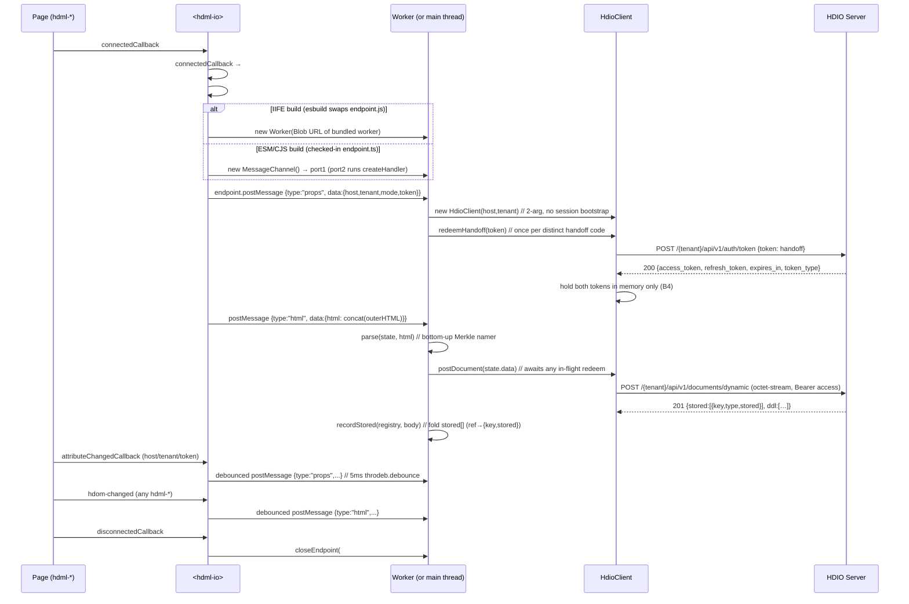

# `<hdml-io>` and the HDIO client

**Scope:** the host element that uploads the HDML document — its attributes, the Worker
message protocol, and the HTTP calls it makes to the HDIO server.

Adjacent reading: [docs/architecture.md](architecture.md) for the end-to-end picture ·
[docs/decisions.md](decisions.md) for the `endpoint.ts` seam that flips between
Worker / MessagePort-fallback execution.

## Element surface

[src/hdio/HdmlIo.ts](../src/hdio/HdmlIo.ts) registers `<hdml-io>` (extends `LitElement`, not
`HdqlElement`). It renders `<slot></slot>` and exposes three attributes:

| Attribute | Type | Purpose |
|---|---|---|
| `host` | string | Base URL of the HDIO server (no trailing slash) — the one base every request is sent to |
| `tenant` | string | Tenant identifier — the leading path segment of every request (`/{tenant}/api/v1/…`) |
| `mode` | string | Auth flow selector (B1, §3.1): `token` (default) or `oidc`. Forwarded to the worker in `props`. |
| `token` | string | Token mode: a **single-use handoff code** the host app's backend minted in issuance step 1, redeemed here for the access/refresh pair (§3.2, B2). Not a bearer token. |

Place one `<hdml-io>` in the page **as a sibling** of the `<hdml-*>` declarations — not as a
parent. It listens to `document` for `hdom-changed` events, so any position works as long as
it is connected.

Auth is **opt-in**: a page that leaves `mode`/`token` unset (and uses its own client/server
mechanism) leaves `<hdml-io>` inert — no request is sent without an access token. Tokens are
held **in memory only** in both modes (B4), so re-auth happens automatically on every reload.

- **token mode** (`mode` unset or `mode="token"`) — the `token` attribute carries the handoff
  code; the worker redeems it (§3.2).
- **oidc mode** (`mode="oidc"`) — no `token`; the element runs a full-page redirect / callback
  dance (§3.3, below).

```html
<hdml-io host="https://hdio.example" tenant="acme" token="…"></hdml-io>
<hdml-io host="https://hdio.example" tenant="acme" mode="oidc"></hdml-io>
```

### OIDC mode — the main-thread state machine (§3.3, B3/B5)

`mode="oidc"` auto-triggers login — there is no manual `login()`. Because the navigation /
`history` / `location` concerns are main-thread (a worker has none), the redirect dance lives
in `HdmlIo.ts`; the code→token **exchange also runs on the main thread** ([`exchange.ts`](../src/hdio/exchange.ts),
[`#runExchange`](../src/hdio/HdmlIo.ts)). It **must**: the IIFE build's worker is inlined from a
`blob:` URL, whose `fetch` carries `Origin: null`, which a cross-origin HDIO server's CORS
allow-list rejects — a worker-side callback fetch never completes. The minted pair is the only
token data crossing into the worker (`oidc-tokens`), held in memory there for the authed
document/query requests. The connect / attribute-change handler is an **ordered,
reentrancy-guarded** state machine (a pure `nextAuthAction` decision in
[src/hdio/oidc.ts](../src/hdio/oidc.ts) + a thin effect):

1. **`?code&state` on the URL** → `#runExchange` does `GET …/auth/callback` **on the main
   thread**; on success it hands the pair to the worker (`oidc-tokens`) and `history.replaceState`s
   to strip the params; a **401** (spent `state`) re-navigates to the IdP; any other failure is
   logged once.
2. else **`?error` on the URL** (the IdP bounced back an error, not a code) → if it is one of
   the four OIDC-standard "interaction required" codes (`login_required` /
   `interaction_required` / `consent_required` / `account_selection_required`) the element
   **retries once interactively** — `navigate` to `/auth/login?…&interactive=1`, which tells
   the server to suppress the tenant's configured `prompt` so the flow cannot loop. Any other
   error (e.g. `access_denied`) is an `auth-error`: strip the params and dev-log once, **no
   retry**.
3. else **`token` set** → the `props` path forwards it (token mode; the worker redeems).
4. else **`mode === "oidc"`** → `location.assign` to
   `` `${host}/{tenant}/api/v1/auth/login?redirect_uri=<origin+pathname>` `` — the login target
   is `host`-based like every call; only the `redirect_uri` **value** is the app's own page
   (URL-encoded, no query). A **reentrancy guard** (`#navigating`) ensures the flurry of
   `attributeChangedCallback` fires (`mode`/`token` in either order) triggers **exactly one**
   navigation.
5. else **inert**.

A stale reload (a spent single-use `state` → the callback 401s) comes back as `auth
{ok:false, reason:"stale"}`, which the state machine treats as "start over" and re-navigates —
**not** a hard error. An `auth {ok:false, reason:"error"}` is surfaced once (dev-log), no loop.

**Silent auto-login.** Because tokens are in-memory only, every reload re-runs step 4; with
no server-side `prompt` the IdP shows its account chooser each time. Set `prompt: "none"` in
the tenant's OIDC SSO config (server-side —
[HDIO-Server `docs/auth.md`](../../HDIO-Server/docs/auth.md#silent-auto-login-promptnone)) and
a reload with a live IdP session returns a code with no UI. When the session is absent/expired
the IdP returns `login_required` (etc.), and step 2's interactive retry takes over — so first
login still works. This is a **server-configured, client-cooperative** flow: the component
needs no attribute, it just reacts to the `?error` the `prompt=none` redirect can produce.

> **Deployment requirement.** The exact `redirect_uri` (`location.origin + location.pathname`)
> must be **pre-registered** in the tenant's SSO config, or the server answers `403
> ErrRedirectURINotAllowed` (`slices.Contains(oidc.RedirectURIs, …)`).

## Lifecycle



The `props` and `html` posts are independently debounced 5 ms via `throdeb.debounce` from
`@hdml/common` — see [src/hdio/HdmlIo.ts:84-93](../src/hdio/HdmlIo.ts#L84-L93) and
[src/hdio/HdmlIo.ts:121-140](../src/hdio/HdmlIo.ts#L121-L140).

The `html` post concatenates `outerHTML` for *every* `hdml-connection`, `hdml-model`, and
`hdml-frame` in the document. Nested children (tables, fields, joins, etc.) ride along inside
their parent's `outerHTML`; they are not posted separately. See
[src/hdio/HdmlIo.ts:125-133](../src/hdio/HdmlIo.ts#L125-L133).

## Worker message protocol

Implemented in [src/hdio/onmessage.ts](../src/hdio/onmessage.ts) as
`createHandler(post)` — the handler is parameterized on its outbound sink
`post(msg, transfer?)`, and its `client` / `state` are **closure** state (one
endpoint, one client). Both directions are a discriminated union on `type`
(RFC 014/001 §2.5) — this supersedes the old two-variant `HdmlMessage`.

**Main → worker** (delivered to the `createHandler` listener):

| `type` | Payload | Wired? |
|---|---|---|
| `props` | `{host, tenant, mode?, token?, config?}` | ✅ Slice A/B · `config` from `window.HDML_CONFIG` (Step 08) |
| `html` | `{html}` | ✅ Slice A |
| `oidc-tokens` | `{access, refresh}` | ✅ handed over by the main-thread OIDC exchange (§3.3) |
| `subscribe` | `{id, ref, column, raw?}` | ✅ Step 07 (worker) · posted by the main-thread bus (Step 08) |
| `unsubscribe` | `{id}` | ✅ Step 07 (worker) · posted by the main-thread bus (Step 08) |

**Worker → main** (via `post(msg, transfer?)`):

| `type` | Payload | Transfer | Wired? |
|---|---|---|---|
| `result` | `{ref, column, values?, nulls?, domain, type}` | `[ArrayBuffer]` when `values`/`nulls` are typed-array buffers | ✅ Step 07 |
| `error` | `{ref?, message}` | — | ✅ Step 07 |

The `result` payload is now tightened to the Step 06 types (§5.6/§5.7): `domain`
is a [`Domain`](../src/hdio/reducers.ts) (`{kind:"extent", value:[min,max]}` or
`{kind:"ordinal", value:[…]}`), `type` is the D9 [`ColumnType`](../src/hdio/decode.ts)
tag, and `values` is present **only when some subscriber of that column set
`raw !== false`** — a transferable `{buffer, byteOffset, byteLength}` for a
numeric/temporal column (the `buffer` rides the transfer list, A4; the source
detaches) or the `string[]` itself for an ordinal column (no buffer to transfer).
`raw:false` subscribers (a pure axis/legend) get `domain` + `type` only.

- **`props`** — constructs the in-Worker `HdioClient` (2-arg: `host`, `tenant`) **only on
  first `props` or a genuine `host`/`tenant` change**, closing the prior one; a repeat
  `props` with the same identity (the debounced attribute flurry, the token-mode auth
  nudge) **reuses** the live client. Rebuilding on every `props` would `close()` — i.e.
  abort — an in-flight redeem and drop the held tokens, and the once-per-code guard would
  then block re-auth on the replacement, leaving every POST unauthenticated. In **token
  mode**, if `data.token` (a handoff code) is present it calls `client.redeemHandoff(token)`
  — but **once per distinct code**: the last redeemed code is retained in closure state so a
  debounced re-`props` carrying the same single-use code does not redeem it twice (§3.2,
  B2); the guard resets only when the identity changes. A failed redeem is logged, not
  re-thrown.
- **`html`** — calls `parse(state, html)` (the bottom-up Merkle namer — see [docs/architecture.md#parse--serialize](architecture.md#parse--serialize)) then `client.postDocument(state.data)`, folding the returned 201 body via `recordStored(state.registry, body)`. `postDocument` internally awaits any in-flight redeem (§3.2), so in **token** mode an `html` that races the auth round-trip still posts with a real `Bearer`. **OIDC** mode has no in-flight redeem to await, so a load-time `html` (fired by `hdom-changed` before the async exchange resolves) throws "not authenticated"; the `oidc-tokens` handler below re-POSTs once the pair lands. `parse` re-names and re-packs the **whole** document every call (no dedup — every element is re-posted; the server idempotent-skips already-present keys). `state` is closure-scoped and holds the `ref → {key, stored}` registry (keyed by local ref `hdml-{type}={name}`) that survives for the endpoint's lifetime — the substrate for the post→confirm→query handshake (RFC 004 Slice E §8.6, E-L).
- **`oidc-tokens`** — the OIDC exchange runs on the **main thread** now (§3.3): a `blob:`-URL
  worker's `fetch` carries `Origin: null`, which a cross-origin HDIO server's CORS rejects, so
  the worker cannot fetch `/auth/callback` itself. The main thread does the exchange and hands
  the minted `{access, refresh}` here; the worker adopts it via `client.setTokens(access,
  refresh)` for the authed document/query requests. It is **stashed** in closure state so a
  client rebuilt by a racing `props` re-adopts it (the exchange fetch and `props` are
  unordered), and cleared on a genuine identity change. Adopting the pair also **re-POSTs the
  current document** (the shared post-and-fold path): the load-time `html`→`postDocument` raced
  ahead of the async tokens and threw "not authenticated", and nothing else re-posts, so this
  re-POST is what actually stores the doc and releases the gated queries — the OIDC analogue of
  token mode's redeem → `#pending` → awaited POST. A no-op until a document has been parsed.

- **`subscribe` / `unsubscribe`** — drive the reactive query engine (Step 07, D). A
  `subscribe {id, ref, column, raw?}` joins the `(ref, column)` to its frame (keyed by the
  source ref); `unsubscribe {id}` removes it and tears the frame down when its last
  subscriber leaves. Both are **posted by `<hdml-io>`'s main-thread subscription registry**
  off the D8 request bus (Step 08) — see [The discovery bus + subscription registry](#the-discovery-bus--subscription-registry-step-08-d7d8)
  and [The query leg](#the-query-leg-slice-d) below.

`HdmlIo.ts`'s `#onMessage` now only fans out `result` — the OIDC `strip` (ok) / `re-navigate`
(stale) branches moved to `#runExchange` when the exchange moved main-side (§3.3). `result` and
`error` are the query-leg outbound: a `result` carries a **transferable `ArrayBuffer`** via the
transfer-list form `post(msg, [buf])` for a raw numeric/temporal column (the source buffer
detaches — RFC §2.6, A4); an `error` carries a failure reason for a frame the consumer
renders empty rather than as a silent spinner.

### Column decode + scale domain (Slice D, D9/D3)

The `result` payload's `type` / `values` / `domain` come from two **pure** modules the worker
calls once per coalesced column (Step 07 wires them into `subscribe` → `result`):

- [src/hdio/decode.ts](../src/hdio/decode.ts) — `decode(ipc)` turns an Arrow IPC payload into
  one `DecodedColumn { name, type, values }` per field, reading each column's kind **off the
  self-describing Arrow result schema** (`field.type`), never the authored frame `type`
  (§5.7, D9):

  | Arrow type | `type` tag | `values` |
  |---|---|---|
  | `Utf8` | `{kind:"string"}` | `string[]` |
  | integer ≤32-bit / float | `{kind:"number"}` | `Float64Array` |
  | 64-bit integer | `{kind:"bigint"}` | `BigInt64Array` |
  | `Date32` / `Date64` | `{kind:"date", unit:"ms"}` | epoch-ms at **UTC midnight** (a calendar day) |
  | `Time32` / `Time64` | `{kind:"time", unit:"ms"}` | **ms since midnight** — a within-day offset, **not** an instant |
  | `Timestamp` | `{kind:"timestamp", unit:"ms", zone?}` | epoch-ms instant, **UTC at the edge** |

  The three temporal families stay **distinct** (never collapsed to one instant), and every
  family is normalized to **ms** here (Arrow's native s/ms/µs/ns converted at decode). A
  zone-less `Timestamp` is read as **UTC** (the one silent decision — deterministic across
  clients, no local-offset shift); a zoned one passes its timezone through as `zone` **without
  shifting the instant**.
- [src/hdio/reducers.ts](../src/hdio/reducers.ts) — `domainFor(col)` returns the
  type-appropriate scale `Domain`: an `extent` `[min, max]` for a numeric/temporal column, or
  the insertion-order-stable `ordinal` distinct list for a `string` one (§5.3, D3). `distinct`
  is computed **only** for strings, so a continuous column never pays a distinct pass — an
  ordinal date bucket an author emits as `VARCHAR` arrives as a string and is handled
  ordinally.

### The query leg (Slice D)

The reactive engine lives in the [onmessage.ts](../src/hdio/onmessage.ts) closure alongside
`client` / `state`: a `subId → subscription` map and a per-frame coalescing map keyed by the
source ref. One frame = one query; the full path is
**subscribe → coalesce → gate → submit → poll → decode → domain → result**.

- **Coalesce (D1, §5.2).** Every subscriber contributes its `column`; the frame's wire
  columns are the sorted **union**. A mount burst is **debounced** (10 ms) before the first
  submit, so N attributes on one frame issue **one** `/queries` with the unioned `columns`.
- **Stored-gate (D4, §5.4).** A **local** target's first query holds until its ref is
  `resolveQueryTarget`-resolvable **and** `stored:true`. The gate is **event-driven**: a
  `postDocument` 201 that flips the ref `stored` releases it (re-evaluated right after
  `recordStored`); a `postDocument` **rejection** fails every gated frame at once with the
  real reason. The timer is only the **backstop** for a POST that neither resolves nor
  rejects — `queryReadyTimeout` (from `props.config.queryReadyTimeout`, **default 10 000 ms**;
  Step 08 populates it from `window.HDML_CONFIG`). The same gate absorbs an **unknown** ref
  (subscribe-before-parse — the resolver throw is read as *not-ready-yet*). On expiry → one
  `error`. **Static** (`/`-prefixed) targets have no gate.
- **Poll (D6, §5.6).** If the `submitQuery` 202 `status` is already terminal (a cache hit),
  skip straight to `queryResult`; else poll `queryStatus` short-first (~200 ms) doubling to a
  ceiling (~2 s) with a wall-clock cap. `completed` → one `queryResult`; `failed` →
  `status.error` is the reason.
- **Supersede (D5, §5.5).** Each frame tracks a monotonic **generation**; a widened union (or
  a changed frame key) bumps it, and any earlier run whose generation is now stale **discards**
  its completion (never delivers). Superseded jobs are **not** cancelled by default (server
  `Cancel` cannot abort a running Trino query); a still-`pending` superseded job is
  best-effort `cancelQuery`-ed (409 swallowed), running jobs never.
- **Deliver (D7, §5.6).** The result is `decode`d **once**; the worker emits **one `result`
  per distinct column** with its `domain` + `type`, and `values` only when some subscriber of
  that column wants raw — the main-thread registry (Step 08) fans the one message out to every
  subscriber of that `(ref, column)`, so a shared raw buffer transfers once.

### The discovery bus + subscription registry (Step 08, D7/D8)

The consumer-facing half lives on the **main thread** in
[src/hdio/HdmlIo.ts](../src/hdio/HdmlIo.ts) (RFC §2.8/§5.8, D7/D8). Data-binding consumers
(charts / axes / legends — a **separate repo**, §8) never touch the worker: they announce
themselves on a `document` event bus, `<hdml-io>` registers them and drives
`subscribe`/`unsubscribe`, and each worker `result` fans out to every matching subscriber.

- **Rendezvous — a `bubbles`/`composed` request event.** `<hdml-io>` listens on `document`
  for the request event (the W3C/Lit context-request pattern); `composed:true` keeps it
  crossing any shadow boundary a consumer sits behind. On receipt it registers a subscriber
  and posts `subscribe {id, ref, column, raw}` to the worker. There is **no**
  `MutationObserver` and **no** hard-coded consumer tag-name list — consumers self-announce.
  This is distinct from hdml-io's own three authored roots, which are **queried** with
  `document.querySelectorAll` (declarations are in the document by definition; consumers
  announce, and may live in shadow).
- **Symmetric `hdml-io-ready` handshake (race-free).** On `connectedCallback` — after the
  endpoint **and** the request listener are wired — `<hdml-io>` dispatches `hdml-io-ready` on
  `document` **and** answers any request it already heard. A consumer, on its own connect,
  both listens for `hdml-io-ready` and dispatches its request; on hearing ready it
  re-dispatches. Subscriptions **de-dupe by `id`**, so hdml-io-first and consumer-first both
  converge. `hdml-io-ready` means "ready to **receive**" (listener + endpoint wired) — **not**
  parsed/stored; the D4 10 s gate then handles satisfiability.
- **Fan-out (D7).** The worker emits **one** `result {ref, column, values?, domain, type}` per
  distinct column; `#fanOut` delivers that **one** payload object — by reference — to every
  subscriber of the matching `(ref, column)`. The transfer already detached the buffer from
  the worker, so the main thread holds one copy: a shared raw column (`x=month` across five
  lines) is **never** re-cloned per subscriber.
- **Teardown via `AbortSignal`.** A subscriber's request carries an optional `AbortSignal`; on
  `abort` (component disconnect) `<hdml-io>` drops it from the registry and posts
  `unsubscribe {id}`. Removal alone stops delivery (the fan-out reads the registry). On
  `<hdml-io>` disconnect the request listener is removed, the endpoint is closed (the worker +
  its tokens die, B4), and the registry is cleared.

**The provisional D8 seam (§8).** The event-name **defaults** are settled (`hdml-io-ready` /
`hdml-io-request` / the D4 `queryReadyTimeout`, all read from `window.HDML_CONFIG`). What
`<hdml-io>` reads off a request event's `detail` (`{id, ref, column, raw?, signal?}` + a
`deliver` callback) is a **marked-provisional** reading — the exact detail schema, the
delivery mechanism (callback and/or an `hdml-data`-style event), and the consumer-side
`ref`+`&column=` attribute are **co-designed with the separate consumer repo** and are not
invented here (see [`RequestDetail`](../src/hdio/HdmlIo.ts) — reconciling it against the real
consumer contract later is expected, not a regression).

### Shared config — `window.HDML_CONFIG` (§8, the sync point)

[src/hdio/config.ts](../src/hdio/config.ts) reads the one main-thread config **both** repos
read, so the discovery-bus names and the D4 backstop stay in step by construction:

| Field | Default | Purpose |
|---|---|---|
| `queryReadyTimeout` | `10000` | D4 stored-gate backstop (ms), forwarded to the worker as `props.config.queryReadyTimeout` |
| `readyEvent` | `"hdml-io-ready"` | the readiness event `<hdml-io>` announces |
| `requestEvent` | `"hdml-io-request"` | the subscription-request event `<hdml-io>` listens for |

`readConfig()` reads `window.HDML_CONFIG` **lazily** (each use — so a host that sets the global
after import is still honoured) and fills these defaults; an invalid `queryReadyTimeout`
(non-number or ≤ 0) or an empty event-name string falls back. Only `queryReadyTimeout` crosses
into the worker (a worker has no `window`); the event names are main-thread-only.

## Query-target resolution (Slice C)

[src/hdio/artifact.ts](../src/hdio/artifact.ts) is the bridge from the parse/save path to a
query: it turns a **source ref** (a query handle, identical grammar to an `hdml-frame`
`source`) into the `doc_path` the server's `walkChain` reads (RFC 014/001 §4, C1–C6). It is
pure — no network, no `@hdml/*` (the transform is IO's own contract with the server, so there
is **no** lockstep bump).

### Source-ref grammar

Two forms, classified on the first character (§2.9):

```
local:   ?hdml-{kind}={name}[&column={col}]
static:  /{dir}/{file}.html?hdml-{kind}={name}[&column={col}]
```

`{kind}` is `frame` | `model` **only** — a connection is not queryable (it has no
`hdml-{kind}={name}@{source}` artifact and the server's `parseArtifactKind` rejects it), so a
`connection` kind throws. The two kinds resolve **uniformly**; a bare-model query's meaning is
the server's `walkChain` concern, so a model is **never** rejected. The `&column=` tail is the
per-subscriber column selector consumed by Step 07 — it is **not** part of the `doc_path` and
is stripped by the resolver. The static ref names the authored **`.html`** markup file
(`.html` = authored source, `.hdml` = compiled artifact).

### `resolveQueryTarget(ref, registry)` — one resolver, two branches

Returns `{ docPath, stored }`:

| Branch | Input | `docPath` | `stored` | Server round-trip |
|---|---|---|---|---|
| **local** (`?`) | `?hdml-{kind}={name}[&column=…]` | `dynamic:` + `registry` entry's canonical key | the entry's `stored` flag | none — reads the worker registry |
| **static** (`/`) | `/{dir}/{file}.html?hdml-{kind}={name}` | `staticRefToDocPath(ref)` | always `true` | none — pure transform |

The **local** branch strips the `&column=` tail, looks the `hdml-{kind}={name}` key up in the
registry, and returns `dynamic:{entry.key}` carrying the entry's `stored` flag (the
post→confirm→query gate — a local target's first query holds until `stored: true`, D4). An
**unknown** local ref **throws** — but as a *pure function*: the query leg (Step 07) reads the
throw as *not-ready-yet* inside the D4 gate window, not an immediate failure. The **static**
branch never touches the registry (it is already server-side, no gate, `stored: true`); a wrong
basename is a query-time **404**, unforeseeable by the FE.

The resolved `docPath` is exactly what the server's `leafRef` expects: a `dynamic:`-prefixed
key selects the Redis-backed dynamic store, a `/`-prefixed path is a static artifact parsed by
`parseArtifactFile(filepath.Base(rel))`
([artifact_resolver.go:75-106](../../HDIO-Server/internal/compile/artifact_resolver.go#L75)).

### `staticRefToDocPath(ref)` — the precomputable pure transform

The static `@…` segment is the source-doc **basename**, not a content hash (only the dynamic
form is `@{hashify(...)}`), so a static target resolves with **zero content and zero server
round-trip**. It mirrors the Go `parseHTMLSourceRef` + `deriveSource` + `docArtifactPath`
([artifact_naming.go:21-108](../../HDIO-Server/internal/compile/artifact_naming.go#L21)):

```
HTML-form:     /{dir}/{file}.html?hdml-{kind}={name}
artifact-form: /{dir}/hdml-{kind}={name}@{file}.hdml
```

The output is **always** `/`-prefixed (the `/` marks a static target), and the directory
segment is omitted for a top-level source (`dir === "."`). Because relocating the transform to
TS does not dissolve the cross-language contract, `artifact.test.ts` pins a Go-derived fixture
— each vector traced to the Go source:

| Input ref | `doc_path` | Pins |
|---|---|---|
| `/x/a.b.html?hdml-frame=f` | `/x/hdml-frame=f@a.b.hdml` | `filepath.Ext` strips only the last extension → `source = a.b` |
| `/maang?hdml-frame=x` | `/hdml-frame=x@maang.hdml` | no extension → `source = maang`, `dir = "."` |
| `/full.html?hdml-model=m` | `/hdml-model=m@full.hdml` | top-level `dir === "."` → no dir prefix (FE keeps the leading `/`) |
| `/a/b/c.html?hdml-frame=f` | `/a/b/hdml-frame=f@c.hdml` | `filepath.Join(docPath, file)` |

`validateElementName` is mirrored too (rejects `""`, `/`, `\`, `..`), so a bad element name
fails **locally**, not at the server.

### The registry is the unified query-target map (C6)

The `ref → { key, stored }` registry in worker `state`
([parse.ts](../src/hdio/parse.ts) `RegistryEntry` / `HdioState`) — folded on each 201 via
`recordStored` — **is** the query-target map `resolveQueryTarget` reads for the local branch;
`resolveQueryTarget` is the single entry point both branches go through. Serialization is
untouched: `parse()` still leaves a `/`-prefixed static `source` **verbatim** (the server's
`parseHTMLSourceRef` errors on a ref without `?`, so pre-converting a `source` edge to
artifact-form would break `walkChain`, C5). Only the **query handle** is converted to
artifact-form, never the document's serialized `source` edges.

## HdioClient

[src/hdio/HdioClient.ts](../src/hdio/HdioClient.ts) wraps `fetch` (polyfilled via
`whatwg-fetch`) and is the **sole** HTTP surface to the HDIO server (RFC 014/001 §2.7). It
was rewritten for the post-006 auth surface: there is **no** `session` bootstrap (the dead
`GET …/sessions` leg — and the `Bearer null` it produced — is gone). The access + refresh
tokens live **in memory only** (B4, §3.4): no `sessionStorage`, re-auth on every reload.

Constructor: `(host, tenant)` — two args, no token, no side effect. The client is inert
(`authed === false`) until an explicit `redeemHandoff` (token mode) or a `setTokens` adopting
the pair the **main-thread** OIDC exchange minted (OIDC mode, §3.3) makes it authed.

Full surface (auth + document from Slice B, query leg from Step 07):

```ts
constructor(host: string, tenant: string);
redeemHandoff(code: string): Promise<void>;          // issuance step 2 (§3.2)
setTokens(access: string | null, refresh: string | null): void; // OIDC adopt (§3.3)
refresh(): Promise<void>;                              // silent, on 401 / expiry
postDocument(data: Uint8Array): Promise<unknown>;      // → 201 body
submitQuery(p: { docPath: string; columns: string[] }):
  Promise<{ jobId: string; status: string }>;          // POST …/queries → 202
queryStatus(jobId: string):
  Promise<{ status: string; error?: string }>;         // GET …/queries/{id}
queryResult(jobId: string): Promise<ArrayBuffer[]>;    // GET …/queries/{id}/result
cancelQuery(jobId: string): Promise<void>;             // DELETE …/queries/{id}
close(): void;                                          // abort in-flight + clear tokens
get authed(): boolean;                                 // #access != null
```

The OIDC callback `GET …/auth/callback` is **not** a client method: it runs on the main thread
([`exchange.ts`](../src/hdio/exchange.ts)) because a `blob:`-Worker `fetch` sends `Origin:
null`, which a cross-origin server's CORS rejects. The client only `setTokens` the result.

`postDocument` and all four query calls share one private authed-send path: it awaits any
in-flight redeem/refresh, rejects if unauthenticated, sends with a real `Bearer`, and on a
**401** refreshes **once** and retries. `submitQuery` POSTs the **D2 body**
`{ doc_path, columns }` (JSON — **not** the retired `?columns=` query string), so the column
projection joins the server's dedup hash (a widened union is a distinct job → coalescing
works). `queryStatus` treats the server's **202** (pending/running) as success and only a real
4xx/5xx as an error — a `failed` job's reason rides in `error` (poll *status*, not result — a
not-ready result is opaque). `queryResult` reads the 4-byte big-endian length-prefixed Arrow
IPC stream and **de-frames** it into one `ArrayBuffer` per batch (each an exactly-sized copy,
ready for `decode`). `cancelQuery` **ignores a 409** (`ErrJobTerminal` — the job already
finished): cancel is best-effort, never load-bearing.

### Endpoint surface

**One** base — the `host` attribute. Every request is sent to `` `${host}${path}` `` (the
dead `/public/api/v1/{tenant}` base is gone). Routes are all verified against
[HDIO-Server handlers.go](../../HDIO-Server/internal/api/handlers.go):

| Call | Method + path | Body | Returns |
|---|---|---|---|
| `redeemHandoff(code)` | `POST /{tenant}/api/v1/auth/token` | `{ token: code }` (JSON) | `{ access_token, refresh_token, expires_in, token_type }` |
| `refresh()` | `POST /{tenant}/api/v1/auth/token/refresh` | `{ refresh_token }` (JSON) | same shape |
| `postDocument(data)` | `POST /{tenant}/api/v1/documents/dynamic` | `data.slice().buffer` (octet-stream `DocumentFilesStruct`) | `201 { stored[], ddl[] }` |
| `submitQuery(p)` | `POST /{tenant}/api/v1/queries` | `{ doc_path, columns }` (JSON, D2) | `202 { job_id, status }` → `{ jobId, status }` |
| `queryStatus(jobId)` | `GET /{tenant}/api/v1/queries/{jobId}` | — (bodiless GET) | `{ status, error? }` (202 pending / 200 terminal, both `ok`) |
| `queryResult(jobId)` | `GET /{tenant}/api/v1/queries/{jobId}/result` | — (bodiless GET) | length-prefixed Arrow IPC → `ArrayBuffer[]` (one per batch) |
| `cancelQuery(jobId)` | `DELETE /{tenant}/api/v1/queries/{jobId}` | — | `204` (or **409 ignored**) |

`redeemHandoff` / `refresh` parse the token pair and hold both in memory (as does `setTokens`
for the main-side OIDC pair); `authed` becomes `true`. `redeemHandoff` / `refresh` share the
in-flight `#pending` guard, so a document POST that races them awaits it first. Common request options: `mode: cors`, `redirect:
follow`, `cache: no-cache`. The body content-type is set **only when a body is present** —
`application/json` for the auth POSTs, `application/octet-stream` for the document POST, and
**nothing on a bodiless GET** (the OIDC callback, and — historically — the removed `sessions`
leg). The `Authorization: Bearer <access>` header is attached only when a token is held —
never `Bearer null`.

`postDocument` awaits any in-flight redeem/refresh first (so an early `html` still carries a
real `Bearer`), then posts. On a **401** it calls `refresh()` and retries **once**; a second
401 surfaces. The **201** `{ stored: [{ key, type, stored }], ddl: [{ name, status,
detail? }] }` (RFC 004 Slice E §7.2) is returned to the caller (the worker's `html` handler),
which folds the confirmed `stored[]` keys into the registry via `recordStored` — both
`stored:true` (freshly written) and `stored:false` (idempotent-skip, already present) mark the
entry present/queryable (E-L). `close()` aborts the instance-held `AbortController` (threaded
onto every request) and nulls both tokens.

### Error handling

`!response.ok` builds an `Error` **without** assuming a JSON body: only a JSON content-type is
parsed (server errors are `{ error }` — see
[HDIO-Server errors.go](../../HDIO-Server/internal/api/errors.go) `WriteError`), and anything
else — a 502 HTML page, an empty 413 — falls back to `response.statusText` or the status code.
This replaces the old unconditional `await response.json()` that threw a parse error on a
non-JSON body and masked the real status. The worker's `props` / `html` handlers
`.catch(console.error)` the surfaced error.

## Same-thread fallback (the `endpoint.ts` seam)

The build-time branch is gone from `HdmlIo.ts`. It holds `#endpoint: null | Endpoint`
(`Worker | MessagePort`) and calls only `createEndpoint()` / `closeEndpoint()` from
[src/hdio/endpoint.ts](../src/hdio/endpoint.ts).

In the ESM and CJS builds, the **checked-in** `endpoint.ts` is the fallback: `createEndpoint`
builds a private `MessageChannel`, wires `createHandler(post)` onto `port2.onmessage`, and
returns `port1` to the element. No global slot is touched — nothing off-page can reach it
(this replaces the pre-Slice-A `globalThis.self` path, which on the main thread hijacked
`window.onmessage`, A1). The handler still runs on the main thread (the fallback is a
correctness/isolation fix, not parallelism — real off-thread work is the IIFE build).

In the IIFE build (`bin/index.min.js`), the esbuild plugin in
[.esbuildrc.mjs](../.esbuildrc.mjs) matches **`endpoint.js`** (not `*.worker.js`) and replaces
the whole module with a `createEndpoint` that Blob-URL-spawns the bundled `HdmlIo.worker.js` as
a real `Worker` (and a `closeEndpoint` that `terminate()`s it). See
[docs/decisions.md#the-endpointts-seam](decisions.md#the-endpointts-seam).
