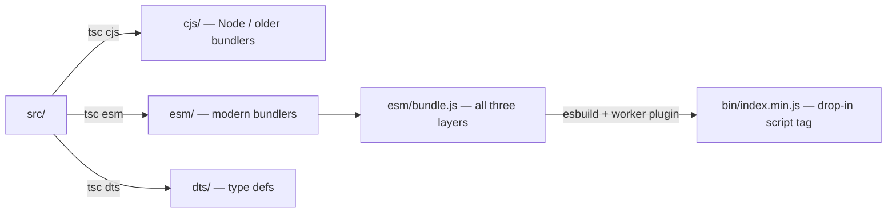

# Integration

**Scope:** how `@hdml/components` is consumed by other repos and apps — the published npm
shape, the dist variants, version alignment rules, and what the HDIO server expects from the
uploads this package produces.

Adjacent reading: [docs/components.md](components.md) for the element registry ·
[docs/hdio-client.md](hdio-client.md) for the on-the-wire FlatBuffers payload.

## Published package

```
name:    @hdml/components
version: 0.0.0-alpha.0  (per package.json; the actually-published alpha is unverified)
license: Apache-2.0
registry: https://registry.npmjs.org/  (publishConfig)
access:   public
```

| `package.json` field | Resolves to |
|---|---|
| `main` | `cjs/index.js` |
| `module` | `esm/index.js` |
| `types` | `dts/index.d.ts` |
| `customElements` | `custom-elements.json` (CEM, produced by `npm run manifest`) |
| `exports` | the four entry points below |
| `sideEffects` | the eight paths below |

`main` / `module` / `types` are kept alongside `exports` as the fallback for resolvers
that do not read `exports` — removing them would be a second breaking change.

## Entry points

The package publishes **four** entries. `.` is the compatibility root and keeps today's
surface exactly; `./hdio`, `./hdql` and `./hdvl` are purely additive.

| Entry | Registers | Notes |
|---|---|---|
| `.` | `<hdml-io>` + the eleven HDQL elements — **twelve** tags | Byte-for-byte what it registered before the split. No display module, no geometry kernel. |
| `./hdio` | `<hdml-io>` only | The other eleven modules in `src/hdio/` are its supporting graph and define no tag. |
| `./hdql` | the eleven HDQL elements | Same import order as `.` — that order is the public registration order. |
| `./hdvl` | **nothing yet** | The display half. It currently exports only the vocabulary (`HDVL_TAG_NAMES` + the twenty `*_ATTRS_LIST` enums re-exported from `@hdml/types`). The twenty-one display tags arrive later; the entry exists now so the `exports` map, `sideEffects` and the `.` bundle baseline are measured before any display module can perturb them. |

```jsonc
"exports": {
  ".":      { "types":   "./dts/index.d.ts",
              "import":  "./esm/index.js",
              "require": "./cjs/index.js" },
  "./hdio": { "types":   "./dts/hdio/index.d.ts",
              "import":  "./esm/hdio/index.js",
              "require": "./cjs/hdio/index.js" },
  "./hdql": { "types":   "./dts/hdql/index.d.ts",
              "import":  "./esm/hdql/index.js",
              "require": "./cjs/hdql/index.js" },
  "./hdvl": { "types":   "./dts/hdvl/index.d.ts",
              "import":  "./esm/hdvl/index.js",
              "require": "./cjs/hdvl/index.js" }
}
```

**`exports` is a resolution *fence*, not just a map — this is a breaking change.** The
moment the field exists, every path it does not list becomes unreachable to a modern
resolver, including deep paths such as `@hdml/components/esm/hdql/HdmlFrame.js`. That is
intended: a consumer importing a deep path breaks, the four documented entry points do
not. Import by entry point.

`src/bundle.ts` → `esm/bundle.js` is deliberately **not** an entry point. It exists only
as the esbuild entry for `bin/index.min.js` and is excluded from CEM analysis alongside
`src/index.ts`.

### Bundle budget

Ceilings, not measurements. The build assertion that enforces them is not wired yet — it
lands with the rest of the display runtime.

| Artifact | Ceiling |
|---|---|
| `.` | today's size ± 2 kB — the root entry may not grow |
| `./hdvl` | 120 kB minified / 40 kB gzipped, measured with `--external:lit` |
| `bin/index.min.js` | its current size plus the `./hdvl` ceiling |

The IIFE bundle at `bin/index.min.js` is **not** referenced from `package.json` — it ships
in the publish payload but consumers wire it manually via `<script src=…/bin/index.min.js>`.
Pages in [html/hdio/hdml-io.bin.html](../html/hdio/hdml-io.bin.html) use it directly.

`TODO(confirm: whether the published tarball deliberately includes all four output dirs and
custom-elements.json, since package.json has no "files" field — by default npm publishes
everything that is not gitignored, but `bin/cjs/dts/esm` are gitignored.)`

## Side-effect import contract

`@hdml/components` is **side-effectful by design.** Importing the entry registers every
custom element on the global `customElementRegistry`:

```ts
// src/index.ts
import "./hdio/HdmlIo";
import "./hdql/HdmlConnection";
// …10 more hdml-* elements
```

Consumers should import the whole module exactly once, before any `<hdml-*>` tag is parsed:

```ts
import "@hdml/components";        // the twelve tags of the root entry
import "@hdml/components/hdql";   // or just the eleven data elements
```

### `sideEffects`

Because the whole package is side-effectful by design, it declares the field explicitly.
This is **required, not cosmetic**: a bundler that respects `sideEffects` and finds it
absent may still strip a bare import, and every `customElements.define` would vanish.

```jsonc
"sideEffects": [
  "./esm/index.js",   "./cjs/index.js",
  "./esm/hdio/*.js",  "./cjs/hdio/*.js",
  "./esm/hdql/*.js",  "./cjs/hdql/*.js",
  "./esm/hdvl/*.js",  "./cjs/hdvl/*.js"
]
```

Two properties of that value are load-bearing, and the TODO this section replaces got
both of them wrong:

- **Both module formats, for every entry.** The side effect is the *registration*, not a
  property of module syntax. Guarding `./esm/hdql/*.js` while leaving `./cjs/hdql/*.js`
  unlisted would protect one build of the same source and not the other.
- **The element modules, not the entry files.** `sideEffects` is a **whitelist**: every
  file it does not match is asserted pure, and a bundler drops bare imports of it. The
  registration lives in the element module, not in the entry that imports it. Listing
  only `./esm/hdql/index.js` therefore strips exactly what the field exists to protect —
  measured, with esbuild reporting *"Ignoring this import because
  `esm/hdql/HdmlSortBy.js` was marked as having no side effects"*, and `bin/index.min.js`
  collapsing from 1 058 169 bytes to 136 with no tag registered.

A per-directory glob satisfies both while staying one pair of paths per entry, and it
covers new modules in an entry's directory without another `package.json` edit.

Both this list and the `exports` map are **generated from one array** in
[scripts/check-dist.mjs](../scripts/check-dist.mjs), which fails the build if they
disagree, if a named path is missing after a build, or if an `exports` target is not
covered by `sideEffects`. A new entry point cannot silently skip its declaration.

## Dist variants



- **`esm/`** keeps `import _script from "./HdmlIo.worker"` resolving to the literal
  `"_script"`. `<hdml-io>` runs the message handler on the main thread.
- **`bin/index.min.js`** inlines the bundled Worker source as a JS string. `<hdml-io>`
  spawns a real `Worker` via Blob URL.
- **`cjs/`** behaves like `esm/` for the Worker question, with CommonJS module shape.

If your app already runs in a Worker-friendly bundler (Vite, Webpack), pull `esm/index.js`
and let the bundler decide whether to extract the Worker file. If you are loading from a
plain `<script>` tag, use `bin/index.min.js`.

## Browser support

Test runner runs **chromium, firefox, webkit** (see [.testrc.js](../.testrc.js)). The
`@web/dev-server-legacy` plugin is wired with `webcomponents: false` for dev and `true` for
tests — implying production targets evergreen browsers and the optional webcomponentsjs
polyfill is only needed for legacy.

`whatwg-fetch` is in `dependencies` so `HdioClient`'s `fetch` call still works under older
runtimes that lack it.

## Version alignment

The five `@hdml/*` dependencies must move as one — they share types and a FlatBuffers
contract.

| Dep | This repo pins | Workspace target |
|---|---|---|
| `@hdml/common` | `0.0.2-alpha.24` | `0.0.2-alpha.24` |
| `@hdml/hash` | `0.0.2-alpha.24` | `0.0.2-alpha.24` |
| `@hdml/parser` | `0.0.2-alpha.24` | `0.0.2-alpha.24` |
| `@hdml/buffer` | `0.0.2-alpha.24` | `0.0.2-alpha.24` |
| `@hdml/types` | `0.0.2-alpha.24` | `0.0.2-alpha.24` |

The five `@hdml/*` deps are aligned with the workspace lockstep at `0.0.2-alpha.24`
(the HDVL display-vocabulary release). Bump all five together when realigning; no
need to bump them individually.

The pins are **exact**, not caret ranges. A caret range lets a stale
`package-lock.json` keep resolving an older tree while the manifest reads new — a
divergence only a clean CI run would surface. `@hdml/schemas` is not pinned here: it
arrives transitively through `@hdml/buffer`, `@hdml/parser` and `@hdml/types`, and must
resolve at the same lockstep version. Verify a bump by reading the **installed** tree,
not the manifest:

```bash
for p in common hash parser buffer types schemas; do
  printf '%-10s ' "$p"
  node -p "require('./node_modules/@hdml/$p/package.json').version"
done
```

**Do not regenerate `package-lock.json` wholesale to perform an `@hdml/*` bump.**
Deleting the lockfile floats every unpinned transitive dependency — most consequentially
`playwright`, which arrives via `@web/test-runner-playwright` and whose browser revisions
must match the ones baked into the devcontainer's read-only `/ms-playwright`. A floated
`playwright` fails every test on all three engines with *"Executable doesn't exist"*.
Editing the manifest and running plain `npm install` updates only the entries the changed
manifest no longer satisfies, which is exactly the six `@hdml/*` lines.

`lit` (`^3.2.1`) and `whatwg-fetch` are not bound to the workspace lockstep.

## What HDIO sees on the wire

`<hdml-io>` posts an `application/octet-stream` body to
`POST {host}/public/api/v1/{tenant}/hdio/files` (see [docs/hdio-client.md](hdio-client.md)).
The body is the `state.data` buffer produced by
[src/hdio/parse.ts:114](../src/hdio/parse.ts#L114), which is `fileifize(hdomToSave)` from
`@hdml/buffer`. The HDIO server is expected to interpret this as a `FilesList` FlatBuffers
table (per the `HDML-Schemas` repo's `.fbs` definitions).

Path scheme used by the client to identify each artifact (built in
[src/hdio/parse.ts:62-112](../src/hdio/parse.ts#L62-L112)):

```
hdml-connection=<name>@<hashOfBase64(serialized)>.html
hdml-model=<name>@<hash>.html
hdml-frame=<name>@<hash>.html
```

The hash is content-addressed; identical content → identical path, so re-renders that don't
change anything do not produce new artifacts. `TODO(confirm: HDIO server treats these
.html-suffixed virtual paths as opaque keys and matches the same scheme on the receiving
side.)`

## Consumer checklist

1. `npm i @hdml/components` (plus a peer `lit@^3` if your app doesn't already have one).
2. `import "@hdml/components";` exactly once.
3. Put `<hdml-io host tenant token>` somewhere in the page.
4. Author the HDML using `<hdml-connection>`, `<hdml-model>`, `<hdml-frame>` and their
   children. The element registry is global — no scoping needed.
5. Drive `host` / `tenant` / `token` from your auth layer. Empty values make `<hdml-io>` a
   no-op.

The `hdom-changed` event is public; you can listen on `document` to observe the same signal
`<hdml-io>` uses, e.g. for debugging.
